# Mapae (마패)

[English](README.md) | **한국어**

> **Bounded authority for autonomous payments on GIWA.**

Mapae는 AI 에이전트가 사용자의 지갑이나 개인키를 소유하지 않고도,
정해진 금액·기간·수취인 범위 안에서 자율적으로 결제할 수 있게 만드는
GIWA-native 에이전틱 페이먼트 인프라입니다.

[](https://docs.giwa.io/giwa-chain/en/get-started/connect-to-giwa)


**마패는 특권의 증표가 아니라 한계의 증표입니다.**

에이전트에게 지갑을 넘기는 대신, 온체인에서 강제되는 제한된 경제적 권한만
위임합니다.

## 왜 Mapae인가

일반적인 자동 결제 봇은 에이전트 프로세스에 자금이 든 EOA 개인키를 넣습니다.
코드의 `MAX_PAYMENT`를 지우면 지갑 전체가 노출되는 구조입니다.

Mapae는 실행 주체와 자금 소유자를 분리합니다.

| 구분 | 일반 자동 결제 봇 | Mapae |
|---|---|---|
| 자금 소유 | 에이전트 EOA | 사용자의 스마트계정 |
| 에이전트 권한 | 지갑 전체 | 세션키에 위임된 범위만 |
| 한도 강제 | 애플리케이션 코드 | 온체인 caveat |
| 결제 가스 | 지불자 | facilitator relayer |
| 회수 | 키 교체 | 위임 취소 |

현재 정책 모델은 다음을 지원합니다.

- 주기별 ERC-20 지출 상한
- 짧은 만료 시간
- 특정 vendor로 수취인 고정
- facilitator/redeemer 제한
- manager → child 재위임과 상위 한도 합산
- owner가 언제든 실행할 수 있는 위임 취소

## 작동 방식

```mermaid
flowchart LR
    Owner["Account owner<br/>wallet"] -->|"root delegation"| Account["HybridDeleGator<br/>smart account"]
    Account -->|"period / expiry / vendor caveats"| Session["Agent session key"]
    Session -->|"payment-specific ERC-7710 leaf"| Agent["AI agent"]
    Agent -->|"GET resource"| Seller["x402 seller"]
    Seller -->|"402 Payment Required"| Agent
    Agent -->|"X-PAYMENT"| Seller
    Seller -->|"verify / settle"| Facilitator["ERC-7710 facilitator"]
    Facilitator -->|"redeemDelegations"| Manager["DelegationManager"]
    Manager -->|"mUSDC.transfer"| Seller
```



Mapae에는 비교 가능한 두 결제 경로가 함께 있습니다.

| 경로 | 목적 | 상태 |
|---|---|---|
| EIP-3009 + x402-rs | 가스리스 exact 결제 기준선 | GIWA Sepolia 정산 완료 |
| ERC-7710 + x402 | 제한·만료·회수 가능한 에이전트 결제 | GIWA Sepolia 정산 완료, caveat 거절은 온체인이 판정 |

## 현재 상태

| 단계 | 결과 |
|---|---|
| D1 | MockUSDC 배포·소스 검증, x402-rs facilitator 연결 |
| D2 | `402 → sign → verify → settle → resource` GIWA 온체인 완주 |
| D3/D4 | Framework와 owner 스마트계정 GIWA 배포, root 위임 오프라인 서명·ERC-1271 검증, 위임 결제 가스리스 정산 |
| D5 | MCP tool 한 번 호출로 사람 개입 0 완주 |
| D6 | 콘솔이 한도·남은 주기 잔액·정산 영수증을 체인에서 직접 읽음 |

- MockUSDC: [`0xcfeb…e92`](https://sepolia-explorer.giwa.io/address/0xcfeb694719A09caeb80798e2011298F29CDa4e92)
- D2 정산: [`0xc9ab…b7a9`](https://sepolia-explorer.giwa.io/tx/0xc9ab58de064e88776cf2681851849cb4d79ad5c443d2675c60cbdd6ffaa3b7a9)
- D4 위임 정산 1 mUSDC: [`0xe897…a97d`](https://sepolia-explorer.giwa.io/tx/0xe897fe55048b91c0f6728d0af313e30db2b425af8955ee89f7174a16c6aaa97d)
- D4 위임 정산 2.5 mUSDC: [`0x71d7…6ce4`](https://sepolia-explorer.giwa.io/tx/0x71d7144213a04ae7b463f1c0e2b021c672938f10c7d92d5d4fe367e532f46ce4)
- 한도 초과와 만료는 백엔드 검사가 아니라 **온체인 enforcer가 거절**한다 —
  증거표는 [기술 노트](docs/tech-notes.md)에 있다.
- 회귀 검증: **216 TypeScript tests + 14 Foundry tests**, 그리고 동일한 23개 caveat
  케이스를 일회용 체인과 GIWA fork 양쪽에서 돌리는 체인 파라미터화 negative-path 수트.

### 증명하지 않은 것

초록 체크를 늘리는 것보다 경계를 분명히 하는 편이 낫다.

- **회수는 온체인으로 증명했고, 지갑 UI와 제출자(submitter)는 증명하지 않았다.**
  `DeleGatorCore.disableDelegation`은 `onlyEntryPointOrSelf`라 owner는 EntryPoint
  UserOperation으로 회수한다. 이제 두 분기 모두 양쪽 수트 타깃에서 돈다 — *self*
  분기, 그리고 실제 owner 서명 UserOperation을 `handleOps`로 태우는 *EntryPoint*
  분기. 의존 요소가 실제로 작동함을 증명하는 대조군 3개가 함께 붙는다: 예치금이
  없으면 `AA21`, owner가 아닌 서명은 `AA24`, 서명된 `entryPoint` 필드를 변조하면
  `AA24`. 제출 엔드포인트(`apps/revocation-submitter`)가 생겼고 콘솔의 회수 버튼도
  거기에 연결됐다 — 연결 → 계정 `owner()` 대조 → 서명 → POST. 아직 증명하지 않은
  것은 마지막 한 뼘, **MetaMask가 그 9개 필드 구조체를 사람이 읽을 수 있게
  렌더링하는지**다. 이건 테스트가 아니라 실제 지갑을 실제 사람 앞에 띄워봐야 한다.
- **킬 스위치는 가스리스가 아니며, 미리 충전해두지 않으면 작동하지 않는다.**
  결제는 EntryPoint를 아예 거치지 않으므로(relayer가 `redeemDelegations`를 직접
  호출) 결제에 대한 payer의 zero-ETH 불변식은 그대로다. 회수는 EntryPoint를 피할
  수 없고, EntryPoint는 계정의 *예치금*에서 가스를 걷는다. 예치금이 없으면 회수는
  `AA21`로 실패한다. relayer가 `EntryPoint.depositTo(payerAccount)`로 채워줄 수
  있으며, 이때 payer의 ETH 잔액은 정확히 0으로 유지되고 relayer는 그 예치금을 다시
  회수할 수 없다. 프레임워크 전체 `DelegationManager.pause()`는 예치금이 필요 없다.
- **중복방지는 프로세스 내부에서만 보장된다.** 단일 replica에서는 올바르지만
  다중 replica 전에 영속 저장소로 옮겨야 한다.
- **실제 스테이블코인은 별도의 토큰 동작 검토가 필요하다.** MockUSDC는 테스트넷 rail이다.

## 빠른 시작

### 준비 사항

- [Bun](https://bun.sh/)
- [Foundry](https://book.getfoundry.sh/getting-started/installation)
- Docker Compose — D2 facilitator 실행 시
- Anvil — D3/D4 로컬 Framework 통합 검증 시

### 설치 및 검증

```bash
git clone --recurse-submodules https://github.com/kooroot/Mapae.git
cd Mapae
bun install --frozen-lockfile
bun run check
```

`bun run check`는 전체 패키지의 strict TypeScript, shared/delegation 테스트,
MCP 서버 스모크, 콘솔 렌더 테스트, 실제 콘솔 빌드, Foundry 테스트를 모두
실행합니다. 키도 네트워크도 필요 없습니다.

콘솔 빌드를 게이트에 넣은 이유는 타입 검사만으로는 못 잡기 때문입니다. `node:`
전용 import는 타입 검사를 멀쩡히 통과한 뒤 번들에서 깨지는데, 이는 브라우저
코드에서 서버 전용 모듈에 손을 뻗는 것과 같은 부류의 실수입니다.

### 에이전트가 스스로 결제하고, 회수되는 것까지 한 명령으로

데모 그 자체입니다. GIWA를 로컬로 fork하고 ERC-7710 facilitator와 seller를 그
fork에 붙인 뒤, MCP 서버에게 유료 리소스를 사게 하고, 이어서 권한을 회수해 같은
호출이 거절되는 것을 보여줍니다.

```bash
cd apps/delegation-lab
bun run test:e2e:mcp
```

중간에 한도로 감당할 수 없는 결제도 한 번 요청하는데, 에이전트는 서명하기 전에
enforcer 자신의 회계를 읽어 거절합니다 —
`payment of 2500000 exceeds 2000000 left in this period`.

이어서 두 정지 스위치를 바깥쪽부터 증명합니다. `DelegationManager`를 일시정지하면
— 프레임워크 전체를 멈추는 쪽 — facilitator가 정산 전에 거절하고, health 엔드포인트가
"불건전하다"가 아니라 **그 이유**를 보고합니다. 프레임워크를 되돌린 뒤 위임 하나를
회수하면 같은 호출이 다시 거절되므로, 두 증명이 서로를 가리지 않습니다.

GIWA에는 아무것도 닿지 않습니다. 자식 프로세스가 loopback RPC에 고정되지 않으면
스크립트가 시작조차 하지 않고, 끝난 뒤 실제 relayer nonce가 그대로인지 다시
읽어 확인합니다.

### 콘솔 실행

```bash
cd apps/console
VITE_RPC_URL=http://127.0.0.1:8546 \
VITE_PERMISSION_CONTEXT=0x… \
bun run dev
```

화면 두 개 — 각인된 한도와 남은 주기 잔액, 그리고 정산 영수증. 영수증은
enforcer 자신의 `TransferredInPeriod` 이벤트에서 읽으므로 별도 원장도 계정
체계도 없습니다. 지갑 연결이 곧 유일한 신원입니다.

### 로컬 Delegation Framework 시나리오 실행

터미널 1:

```bash
anvil --silent --chain-id 31337 --port 8545
```

터미널 2:

```bash
cd contracts
forge build

cd ../apps/delegation-lab
bun run test:local
```

이 시나리오는 공식 MetaMask Delegation Framework를 로컬 Anvil에 배포한 뒤
다음을 실제 EVM에서 검증합니다.

1. 3 mUSDC 주기 한도 안의 결제 3건 성공
2. 같은 주기의 추가 결제 거절
3. 고정 vendor가 아닌 수취인 거절

## 구성

실제 사용자 주소나 키는 소스에 하드코딩하지 않습니다.

```bash
cp apps/delegation-lab/.env.example apps/delegation-lab/.env
```

| 변수 | 역할 |
|---|---|
| `CASE_1_OWNER_ADDRESS` | Case 1 owner, owner 스마트계정과 root delegation 제어 |
| `CASE_2_VENDOR_ADDRESS` | Case 2 vendor 정책의 고정 수취인 |
| `FRAMEWORK_ADMIN_ADDRESS` | DelegationManager ownership·pause 관리 |
| `DEPLOYER_ADDRESS` | Framework·owner account 배포 signer의 기대 주소 |
| `RELAYER_ADDRESS` | D4 정산 relayer 기대 주소, Framework 배포에는 사용하지 않음 |

Deployer·relayer·Framework admin·세 D3 case identity는 모두 별도 역할입니다.
개인키에서 파생된 주소가 설정한 공개주소와 다르면 broadcast 전에 중단합니다.

`.env`, `.secrets`, 실제 세션 주소, 배포 broadcast, permission artifact는 모두
Git에서 제외됩니다. 예제 파일에는 fixture 값만 들어 있습니다.

## 보안 모델

### 침해된 facilitator가 할 수 있는 것

facilitator는 릴레이어 키를 쥐고, 서명된 `X-PAYMENT`를 받고, leaf가 지정한 redeemer
본인입니다 — 모든 신원 검사를 통과하는 위치입니다. 그러므로 물어야 할 것은 신뢰
여부가 아니라 **완전히 침해되었을 때의 최대 피해**입니다.

서명은 permission context를 덮지만 **execution은 덮지 않습니다.**
`redeemDelegations`는 `_executionCallDatas`를 호출자의 calldata로 받습니다
(`DelegationManager.sol:126-133`). 즉 침해된 facilitator는 멀쩡한 leaf와 함께 자기가
고른 아무 execution이나 제출할 수 있고, 이를 막는 것은 그 leaf의 caveat뿐입니다.
그리고 실제로 막힙니다.

| 시도 | 거절하는 enforcer | 온체인 revert |
|---|---|---|
| 벤더 대신 자기 주소로 지급 | `AllowedCalldataEnforcer` | `invalid-calldata` |
| 금액 부풀리기 (주기 상한 이내라도) | `ERC20TransferAmountEnforcer` | `allowance-exceeded` |
| 1회성 지불을 상시 allowance로 전환 | `ERC20TransferAmountEnforcer` | `invalid-method` |
| 다른 컨트랙트로 호출 돌리기 | `ERC20TransferAmountEnforcer` | `invalid-contract` |
| native 값 끼워 빼내기 | `ValueLteEnforcer` | `value-too-high` |
| **payer 계정 자신을 target으로** (self 분기 진입) | `ERC20TransferAmountEnforcer` | `invalid-contract` |
| 같은 leaf 재상환 | `ERC20TransferAmountEnforcer` | `allowance-exceeded` |

남는 것은 안전성이 아니라 가용성입니다 — 정산을 거부하거나, 만료 창 안에서 순서를
바꾸거나, 지불자가 이미 승인한 결제를 집행할 수 있습니다. 다만 수취인은 언제나
에이전트가 고정한 벤더이고 자기 자신이 될 수 없습니다. **탈취·경로 변경·한도 초과는
불가능합니다.** 릴레이어에게 가스는 맡기되 자금은 맡기지 않는 구조의 값이 여기 있습니다.

각 행은 `negative-path-suite.ts`의 케이스이며, 6개 변조 케이스에는 대조군이
붙어 있습니다 — 같은 leaf·같은 redeemer로 변조만 뺀 execution은 정상 정산됩니다.
소진된 주기나 낡은 계정 때문이 아니라 변조 때문에 거절되었음을 이 대조군이 보장합니다.

### 결제 바인딩

- facilitator는 서명된 `permissionContext`의 마지막/root delegator를
  canonical payer로 사용합니다.
- 별도 wire field인 `payload.delegator`가 signed root와 다르면 거절합니다.
- 중복방지 키 `paymentIntentId`는 JSON 문자열이 아니라 network, asset,
  amount, payTo, manager, permission-context byte hash를 ABI 인코딩해 생성합니다.
- 동일 intent의 동시 정산 요청은 single-flight로 한 번만 실행합니다.
- permission context와 결제 서명은 bearer authorization으로 취급해 로그에
  남기지 않습니다.
- facilitator는 loopback 또는 사설망에서만 운영하고 요청 크기·gas·금액
  상한을 적용합니다.

현재 프로세스 내 중복방지는 안전하지만, 재시작과 다중 replica를 넘는
idempotency는 제품화 전에 Redis/Postgres 같은 영속 저장소로 이전해야 합니다.

위협 모델과 온체인 보안 설계는 [기술 노트](docs/tech-notes.md)에 정리되어 있습니다.

## GIWA 연동

| 항목 | 값 |
|---|---|
| Network | GIWA Sepolia |
| Chain ID | `91342` |
| CAIP-2 | `eip155:91342` |
| RPC | `https://sepolia-rpc.giwa.io` |
| Explorer | `https://sepolia-explorer.giwa.io` |
| EntryPoint | `0x0000000071727De22E5E9d8BAf0edAc6f37da032` |

Mapae의 기본 MVP는 누구나 사용할 수 있는 무허가 결제 경로입니다.
향후 검증형 B2B 경로에서는 GIWA의
[Dojang](https://github.com/giwa-io/dojang) `Verified Address` attestation을
선택적 KYC 게이트로 결합합니다. Dojang은 현재 D1~D4 결제 경로에 아직
통합되어 있지 않습니다.

## 저장소 구조

```text
contracts/                 MockUSDC + exact Framework Forge 배포
facilitator/               x402-rs GIWA configuration
packages/shared/           chain, token, x402 v2 types, error model
packages/delegation/       policies, signing, revocation, ERC-7710 boundary
apps/agent/                D2 payer agent
apps/seller/               D2 x402 seller
apps/delegation-lab/       policy scenarios and deployment previews
apps/delegated-agent/      ERC-7710 payment agent
apps/delegated-seller/     ERC-7710 resource seller
apps/facilitator-erc7710/  delegated settlement adapter
apps/agent-mcp/            요청 시 리소스를 결제하는 MCP 서버
apps/revocation-submitter/ 서명된 회수를 실어 나르는 loopback 엔드포인트
apps/console/              위임·영수증 화면, 지갑 모듈 크기
docs/                      기술 노트와 배포 컨트랙트 레퍼런스
```

## 문서

- [기술 노트](docs/tech-notes.md)
- [회수 런북](docs/revocation-runbook.md) — 킬 스위치와 그 검증 방법
- [배포된 컨트랙트](docs/deployed-contracts.md)

## 배포 안전장치

기본 명령은 배포 preview만 수행합니다. GIWA write는 `--broadcast`와 명시적인
승인 문구가 함께 있을 때만 활성화되며, 활성화 단계마다 별도 승인을 거칩니다.

이 저장소에서 재현 가능한 것은 전부 일회용 체인이나 로컬 fork에서 돌아갑니다.
end-to-end 스크립트는 자식 프로세스가 loopback 노드가 아닌 곳과 통신하려 하면
시작하지 않습니다 — 같은 명령을 실제 RPC로 겨누면 진짜 정산이 나가기 때문입니다.
`apps/delegation-lab`의 배포 도구는 정반대 이유로 HTTPS 전용 규칙을 더 엄격히
유지합니다. 그것들은 GIWA에 닿는 것이 목적이므로 fork를 겨눠서는 안 됩니다.
