# Mapae (마패)

[English](README.md) | **한국어**

> **Bounded authority for autonomous payments on GIWA.**

Mapae는 AI 에이전트가 사용자의 지갑이나 개인키를 소유하지 않고도,
정해진 금액·기간·수취인 범위 안에서 자율적으로 결제할 수 있게 만드는
GIWA-native 에이전틱 페이먼트 인프라입니다.

[](https://docs.giwa.io/giwa-chain/en/get-started/connect-to-giwa)


**마패는 특권의 증표가 아니라 한계의 증표입니다.**

에이전트에게 지갑을 넘기는 대신, 온체인에서 강제되는 제한된 경제적 권한만
위임합니다.

## 왜 Mapae인가

일반적인 자동 결제 봇은 에이전트 프로세스에 자금이 든 EOA 개인키를 넣습니다.
코드의 `MAX_PAYMENT`를 지우면 지갑 전체가 노출되는 구조입니다.

Mapae는 실행 주체와 자금 소유자를 분리합니다.

| 구분 | 일반 자동 결제 봇 | Mapae |
|---|---|---|
| 자금 소유 | 에이전트 EOA | 사용자의 스마트계정 |
| 에이전트 권한 | 지갑 전체 | 세션키에 위임된 범위만 |
| 한도 강제 | 애플리케이션 코드 | 온체인 caveat |
| 결제 가스 | 지불자 | facilitator relayer |
| 회수 | 키 교체 | 위임 취소 |

현재 정책 모델은 다음을 지원합니다.

- 주기별 ERC-20 지출 상한
- 짧은 만료 시간
- 특정 vendor로 수취인 고정
- facilitator/redeemer 제한
- manager → child 재위임과 상위 한도 합산
- owner가 언제든 실행할 수 있는 위임 취소

## 작동 방식

```mermaid
flowchart LR
    Owner["Account owner<br/>wallet"] -->|"root delegation"| Account["HybridDeleGator<br/>smart account"]
    Account -->|"period / expiry / vendor caveats"| Session["Agent session key"]
    Session -->|"payment-specific ERC-7710 leaf"| Agent["AI agent"]
    Agent -->|"GET resource"| Seller["x402 seller"]
    Seller -->|"402 Payment Required"| Agent
    Agent -->|"X-PAYMENT"| Seller
    Seller -->|"verify / settle"| Facilitator["ERC-7710 facilitator"]
    Facilitator -->|"redeemDelegations"| Manager["DelegationManager"]
    Manager -->|"mUSDC.transfer"| Seller
```



Mapae에는 비교 가능한 두 결제 경로가 함께 있습니다.

| 경로 | 목적 | 상태 |
|---|---|---|
| EIP-3009 + x402-rs | 가스리스 exact 결제 기준선 | GIWA Sepolia 정산 완료 |
| ERC-7710 + x402 | 제한·만료·회수 가능한 에이전트 결제 | 로컬 실제 EVM 검증 완료, GIWA 활성화 대기 |

## 현재 상태

| 단계 | 결과 |
|---|---|
| D1 | MockUSDC 배포·소스 검증, x402-rs facilitator 연결 |
| D2 | `402 → sign → verify → settle → resource` GIWA 온체인 완주 |
| D3 | period/vendor/manager-child 정책과 취소 준비, 로컬 Framework 검증 |
| D4 | ERC-7710 agent·seller·facilitator, canonical payer와 중복방지 구현 |
| M-02/M-03 | exact Forge 배포·38개 live wiring·2단계 ownership·active-only gate·owner proxy를 로컬 검증 |

- MockUSDC: [`0xcfeb...e92`](https://sepolia-explorer.giwa.io/address/0xcfeb694719A09caeb80798e2011298F29CDa4e92)
- D2 settlement: [`0xc9ab...b7a9`](https://sepolia-explorer.giwa.io/tx/0xc9ab58de064e88776cf2681851849cb4d79ad5c443d2675c60cbdd6ffaa3b7a9)
- 회귀 검증: **34 TypeScript tests + 14 Foundry tests**
- D3/D4 GIWA Framework broadcast: **아직 실행하지 않음**

## 빠른 시작

### 준비 사항

- [Bun](https://bun.sh/)
- [Foundry](https://book.getfoundry.sh/getting-started/installation)
- Docker Compose — D2 facilitator 실행 시
- Anvil — D3/D4 로컬 Framework 통합 검증 시

### 설치 및 검증

```bash
git clone --recurse-submodules https://github.com/kooroot/Mapae.git
cd Mapae
bun install --frozen-lockfile
bun run check
```

`bun run check`는 strict TypeScript, shared/delegation 테스트, Foundry 테스트를
모두 실행합니다.

### 로컬 Delegation Framework 시나리오 실행

터미널 1:

```bash
anvil --silent --chain-id 31337 --port 8545
```

터미널 2:

```bash
cd contracts
forge build

cd ../apps/delegation-lab
bun run test:local
```

이 시나리오는 공식 MetaMask Delegation Framework를 로컬 Anvil에 배포한 뒤
다음을 실제 EVM에서 검증합니다.

1. 3 mUSDC 주기 한도 안의 결제 3건 성공
2. 같은 주기의 추가 결제 거절
3. 고정 vendor가 아닌 수취인 거절

## 구성

실제 사용자 주소나 키는 소스에 하드코딩하지 않습니다.

```bash
cp apps/delegation-lab/.env.example apps/delegation-lab/.env
```

| 변수 | 역할 |
|---|---|
| `CASE_1_OWNER_ADDRESS` | Case 1 owner, owner 스마트계정과 root delegation 제어 |
| `CASE_2_VENDOR_ADDRESS` | Case 2 vendor 정책의 고정 수취인 |
| `CASE_3_MANAGER_ADDRESS` | Case 3 manager identity |
| `FRAMEWORK_ADMIN_ADDRESS` | DelegationManager ownership·pause 관리 |
| `DEPLOYER_ADDRESS` | Framework·owner account 배포 signer의 기대 주소 |
| `RELAYER_ADDRESS` | D4 정산 relayer 기대 주소, Framework 배포에는 사용하지 않음 |

Deployer·relayer·Framework admin·세 D3 case identity는 모두 별도 역할입니다.
개인키에서 파생된 주소가 설정한 공개주소와 다르면 broadcast 전에 중단합니다.

`.env`, `.secrets`, 실제 세션 주소, 배포 broadcast, permission artifact는 모두
Git에서 제외됩니다. 예제 파일에는 fixture 값만 들어 있습니다.

## 보안 모델

Mapae의 핵심 보안 경계는 다음과 같습니다.

- facilitator는 서명된 `permissionContext`의 마지막/root delegator를
  canonical payer로 사용합니다.
- 별도 wire field인 `payload.delegator`가 signed root와 다르면 거절합니다.
- 중복방지 키 `paymentIntentId`는 JSON 문자열이 아니라 network, asset,
  amount, payTo, manager, permission-context byte hash를 ABI 인코딩해 생성합니다.
- 동일 intent의 동시 정산 요청은 single-flight로 한 번만 실행합니다.
- permission context와 결제 서명은 bearer authorization으로 취급해 로그에
  남기지 않습니다.
- facilitator는 loopback 또는 사설망에서만 운영하고 요청 크기·gas·금액
  상한을 적용합니다.

현재 프로세스 내 중복방지는 안전하지만, 재시작과 다중 replica를 넘는
idempotency는 제품화 전에 Redis/Postgres 같은 영속 저장소로 이전해야 합니다.

전체 검토 결과와 남은 배포 게이트는
[배포 전 보안 검토](docs/audits/predeployment-contract-security-review-2026-07-24.md)에
기록되어 있습니다.

## GIWA 연동

| 항목 | 값 |
|---|---|
| Network | GIWA Sepolia |
| Chain ID | `91342` |
| CAIP-2 | `eip155:91342` |
| RPC | `https://sepolia-rpc.giwa.io` |
| Explorer | `https://sepolia-explorer.giwa.io` |
| EntryPoint | `0x0000000071727De22E5E9d8BAf0edAc6f37da032` |

Mapae의 기본 MVP는 누구나 사용할 수 있는 무허가 결제 경로입니다.
향후 검증형 B2B 경로에서는 GIWA의
[Dojang](https://github.com/giwa-io/dojang) `Verified Address` attestation을
선택적 KYC 게이트로 결합합니다. Dojang은 현재 D1~D4 결제 경로에 아직
통합되어 있지 않습니다.

## 저장소 구조

```text
contracts/                 MockUSDC + exact Framework Forge 배포
facilitator/               x402-rs GIWA configuration
packages/shared/           chain, token, x402 v2 types, error model
packages/delegation/       policies, signing, revocation, ERC-7710 boundary
apps/agent/                D2 payer agent
apps/seller/               D2 x402 seller
apps/delegation-lab/       policy scenarios and deployment previews
apps/delegated-agent/      ERC-7710 payment agent
apps/delegated-seller/     ERC-7710 resource seller
apps/facilitator-erc7710/  delegated settlement adapter
docs/                      architecture, runbooks, and security reviews
```

## 문서

- [프로젝트 마스터 문서](docs/mapae-master.md)
- [D3/D4 실행 안내서](docs/d3-d4-runbook.md)
- [Forge Framework 배포 런북](docs/framework-forge-deployment.md)
- [기술 노트](docs/tech-notes.md)
- [보안 검토](docs/security-review-2026-07-23.md)
- [적대적 배포 전 감사](docs/audits/predeployment-contract-security-review-2026-07-24.md)
- [M-02 / M-03 보완 계획](docs/m02-m03-remediation-plan.md)

## 배포 안전장치

기본 명령은 배포 preview만 수행합니다. GIWA write는 `--broadcast`와 명시적인
승인 문구가 함께 있을 때만 활성화됩니다. 공개 활성화 전에는 Framework
composition manifest, 최종 Framework-admin ownership, 실제 Framework
negative-path 검증을 완료해야 합니다.

자세한 순서는 [D3/D4 runbook](docs/d3-d4-runbook.md)을 참고하세요.
