# Mapae

**English** | [한국어](README.ko.md)

> **Bounded authority for autonomous payments on GIWA.**

Mapae is GIWA-native agentic payment infrastructure that lets AI agents pay
autonomously within explicit amount, time, recipient, and redeemer limits—without
owning the user's wallet or private key.

[](https://docs.giwa.io/giwa-chain/en/get-started/connect-to-giwa)


**Mapae is not a symbol of unlimited authority. It is a proof of where authority
ends.**

Instead of handing an agent a funded wallet, Mapae delegates narrowly scoped
economic authority enforced onchain.

## Why Mapae

A conventional payment bot holds a funded EOA private key. Its spending limit is
usually an application-level promise that disappears when one line of code changes.

Mapae separates the actor executing a payment from the user who owns the funds.

| | Conventional payment bot | Mapae |
|---|---|---|
| Fund ownership | Agent-controlled EOA | User-owned smart account |
| Agent authority | Entire wallet | Delegated session scope only |
| Spending limits | Application code | Onchain caveats |
| Settlement gas | Payer | Facilitator relayer |
| Account creation gas | User | Onboarding sponsor |
| Revocation | Rotate the wallet key | Disable the delegation |

The current policy model supports:

- ERC-20 spending limits per period
- short permission expiry
- fixed-vendor recipient policies
- facilitator/redeemer restrictions
- manager-to-child re-delegation with aggregate parent limits
- owner-controlled revocation

## How it works

```mermaid
flowchart LR
    Owner["Account owner<br/>wallet"] -->|"pre-deployment<br/>signature"| Bootstrap["account-bootstrap<br/>sponsor gas"]
    Bootstrap -->|"CREATE2 deploy<br/>+ mUSDC float"| Account["HybridDeleGator<br/>smart account"]
    Owner -->|"root delegation"| Account
    Account -->|"period / expiry / vendor caveats"| Session["Agent session key"]
    Session -->|"payment-specific ERC-7710 leaf"| Agent["AI agent"]
    Agent -->|"GET resource"| Seller["x402 seller"]
    Seller -->|"402 Payment Required"| Agent
    Agent -->|"Payment-Signature"| Seller
    Seller -->|"verify / settle"| Facilitator["ERC-7710 facilitator"]
    Facilitator -->|"redeemDelegations"| Manager["DelegationManager"]
    Manager -->|"mUSDC.transfer"| Seller
```



The repository keeps two payment paths side by side:

| Path | Purpose | Status |
|---|---|---|
| EIP-3009 + x402-rs | Gasless exact-payment baseline | Settled on GIWA Sepolia |
| ERC-7710 + x402 | Limited, expiring, revocable agent payments | Settled on GIWA Sepolia; caveat rejections come from the deployed enforcers, evaluated against live GIWA state |

## Current status

Two different things are called "done" below, and the column says which. **GIWA** means
a transaction was mined on GIWA Sepolia and you can open it in the explorer. **Local fork**
means it runs against real GIWA state and real deployed bytecode in a local Anvil fork —
a strong result, but nothing was mined and there is no link to follow.

| Capability | Result | Proven on |
|---|---|---|
| Token + facilitator | MockUSDC deployed and verified; x402-rs facilitator connected | **GIWA** |
| Direct payment | `402 → sign → verify → settle → resource` completed | **GIWA** |
| Delegated payment | Delegation Framework and the owner smart account deployed; root permission signed offline and verified through ERC-1271; delegated payments settled gaslessly | **GIWA** |
| Agent automation | One MCP tool call completes the whole payment with no human in the loop | **GIWA** |
| Sponsored onboarding | A payer smart account deployed by a sponsor from a root permission signed **before the account existed**; the new user holds zero ETH at every step | **GIWA** |
| Studio | Studio (app.mapae.io) reads the cap, the remaining period balance and the settlement receipts straight from chain | **GIWA** |
| Standing gates | Documentation, logging, advisory and test-count gates; 542 TypeScript + 14 Foundry tests; 23/23 negative paths on both chain targets; 15/15 onboarding cases on a GIWA fork | Local + read-only GIWA verification |

- MockUSDC: [`0xcfeb…e92`](https://sepolia-explorer.giwa.io/address/0xcfeb694719A09caeb80798e2011298F29CDa4e92)
- Direct settlement: [`0xc9ab…b7a9`](https://sepolia-explorer.giwa.io/tx/0xc9ab58de064e88776cf2681851849cb4d79ad5c443d2675c60cbdd6ffaa3b7a9)
- Delegated settlement, 1 mUSDC: [`0xe897…a97d`](https://sepolia-explorer.giwa.io/tx/0xe897fe55048b91c0f6728d0af313e30db2b425af8955ee89f7174a16c6aaa97d)
- Delegated settlement, 2.5 mUSDC: [`0x71d7…6ce4`](https://sepolia-explorer.giwa.io/tx/0x71d7144213a04ae7b463f1c0e2b021c672938f10c7d92d5d4fe367e532f46ce4)
- **Agent-driven settlement**, one MCP call, no human step:
  [`0x533c…9964c`](https://sepolia-explorer.giwa.io/tx/0x533c5cb2945b89c7a56abf681ef049124deb4daf141e1a52b280385cefd9964c)
  — block 31634935, payer −1.00 mUSDC, vendor +1.00 mUSDC, **payer gas spend 0**.
  This run also surfaced a real defect and its fix is in the same tree: the answer the
  agent received said the payment had been rejected while it had in fact been mined. See
  "settlement-unknown" below.
- **Sponsored onboarding**, account deployed from a signature that predates the account:
  deploy [`0xed21…9902`](https://sepolia-explorer.giwa.io/tx/0xed21ac71881cc587cc742862fea9ce16e5d2a09370a3516118884c66e1599902),
  mUSDC float mint [`0x9d14…baa0`](https://sepolia-explorer.giwa.io/tx/0x9d14588b8bc3e72851b320036696493f668a7675f664b5b812737540a373baa0)
  — account [`0x1528…3301`](https://sepolia-explorer.giwa.io/address/0x15286FE9A48d52504607bEaaa021B29194353301),
  whose live ERC-1271 then answered `0x1626ba7e` for that pre-deployment signature.
  The new user paid no gas and never held ETH.
- Over-cap and expired payments are refused by the enforcers, not by a backend check.
  **There is no transaction to link for these two**, and that is the mechanism working
  rather than a gap: the facilitator simulates `redeemDelegations` against live GIWA state
  before it broadcasts, so the enforcer's revert arrives at `/verify` and no doomed
  transaction is ever paid for. The verdict comes from the deployed enforcer bytecode
  reading the real period counter — it is simply an `eth_call`, not a mined block. See the
  evidence table in the [technical documentation](https://gitbook.mapae.io).
- Regression suite: **542 TypeScript tests (437 shared/delegation/scripts + 3 MCP + 102 web)
  + 14 Foundry tests**, plus a chain-parameterised negative-path suite that runs the same
  twenty-three caveat cases on a disposable chain and on a GIWA fork. The breakdown is
  given because `bun run check` prints it as four separate numbers — a single total is a
  claim you cannot check against anything the command actually shows you.

### What is not proven here

Being explicit about the edges matters more than a longer list of green checks.

- **The negative-path evidence below comes from a local fork**, not from GIWA — real
  deployed bytecode, real account, real EntryPoint, but no mined transaction per case.
  (A first *live* sponsored revocation has since been mined on GIWA, 2026-08-04, through
  the public `/revoke` path; the per-case fork evidence stands on its own terms.) The demo payer's EntryPoint deposit on GIWA is `0`, so its
  self-funded (censorship-resistant) revocation path stays un-armed until the owner
  funds that deposit; the sponsored `/revoke` path arms the deposit at revoke time
  instead, and completed its first live revocation on 2026-08-04.
  Every sponsored-onboarded account starts at deposit `0` too, so this boundary belongs
  to the whole class of accounts, not to one demo account.
  `DeleGatorCore.disableDelegation` is `onlyEntryPointOrSelf`, so an owner revokes by
  submitting an EntryPoint UserOperation. Both branches run on both suite targets:
  the *self* branch, and the *EntryPoint* branch driven by a real owner-signed
  UserOperation through `handleOps`, with three controls proving each dependency is
  load-bearing — an unfunded deposit fails `AA21`, a non-owner signature fails `AA24`,
  and tampering with the signed `entryPoint` field fails `AA24`. The submitter endpoint
  now exists (`apps/revocation-submitter`) and Studio's revoke button
  (`apps/web/src/dapp/RevokeButton.tsx`) is wired to it: connect, check the connected
  wallet against the account's `owner()`, sign, POST.
  What is still not proven is the last inch — **MetaMask rendering that nine-field
  struct legibly for a human to approve**. That needs a real wallet in front of a real
  person, not a test.
- **The kill switch is not gasless, and it does not work unless it was pre-funded.**
  Payments never touch the EntryPoint — the relayer calls `redeemDelegations` directly
  — so the payer's zero-ETH invariant holds for paying. Revocation cannot avoid the
  EntryPoint, which charges the account's *deposit*. With no deposit the revocation
  fails `AA21`. A relayer can fund it with `EntryPoint.depositTo(payerAccount)`, which
  leaves the payer's ETH balance at exactly zero and cannot be clawed back by the
  relayer. Framework-wide `DelegationManager.pause()` needs no deposit.
- **A settlement can outlive the agent's patience, and then the answer is "unknown".**
  Found by running the MCP payment loop on GIWA rather than on a fork. Four timeouts stack on one payment —
  the facilitator's wait for a receipt, the seller's call to it, the seller's HTTP idle
  timeout, and the agent's own deadline — and they were inverted: `Bun.serve`'s 10 s
  default sat underneath a 60 s receipt wait. The transfer was mined and the agent was
  told it had been rejected. The budgets now grow outward (25 → 35 → 45 → 50 s) and a
  payment whose outcome is not established returns `SETTLEMENT_UNKNOWN` instead of
  `PAYMENT_REJECTED`, because the two invite opposite responses and retrying the first
  can pay twice. A fork mines instantly, so no amount of local testing would have shown
  this.
- **The onboarding sponsor is a funded key answering unauthenticated internet
  requests.** Keypairs are free offline, so per-account idempotency is identity, not a
  budget; the real bounds on a griefing run are the per-IP rate limit, the daily gas
  budget, and the sponsor wallet's own deliberately small balance. Exhausting them
  stops onboarding for the day — it cannot reach payer funds, caps, or settlement,
  because the sponsor holds no delegation authority.
- **Idempotency is in-process.** It is correct for a single replica and must move
  to a durable store before running more than one.
- **A production stablecoin needs its own token-behaviour review.** MockUSDC is a
  testnet rail.

## Quick start

### Prerequisites

- [Bun](https://bun.sh/)
- [Foundry](https://book.getfoundry.sh/getting-started/installation)
- Docker Compose for the x402 facilitator
- Anvil for the local Framework integration

### Install and verify

```bash
git clone --recurse-submodules https://github.com/kooroot/Mapae.git
cd Mapae
bun install --frozen-lockfile
bun run check
```

`bun run check` runs strict TypeScript across every package, four standing
checks — documentation, logging, dependency advisories, test counts — the shared
and delegation suites, the MCP server smoke tests, the web render tests, a
real web build, and the Foundry contract suite. It needs no keys. Only the
advisory check wants the network, and it says so and carries on without it.
The same command and the hermetic 23-case delegation suite run in GitHub Actions
on every pull request and every push to `main`, from a recursive-submodule checkout
with Bun and Foundry pinned to the versions used for the latest full-gate re-run.

The documentation check is in the gate because this README is the primary
description of the system, which turns doc rot into a correctness bug. It
verifies that every `bun run` and `make` command written in a code block exists,
that every relative link resolves, and that every address matches one of the two
canonical sources — the deployment artifacts and `packages/shared/src/token.ts`.
Its first run found that MockUSDC's address is in no artifact at all, which this
repository had been claiming otherwise.

The count of tests in the badge above is checked against the tests that exist,
not against the other numbers on this page. Badge, total and breakdown agreeing
with each other never meant they were right — they move together whenever
someone edits them by hand — and the stated number was twelve short the last
time a suite grew, while the gate printed that the counts checked out. `bun test`
with a name filter that matches nothing collects every file and reports the
total without running a single test body; `forge test --list` does the same for
the contracts.

The advisory check runs `bun audit` and requires every finding to be either
fixed or accepted in writing with a proof attached. One is accepted today: a
Windows path traversal in the HTTP adapter that `@modelcontextprotocol/sdk`
pulls in for a transport this repository does not use. No compatible update
closes it — the SDK declares `^1.19.9` and the fix landed in 2.0.5 — so the
acceptance rests entirely on that adapter never entering our bundle, which is
re-measured on every run. A control file that imports the transport on purpose
has to be found by the same measurement first: a detector that always reported
zero would pass the check while proving nothing.

The logging check refuses a raw error inside any `console.*` argument. The
private RPC endpoint used for local forks carries its API key in the URL *path*,
and viem embeds its transport URL in every error message, so
`console.error(error.message)` is a credential disclosure. Errors reach a sink
through `redactForLog`, which reduces any URL to `scheme://host`. That rule used
to be enforced by review: an audit found seventeen escape paths and fixed them
file by file, but its sweep was scoped to two directories and `apps/agent` kept
the forbidden expression through it. A rule that new code keeps reintroducing
belongs in the gate.

The web build is part of the gate because type checking alone does not catch
it: a `node:`-only import type-checks cleanly and then fails to bundle, which is
the same class of mistake as reaching for a server-only module from browser code.

### See the limits refuse a payment, on a chain you own

This is the strongest thing you can check without anything of ours. It spawns a
disposable Anvil, deploys the pinned 38-unit Framework and MockUSDC onto it, and
runs twenty-three cases against the deployed enforcer bytecode — the period cap,
its reset, expiry, replay, a wrong redeemer, a recipient swap, six ways a
compromised facilitator could try to profit, and revocation through both the
account and the EntryPoint.

```bash
cd apps/delegation-lab
bun run test:negative
```

No keys, no network, no artifact from us: it generates its own owner, agent,
manager and child accounts, and the default target is hermetic. Measured from a
clean clone with nothing but Bun and Foundry installed — `23/23 cases passed`,
exit 0. Every refusal prints the enforcer and the exact revert string, so what
refuses is legible rather than asserted.

The same twenty-three cases also run against the contracts that are actually
deployed on GIWA, instead of a fresh local copy of them:

```bash
SUITE_TARGET=fork bun run test:negative
```

That target needs a GIWA RPC endpoint and forks the live chain locally; nothing
is broadcast. It is the stronger of the two, and the one this repository's claims
rest on — the refusals come from the enforcer bytecode at the addresses in
[docs/deployed-contracts.md](docs/deployed-contracts.md), reading real GIWA state.
Measured 2026-07-26: `23/23 cases passed` and exit 0 on both targets.

### Watch the agent pay by itself, then revoke it

This forks GIWA locally, starts the ERC-7710 facilitator and seller against that
fork, asks the MCP server to buy a gated resource, and then revokes the permission
and shows the same call being refused.

```bash
cd apps/delegation-lab
bun run test:e2e:mcp
```

**This one is not runnable from a clone, and that is not a defect to route around.**
It replays *this* deployment: it needs `apps/delegation-lab/.env` and a signed root
permission at `open-agent.permission.json`, and that permission can only be produced
by the wallet that owns the deployed account. Both are gitignored, so a fresh clone
stops at `FACILITATOR_SIGNER_ADDRESS must be set (apps/delegation-lab/.env)`. Setup is in
[`docs/giwa-demo-runbook.md`](docs/giwa-demo-runbook.md); if you want a payment loop
you can drive end to end yourself, use `test:negative` above — it proves the same
enforcement without needing anyone's signature. And if you want an account of your
own rather than a replay of ours, [app.mapae.io](https://app.mapae.io) onboards you
on live GIWA: sign a root permission against an account that does not exist yet and
the sponsored bootstrap service deploys it — you pay no gas and hold no ETH.

Along the way it also asks for a payment the cap cannot cover, and the agent
refuses it from the enforcer's own accounting before signing anything:
`payment of 2500000 exceeds 2000000 left in this period`.

It then proves both stop switches, from the outside in. Pausing the
`DelegationManager` — the framework-wide one — has the facilitator refuse before
settling, and its health endpoint says why rather than only that it is unhealthy.
Revoking the single delegation stops the same call again after the framework is
restored, so neither proof can be mistaken for the other.

Nothing reaches GIWA. The script refuses to start unless every child process is
pinned to a loopback RPC, and it re-reads the real relayer nonce afterwards to show
it never moved.

### Open Studio

```bash
cd apps/web
bun run dev
```

Open `/app`: the delegation scope with its remaining period balance, the
settlement receipts, and the owner kill switch. The receipts come from the
enforcer's own `TransferredInPeriod` events, so Studio needs no database and no
accounts — connecting a wallet is the only identity there is. The hosted build
is https://app.mapae.io.

### Run the local Delegation Framework scenario

Terminal 1:

```bash
anvil --silent --chain-id 31337 --port 8545
```

Terminal 2:

```bash
cd contracts
forge build

cd ../apps/delegation-lab
bun run test:local
```

The scenario deploys the official MetaMask Delegation Framework to a disposable
local Anvil chain and verifies:

1. three successful 1 mUSDC payments under a 3 mUSDC period limit;
2. rejection of an additional payment in the same period; and
3. rejection of a recipient outside the fixed-vendor policy.

## Configuration

User-specific addresses and keys are never hardcoded in source.

```bash
cp apps/delegation-lab/.env.example apps/delegation-lab/.env
```

| Variable | Role |
|---|---|
| `CASE_1_OWNER_ADDRESS` | Case 1 owner; controls the owner smart account and root delegations |
| `CASE_2_VENDOR_ADDRESS` | Recipient pinned by the Case 2 vendor policy |
| `FRAMEWORK_ADMIN_ADDRESS` | Controls DelegationManager ownership and pause state |
| `DEPLOYER_ADDRESS` | Expected signer for Framework and owner-account deployment |
| `FACILITATOR_SIGNER_ADDRESS` | Expected settlement signer; never used for Framework deployment |

Deployer, relayer, Framework admin, and the three demo case identities are
independent roles. The corresponding private key must resolve to its configured
public address or the operation fails before broadcast. The onboarding sponsor
(`apps/account-bootstrap/.env`) is a further independent funded role: the service
refuses to boot if the sponsor equals the relayer or the deployer, because that key
answers unauthenticated internet requests and its balance is the ceiling on what
griefing can cost.

`.env`, `.secrets`, deployment broadcasts, and permission artifacts are excluded
from Git. Session generation splits its output on purpose: private keys go to
`.secrets/`, and the matching public addresses ship in
`deployments/d3-session-addresses.json` so `docs/deployed-contracts.md` has a
canonical source on every clone. Tracked examples contain fixtures only.

## Security model

### What a compromised facilitator can do

The facilitator holds the relayer key, receives the signed `Payment-Signature`, and *is* the
redeemer the leaf pins — every identity check passes for it. So the question is not
whether to trust it, but what the worst case is when it is fully compromised.

The signature covers the permission context. It does **not** cover the execution:
`redeemDelegations` takes `_executionCallDatas` as calldata from the caller
(`DelegationManager.sol:126-133`), so a compromised facilitator can submit any
execution it likes alongside a perfectly valid leaf. Only the caveats on that leaf
stand in the way — and they hold:

Every revert below is produced by the deployed enforcer bytecode, on a disposable chain
and again on a GIWA fork. None of them is a mined GIWA transaction — a tampering attempt
that reverts in simulation is never broadcast, which is the point.

| Attempt | Refused by | Enforcer revert |
|---|---|---|
| Pay itself instead of the vendor | `AllowedCalldataEnforcer` | `invalid-calldata` |
| Inflate the amount, even within the period cap | `ERC20TransferAmountEnforcer` | `allowance-exceeded` |
| Turn a one-shot payment into a standing allowance | `ERC20TransferAmountEnforcer` | `invalid-method` |
| Redirect the call to another contract | `ERC20TransferAmountEnforcer` | `invalid-contract` |
| Attach native value to the call | `ValueLteEnforcer` | `value-too-high` |
| **Aim the execution at the payer account itself** (reaching `onlyEntryPointOrSelf`) | `ERC20TransferAmountEnforcer` | `invalid-contract` |
| Redeem the same leaf twice | `ERC20TransferAmountEnforcer` | `allowance-exceeded` |

What remains is liveness, not safety: it can refuse to settle, reorder within the
expiry window, or settle a payment the payer already authorized — to the vendor the
agent pinned, never to itself. **Theft, redirection, and exceeding the cap are not
available to it.** That is what makes handing a relayer the gas, but not the funds, a
different arrangement from handing it a funded wallet.

Each row is a case in `negative-path-suite.ts`, and the six tampering cases carry a
control — same leaf, same redeemer, untampered execution settles — so the refusals are
attributable to the tampering rather than to an exhausted period or a stale account.

The same public host also routes `/bootstrap` to the onboarding sponsor — a separate
service with a separate key. Compromising it is worth at most the sponsor wallet's
balance in wasted gas: the sponsor holds no delegation authority, so payer funds,
caps, and settlement are out of its reach by construction.

### Payment binding

- The facilitator derives the canonical payer from the last/root delegation in the
  signed `permissionContext`.
- The separate wire claim `payload.delegator` must match that signed root.
- The idempotency key `paymentIntentId` is a domain-separated ABI hash over the
  network, asset, amount, recipient, manager, and permission-context byte hash—not
  a hash of JSON text.
- Concurrent requests for the same intent are coalesced into a single settlement
  operation.
- Permission contexts and payment signatures are treated as bearer authorizations
  and never written to logs.
- Facilitator processes bind loopback only and enforce request, amount, gas, and
  timeout limits; the public hostname is a tunnel in front of that loopback, never a
  public interface binding. The application API carries no authentication of its own,
  which is why the tunnel and those limits are load-bearing.

In-process idempotency is covered. Before multi-replica production deployment,
`paymentIntentId → transaction hash` state must move to a durable store such as
Redis or Postgres.

See the [technical documentation](https://gitbook.mapae.io) for the threat model and the
on-chain security design.

## GIWA integration

| | |
|---|---|
| Network | GIWA Sepolia |
| Chain ID | `91342` |
| CAIP-2 | `eip155:91342` |
| RPC | `https://sepolia-rpc.giwa.io` |
| Explorer | `https://sepolia-explorer.giwa.io` |
| EntryPoint | `0x0000000071727De22E5E9d8BAf0edAc6f37da032` |

Mapae's default MVP path is permissionless. A future verified B2B path can add
GIWA [Dojang](https://github.com/giwa-io/dojang) `Verified Address` attestations as
an optional KYC gate. Dojang is not yet part of the settlement path.

## Repository

```text
contracts/                 MockUSDC + exact Framework Forge deployment
facilitator/               x402-rs GIWA configuration
packages/shared/           chain, token, x402 v2 types, error model
packages/delegation/       policies, signing, revocation, ERC-7710 boundary
apps/agent/                EIP-3009 payer agent
apps/seller/               EIP-3009 x402 seller
apps/delegation-lab/       policy scenarios, deployment previews, end-to-end proofs
apps/delegated-agent/      ERC-7710 payment agent
apps/delegated-seller/     ERC-7710 resource seller
apps/facilitator-erc7710/  delegated settlement adapter
apps/agent-mcp/            MCP server that pays for a resource on request
apps/revocation-submitter/ loopback endpoint that carries a signed revocation
apps/account-bootstrap/    sponsored payer-account deploy from a pre-deployment signature
apps/web/                  public landing (mapae.io) and Studio (app.mapae.io)
docs/                      technical notes and the deployed-contract reference
```

## Documentation

- [mapae.io](https://mapae.io) — live landing with onchain evidence
- [app.mapae.io](https://app.mapae.io) — Studio: sponsored onboarding, then grant, inspect and revoke a delegation
- [Technical documentation](https://gitbook.mapae.io)
- [MCP guide](docs/mcp-guide.md) — register the payment server in an MCP client
- [Revocation runbook](docs/revocation-runbook.md) — the kill switch, and how to verify it
- [Deployed contracts](docs/deployed-contracts.md)

## Deployment safety

Default deployment commands are previews. Framework, owner-account and
ownership-acceptance deployments require `--broadcast` together with an approval
phrase pinned to the composition being deployed. MockUSDC deployment and
`run:giwa` settlement are gated by `--broadcast` alone — deliberately, because a
settlement is bounded by the on-chain caveat while an infrastructure deployment
is not. Every activation step is approved separately.

The one in-tree service that broadcasts to GIWA from a funded key —
`apps/account-bootstrap` — carries its own two-part gate: `BOOTSTRAP_ENABLED` plus an
approval phrase pinned to the exact deployment composition, and it refuses to boot if
its sponsor key coincides with the relayer or the deployer.

Everything reproducible from this repository runs against a disposable chain or a
local fork. The end-to-end script will not start if a child process would talk to
anything other than a loopback node, because the same command pointed at the real
RPC would settle real transactions. Deployment tooling under `apps/delegation-lab`
keeps a stricter HTTPS-only rule for exactly the opposite reason: those commands
are meant to reach GIWA and must never be aimed at a fork.

## License

MIT — see [LICENSE](LICENSE). The submodules under `contracts/lib/` are upstream
projects and keep their own licenses.
