# Mapae

**English** | [한국어](README.ko.md)

> **Bounded authority for autonomous payments on GIWA.**

Mapae is GIWA-native agentic payment infrastructure that lets AI agents pay
autonomously within explicit amount, time, recipient, and redeemer limits—without
owning the user's wallet or private key.

[](https://docs.giwa.io/giwa-chain/en/get-started/connect-to-giwa)


**Mapae is not a symbol of unlimited authority. It is a proof of where authority
ends.**

Instead of handing an agent a funded wallet, Mapae delegates narrowly scoped
economic authority enforced onchain.

## Why Mapae

A conventional payment bot holds a funded EOA private key. Its spending limit is
usually an application-level promise that disappears when one line of code changes.

Mapae separates the actor executing a payment from the user who owns the funds.

| | Conventional payment bot | Mapae |
|---|---|---|
| Fund ownership | Agent-controlled EOA | User-owned smart account |
| Agent authority | Entire wallet | Delegated session scope only |
| Spending limits | Application code | Onchain caveats |
| Settlement gas | Payer | Facilitator relayer |
| Revocation | Rotate the wallet key | Disable the delegation |

The current policy model supports:

- ERC-20 spending limits per period
- short permission expiry
- fixed-vendor recipient policies
- facilitator/redeemer restrictions
- manager-to-child re-delegation with aggregate parent limits
- owner-controlled revocation

## How it works

```mermaid
flowchart LR
    Owner["Account owner<br/>wallet"] -->|"root delegation"| Account["HybridDeleGator<br/>smart account"]
    Account -->|"period / expiry / vendor caveats"| Session["Agent session key"]
    Session -->|"payment-specific ERC-7710 leaf"| Agent["AI agent"]
    Agent -->|"GET resource"| Seller["x402 seller"]
    Seller -->|"402 Payment Required"| Agent
    Agent -->|"X-PAYMENT"| Seller
    Seller -->|"verify / settle"| Facilitator["ERC-7710 facilitator"]
    Facilitator -->|"redeemDelegations"| Manager["DelegationManager"]
    Manager -->|"mUSDC.transfer"| Seller
```



The repository keeps two payment paths side by side:

| Path | Purpose | Status |
|---|---|---|
| EIP-3009 + x402-rs | Gasless exact-payment baseline | Settled on GIWA Sepolia |
| ERC-7710 + x402 | Limited, expiring, revocable agent payments | Verified on a local EVM; GIWA activation pending |

## Current status

| Milestone | Result |
|---|---|
| D1 | MockUSDC deployed and verified; x402-rs facilitator connected |
| D2 | `402 → sign → verify → settle → resource` completed on GIWA |
| D3 | Period, vendor, manager-child, and revocation paths verified locally |
| D4 | ERC-7710 agent, seller, facilitator, canonical payer, and idempotency implemented |
| M-02/M-03 | Exact Forge deployment path, 38-unit live wiring, two-step ownership, active-only gates, and owner proxy verified locally |

- MockUSDC: [`0xcfeb...e92`](https://sepolia-explorer.giwa.io/address/0xcfeb694719A09caeb80798e2011298F29CDa4e92)
- D2 settlement: [`0xc9ab...b7a9`](https://sepolia-explorer.giwa.io/tx/0xc9ab58de064e88776cf2681851849cb4d79ad5c443d2675c60cbdd6ffaa3b7a9)
- Regression suite: **34 TypeScript tests + 14 Foundry tests**
- D3/D4 Framework writes on GIWA: **not broadcast**

## Quick start

### Prerequisites

- [Bun](https://bun.sh/)
- [Foundry](https://book.getfoundry.sh/getting-started/installation)
- Docker Compose for the D2 facilitator
- Anvil for the local D3/D4 Framework integration

### Install and verify

```bash
git clone --recurse-submodules https://github.com/kooroot/Mapae.git
cd Mapae
bun install --frozen-lockfile
bun run check
```

`bun run check` runs strict TypeScript checks, shared/delegation tests, and the
Foundry contract suite.

### Run the local Delegation Framework scenario

Terminal 1:

```bash
anvil --silent --chain-id 31337 --port 8545
```

Terminal 2:

```bash
cd contracts
forge build

cd ../apps/delegation-lab
bun run test:local
```

The scenario deploys the official MetaMask Delegation Framework to a disposable
local Anvil chain and verifies:

1. three successful 1 mUSDC payments under a 3 mUSDC period limit;
2. rejection of an additional payment in the same period; and
3. rejection of a recipient outside the fixed-vendor policy.

## Configuration

User-specific addresses and keys are never hardcoded in source.

```bash
cp apps/delegation-lab/.env.example apps/delegation-lab/.env
```

| Variable | Role |
|---|---|
| `CASE_1_OWNER_ADDRESS` | Case 1 owner; controls the owner smart account and root delegations |
| `CASE_2_VENDOR_ADDRESS` | Recipient pinned by the Case 2 vendor policy |
| `CASE_3_MANAGER_ADDRESS` | Case 3 manager identity |
| `FRAMEWORK_ADMIN_ADDRESS` | Controls DelegationManager ownership and pause state |
| `DEPLOYER_ADDRESS` | Expected signer for Framework and owner-account deployment |
| `RELAYER_ADDRESS` | Expected D4 settlement relayer; never used for Framework deployment |

Deployer, relayer, Framework admin, and the three D3 case identities are
independent roles. The corresponding private key must resolve to its configured
public address or the operation fails before broadcast.

`.env`, `.secrets`, generated session addresses, deployment broadcasts, and
permission artifacts are excluded from Git. Tracked examples contain fixtures only.

## Security model

- The facilitator derives the canonical payer from the last/root delegation in the
  signed `permissionContext`.
- The separate wire claim `payload.delegator` must match that signed root.
- The idempotency key `paymentIntentId` is a domain-separated ABI hash over the
  network, asset, amount, recipient, manager, and permission-context byte hash—not
  a hash of JSON text.
- Concurrent requests for the same intent are coalesced into a single settlement
  operation.
- Permission contexts and payment signatures are treated as bearer authorizations
  and never written to logs.
- Facilitators stay on loopback or a private network and enforce request, amount,
  gas, and timeout limits.

In-process idempotency is covered. Before multi-replica production deployment,
`paymentIntentId → transaction hash` state must move to a durable store such as
Redis or Postgres.

See the
[pre-deployment security review](docs/audits/predeployment-contract-security-review-2026-07-24.md)
for the full threat model and remaining activation gates.

## GIWA integration

| | |
|---|---|
| Network | GIWA Sepolia |
| Chain ID | `91342` |
| CAIP-2 | `eip155:91342` |
| RPC | `https://sepolia-rpc.giwa.io` |
| Explorer | `https://sepolia-explorer.giwa.io` |
| EntryPoint | `0x0000000071727De22E5E9d8BAf0edAc6f37da032` |

Mapae's default MVP path is permissionless. A future verified B2B path can add
GIWA [Dojang](https://github.com/giwa-io/dojang) `Verified Address` attestations as
an optional KYC gate. Dojang is not yet part of the D1-D4 settlement path.

## Repository

```text
contracts/                 MockUSDC + exact Framework Forge deployment
facilitator/               x402-rs GIWA configuration
packages/shared/           chain, token, x402 v2 types, error model
packages/delegation/       policies, signing, revocation, ERC-7710 boundary
apps/agent/                D2 payer agent
apps/seller/               D2 x402 seller
apps/delegation-lab/       policy scenarios and deployment previews
apps/delegated-agent/      ERC-7710 payment agent
apps/delegated-seller/     ERC-7710 resource seller
apps/facilitator-erc7710/  delegated settlement adapter
docs/                      architecture, runbooks, and security reviews
```

## Documentation

- [Project master document](docs/mapae-master.md)
- [D3/D4 runbook](docs/d3-d4-runbook.md)
- [Forge Framework deployment runbook](docs/framework-forge-deployment.md)
- [Technical notes](docs/tech-notes.md)
- [Security review](docs/security-review-2026-07-23.md)
- [Adversarial pre-deployment audit](docs/audits/predeployment-contract-security-review-2026-07-24.md)
- [M-02 / M-03 remediation plan](docs/m02-m03-remediation-plan.md)

## Deployment safety

Default deployment commands are previews. GIWA writes require both `--broadcast`
and an explicit approval phrase. Public activation remains gated on the Framework
composition manifest, final Framework-admin ownership, and real-Framework
negative-path verification.

See the [D3/D4 runbook](docs/d3-d4-runbook.md) for the complete activation sequence.
