# Mapae

**English** | [한국어](README.ko.md)

> **Bounded authority for autonomous payments on GIWA.**

Mapae is GIWA-native agentic payment infrastructure that lets AI agents pay
autonomously within explicit amount, time, recipient, and redeemer limits—without
owning the user's wallet or private key.

[](https://docs.giwa.io/giwa-chain/en/get-started/connect-to-giwa)


**Mapae is not a symbol of unlimited authority. It is a proof of where authority
ends.**

Instead of handing an agent a funded wallet, Mapae delegates narrowly scoped
economic authority enforced onchain.

## Why Mapae

A conventional payment bot holds a funded EOA private key. Its spending limit is
usually an application-level promise that disappears when one line of code changes.

Mapae separates the actor executing a payment from the user who owns the funds.

| | Conventional payment bot | Mapae |
|---|---|---|
| Fund ownership | Agent-controlled EOA | User-owned smart account |
| Agent authority | Entire wallet | Delegated session scope only |
| Spending limits | Application code | Onchain caveats |
| Settlement gas | Payer | Facilitator relayer |
| Revocation | Rotate the wallet key | Disable the delegation |

The current policy model supports:

- ERC-20 spending limits per period
- short permission expiry
- fixed-vendor recipient policies
- facilitator/redeemer restrictions
- manager-to-child re-delegation with aggregate parent limits
- owner-controlled revocation

## How it works

```mermaid
flowchart LR
    Owner["Account owner<br/>wallet"] -->|"root delegation"| Account["HybridDeleGator<br/>smart account"]
    Account -->|"period / expiry / vendor caveats"| Session["Agent session key"]
    Session -->|"payment-specific ERC-7710 leaf"| Agent["AI agent"]
    Agent -->|"GET resource"| Seller["x402 seller"]
    Seller -->|"402 Payment Required"| Agent
    Agent -->|"X-PAYMENT"| Seller
    Seller -->|"verify / settle"| Facilitator["ERC-7710 facilitator"]
    Facilitator -->|"redeemDelegations"| Manager["DelegationManager"]
    Manager -->|"mUSDC.transfer"| Seller
```



The repository keeps two payment paths side by side:

| Path | Purpose | Status |
|---|---|---|
| EIP-3009 + x402-rs | Gasless exact-payment baseline | Settled on GIWA Sepolia |
| ERC-7710 + x402 | Limited, expiring, revocable agent payments | Settled on GIWA Sepolia; caveat rejections come from the deployed enforcers, evaluated against live GIWA state |

## Current status

Two different things are called "done" below, and the column says which. **GIWA** means
a transaction was mined on GIWA Sepolia and you can open it in the explorer. **Local fork**
means it runs against real GIWA state and real deployed bytecode in a local Anvil fork —
a strong result, but nothing was mined and there is no link to follow.

| Milestone | Result | Proven on |
|---|---|---|
| D1 | MockUSDC deployed and verified; x402-rs facilitator connected | **GIWA** |
| D2 | `402 → sign → verify → settle → resource` completed | **GIWA** |
| D3/D4 | Delegation Framework and the owner smart account deployed; root permission signed offline and verified through ERC-1271; delegated payments settled gaslessly | **GIWA** |
| D5 | One MCP tool call completes the whole payment with no human in the loop | **GIWA** |
| D6 | Console reads the cap, the remaining period balance and the settlement receipts straight from chain | Local fork |

- MockUSDC: [`0xcfeb…e92`](https://sepolia-explorer.giwa.io/address/0xcfeb694719A09caeb80798e2011298F29CDa4e92)
- D2 settlement: [`0xc9ab…b7a9`](https://sepolia-explorer.giwa.io/tx/0xc9ab58de064e88776cf2681851849cb4d79ad5c443d2675c60cbdd6ffaa3b7a9)
- D4 delegated settlement, 1 mUSDC: [`0xe897…a97d`](https://sepolia-explorer.giwa.io/tx/0xe897fe55048b91c0f6728d0af313e30db2b425af8955ee89f7174a16c6aaa97d)
- D4 delegated settlement, 2.5 mUSDC: [`0x71d7…6ce4`](https://sepolia-explorer.giwa.io/tx/0x71d7144213a04ae7b463f1c0e2b021c672938f10c7d92d5d4fe367e532f46ce4)
- **D5 agent-driven settlement**, one MCP call, no human step:
  [`0x533c…9964c`](https://sepolia-explorer.giwa.io/tx/0x533c5cb2945b89c7a56abf681ef049124deb4daf141e1a52b280385cefd9964c)
  — block 31634935, payer −1.00 mUSDC, vendor +1.00 mUSDC, **payer gas spend 0**.
  This run also surfaced a real defect and its fix is in the same tree: the answer the
  agent received said the payment had been rejected while it had in fact been mined. See
  "settlement-unknown" below.
- Over-cap and expired payments are refused by the enforcers, not by a backend check.
  **There is no transaction to link for these two**, and that is the mechanism working
  rather than a gap: the facilitator simulates `redeemDelegations` against live GIWA state
  before it broadcasts, so the enforcer's revert arrives at `/verify` and no doomed
  transaction is ever paid for. The verdict comes from the deployed enforcer bytecode
  reading the real period counter — it is simply an `eth_call`, not a mined block. See the
  evidence table in the [technical notes](docs/tech-notes.md).
- Regression suite: **325 TypeScript tests (228 shared/delegation + 3 MCP + 94 console)
  + 14 Foundry tests**, plus a chain-parameterised negative-path suite that runs the same
  twenty-three caveat cases on a disposable chain and on a GIWA fork. The breakdown is
  given because `bun run check` prints it as four separate numbers — a single total is a
  claim you cannot check against anything the command actually shows you.

### What is not proven here

Being explicit about the edges matters more than a longer list of green checks.

- **Revocation has never been executed on GIWA.** Every result below comes from a local
  fork — real deployed bytecode, real account, real EntryPoint, but no mined transaction
  and no explorer link. The payer account's EntryPoint deposit on GIWA is `0`, so the
  console's revoke button renders disabled against the live chain until someone funds it.
  `DeleGatorCore.disableDelegation` is `onlyEntryPointOrSelf`, so an owner revokes by
  submitting an EntryPoint UserOperation. Both branches run on both suite targets:
  the *self* branch, and the *EntryPoint* branch driven by a real owner-signed
  UserOperation through `handleOps`, with three controls proving each dependency is
  load-bearing — an unfunded deposit fails `AA21`, a non-owner signature fails `AA24`,
  and tampering with the signed `entryPoint` field fails `AA24`. The submitter endpoint
  now exists (`apps/revocation-submitter`) and the console's revoke button is wired to
  it: connect, check the connected wallet against the account's `owner()`, sign, POST.
  What is still not proven is the last inch — **MetaMask rendering that nine-field
  struct legibly for a human to approve**. That needs a real wallet in front of a real
  person, not a test.
- **The kill switch is not gasless, and it does not work unless it was pre-funded.**
  Payments never touch the EntryPoint — the relayer calls `redeemDelegations` directly
  — so the payer's zero-ETH invariant holds for paying. Revocation cannot avoid the
  EntryPoint, which charges the account's *deposit*. With no deposit the revocation
  fails `AA21`. A relayer can fund it with `EntryPoint.depositTo(payerAccount)`, which
  leaves the payer's ETH balance at exactly zero and cannot be clawed back by the
  relayer. Framework-wide `DelegationManager.pause()` needs no deposit.
- **A settlement can outlive the agent's patience, and then the answer is "unknown".**
  Found by running D5 on GIWA rather than on a fork. Four timeouts stack on one payment —
  the facilitator's wait for a receipt, the seller's call to it, the seller's HTTP idle
  timeout, and the agent's own deadline — and they were inverted: `Bun.serve`'s 10 s
  default sat underneath a 60 s receipt wait. The transfer was mined and the agent was
  told it had been rejected. The budgets now grow outward (25 → 35 → 45 → 50 s) and a
  payment whose outcome is not established returns `SETTLEMENT_UNKNOWN` instead of
  `PAYMENT_REJECTED`, because the two invite opposite responses and retrying the first
  can pay twice. A fork mines instantly, so no amount of local testing would have shown
  this.
- **Idempotency is in-process.** It is correct for a single replica and must move
  to a durable store before running more than one.
- **A production stablecoin needs its own token-behaviour review.** MockUSDC is a
  testnet rail.

## Quick start

### Prerequisites

- [Bun](https://bun.sh/)
- [Foundry](https://book.getfoundry.sh/getting-started/installation)
- Docker Compose for the D2 facilitator
- Anvil for the local D3/D4 Framework integration

### Install and verify

```bash
git clone --recurse-submodules https://github.com/kooroot/Mapae.git
cd Mapae
bun install --frozen-lockfile
bun run check
```

`bun run check` runs strict TypeScript across every package, a documentation
check, the shared and delegation suites, the MCP server smoke tests, the console
render tests, a real console build, and the Foundry contract suite. It needs no
keys and no network.

The documentation check is in the gate because the roadmap makes this README the
submission, which turns doc rot into a correctness bug. It verifies that every
`bun run` and `make` command written in a code block exists, that every relative
link resolves, and that every address matches one of the two canonical sources —
the deployment artifacts and `packages/shared/src/token.ts`. Its first run found
that MockUSDC's address is in no artifact at all, which this repository had been
claiming otherwise for months.

The console build is part of the gate because type checking alone does not catch
it: a `node:`-only import type-checks cleanly and then fails to bundle, which is
the same class of mistake as reaching for a server-only module from browser code.

### Watch the agent pay by itself, then revoke it

This is the demo in one command. It forks GIWA locally, starts the ERC-7710
facilitator and seller against that fork, asks the MCP server to buy a gated
resource, and then revokes the permission and shows the same call being refused.

```bash
cd apps/delegation-lab
bun run test:e2e:mcp
```

Along the way it also asks for a payment the cap cannot cover, and the agent
refuses it from the enforcer's own accounting before signing anything:
`payment of 2500000 exceeds 2000000 left in this period`.

It then proves both stop switches, from the outside in. Pausing the
`DelegationManager` — the framework-wide one — has the facilitator refuse before
settling, and its health endpoint says why rather than only that it is unhealthy.
Revoking the single delegation stops the same call again after the framework is
restored, so neither proof can be mistaken for the other.

Nothing reaches GIWA. The script refuses to start unless every child process is
pinned to a loopback RPC, and it re-reads the real relayer nonce afterwards to show
it never moved.

### Open the console

```bash
cd apps/console
VITE_RPC_URL=http://127.0.0.1:8546 \
VITE_PERMISSION_CONTEXT=0x… \
bun run dev
```

Two screens: the engraved cap with its remaining period balance, and the
settlement receipts. The receipts come from the enforcer's own
`TransferredInPeriod` events, so the console needs no database and no accounts —
connecting a wallet is the only identity there is.

### Run the local Delegation Framework scenario

Terminal 1:

```bash
anvil --silent --chain-id 31337 --port 8545
```

Terminal 2:

```bash
cd contracts
forge build

cd ../apps/delegation-lab
bun run test:local
```

The scenario deploys the official MetaMask Delegation Framework to a disposable
local Anvil chain and verifies:

1. three successful 1 mUSDC payments under a 3 mUSDC period limit;
2. rejection of an additional payment in the same period; and
3. rejection of a recipient outside the fixed-vendor policy.

## Configuration

User-specific addresses and keys are never hardcoded in source.

```bash
cp apps/delegation-lab/.env.example apps/delegation-lab/.env
```

| Variable | Role |
|---|---|
| `CASE_1_OWNER_ADDRESS` | Case 1 owner; controls the owner smart account and root delegations |
| `CASE_2_VENDOR_ADDRESS` | Recipient pinned by the Case 2 vendor policy |
| `FRAMEWORK_ADMIN_ADDRESS` | Controls DelegationManager ownership and pause state |
| `DEPLOYER_ADDRESS` | Expected signer for Framework and owner-account deployment |
| `RELAYER_ADDRESS` | Expected D4 settlement relayer; never used for Framework deployment |

Deployer, relayer, Framework admin, and the three D3 case identities are
independent roles. The corresponding private key must resolve to its configured
public address or the operation fails before broadcast.

`.env`, `.secrets`, generated session addresses, deployment broadcasts, and
permission artifacts are excluded from Git. Tracked examples contain fixtures only.

## Security model

### What a compromised facilitator can do

The facilitator holds the relayer key, receives the signed `X-PAYMENT`, and *is* the
redeemer the leaf pins — every identity check passes for it. So the question is not
whether to trust it, but what the worst case is when it is fully compromised.

The signature covers the permission context. It does **not** cover the execution:
`redeemDelegations` takes `_executionCallDatas` as calldata from the caller
(`DelegationManager.sol:126-133`), so a compromised facilitator can submit any
execution it likes alongside a perfectly valid leaf. Only the caveats on that leaf
stand in the way — and they hold:

Every revert below is produced by the deployed enforcer bytecode, on a disposable chain
and again on a GIWA fork. None of them is a mined GIWA transaction — a tampering attempt
that reverts in simulation is never broadcast, which is the point.

| Attempt | Refused by | Enforcer revert |
|---|---|---|
| Pay itself instead of the vendor | `AllowedCalldataEnforcer` | `invalid-calldata` |
| Inflate the amount, even within the period cap | `ERC20TransferAmountEnforcer` | `allowance-exceeded` |
| Turn a one-shot payment into a standing allowance | `ERC20TransferAmountEnforcer` | `invalid-method` |
| Redirect the call to another contract | `ERC20TransferAmountEnforcer` | `invalid-contract` |
| Attach native value to the call | `ValueLteEnforcer` | `value-too-high` |
| **Aim the execution at the payer account itself** (reaching `onlyEntryPointOrSelf`) | `ERC20TransferAmountEnforcer` | `invalid-contract` |
| Redeem the same leaf twice | `ERC20TransferAmountEnforcer` | `allowance-exceeded` |

What remains is liveness, not safety: it can refuse to settle, reorder within the
expiry window, or settle a payment the payer already authorized — to the vendor the
agent pinned, never to itself. **Theft, redirection, and exceeding the cap are not
available to it.** That is what makes handing a relayer the gas, but not the funds, a
different arrangement from handing it a funded wallet.

Each row is a case in `negative-path-suite.ts`, and the six tampering cases carry a
control — same leaf, same redeemer, untampered execution settles — so the refusals are
attributable to the tampering rather than to an exhausted period or a stale account.

### Payment binding

- The facilitator derives the canonical payer from the last/root delegation in the
  signed `permissionContext`.
- The separate wire claim `payload.delegator` must match that signed root.
- The idempotency key `paymentIntentId` is a domain-separated ABI hash over the
  network, asset, amount, recipient, manager, and permission-context byte hash—not
  a hash of JSON text.
- Concurrent requests for the same intent are coalesced into a single settlement
  operation.
- Permission contexts and payment signatures are treated as bearer authorizations
  and never written to logs.
- Facilitators stay on loopback or a private network and enforce request, amount,
  gas, and timeout limits.

In-process idempotency is covered. Before multi-replica production deployment,
`paymentIntentId → transaction hash` state must move to a durable store such as
Redis or Postgres.

See the [technical notes](docs/tech-notes.md) for the threat model and the
on-chain security design.

## GIWA integration

| | |
|---|---|
| Network | GIWA Sepolia |
| Chain ID | `91342` |
| CAIP-2 | `eip155:91342` |
| RPC | `https://sepolia-rpc.giwa.io` |
| Explorer | `https://sepolia-explorer.giwa.io` |
| EntryPoint | `0x0000000071727De22E5E9d8BAf0edAc6f37da032` |

Mapae's default MVP path is permissionless. A future verified B2B path can add
GIWA [Dojang](https://github.com/giwa-io/dojang) `Verified Address` attestations as
an optional KYC gate. Dojang is not yet part of the D1-D4 settlement path.

## Repository

```text
contracts/                 MockUSDC + exact Framework Forge deployment
facilitator/               x402-rs GIWA configuration
packages/shared/           chain, token, x402 v2 types, error model
packages/delegation/       policies, signing, revocation, ERC-7710 boundary
apps/agent/                D2 payer agent
apps/seller/               D2 x402 seller
apps/delegation-lab/       policy scenarios, deployment previews, end-to-end proofs
apps/delegated-agent/      ERC-7710 payment agent
apps/delegated-seller/     ERC-7710 resource seller
apps/facilitator-erc7710/  delegated settlement adapter
apps/agent-mcp/            MCP server that pays for a resource on request
apps/revocation-submitter/ loopback endpoint that carries a signed revocation
apps/console/              delegation and receipt screens, wallet-module sized
docs/                      technical notes and the deployed-contract reference
```

## Documentation

- [Technical notes](docs/tech-notes.md)
- [Revocation runbook](docs/revocation-runbook.md) — the kill switch, and how to verify it
- [Deployed contracts](docs/deployed-contracts.md)

## Deployment safety

Default deployment commands are previews. GIWA writes require both `--broadcast`
and an explicit approval phrase, and every activation step is approved separately.

Everything reproducible from this repository runs against a disposable chain or a
local fork. The end-to-end script will not start if a child process would talk to
anything other than a loopback node, because the same command pointed at the real
RPC would settle real transactions. Deployment tooling under `apps/delegation-lab`
keeps a stricter HTTPS-only rule for exactly the opposite reason: those commands
are meant to reach GIWA and must never be aimed at a fork.
