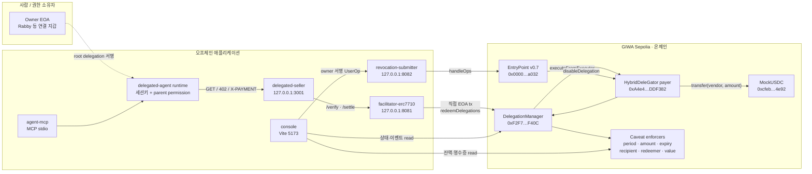
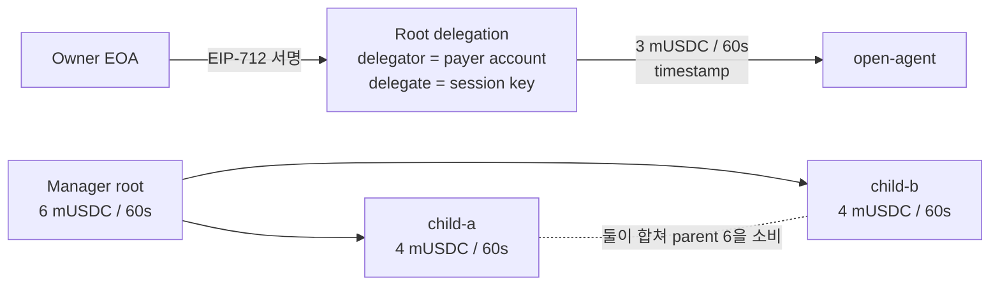
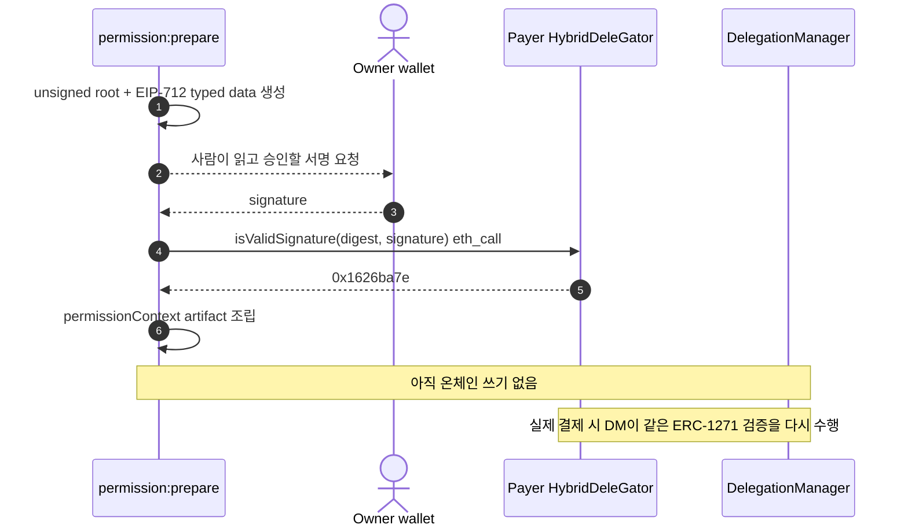
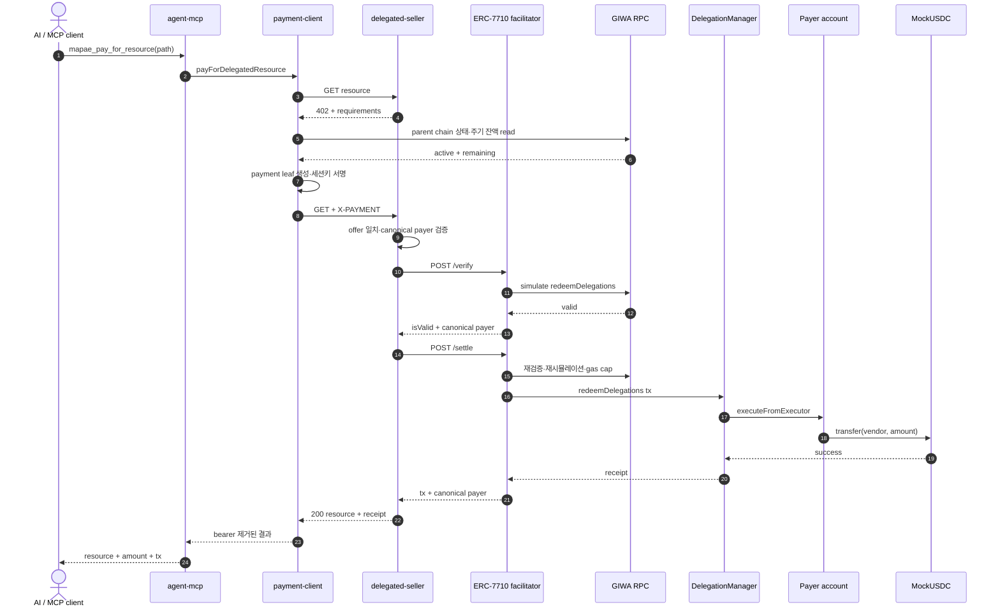
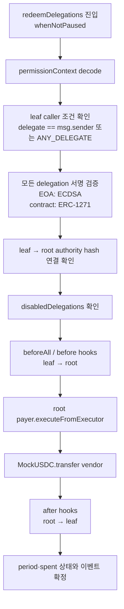
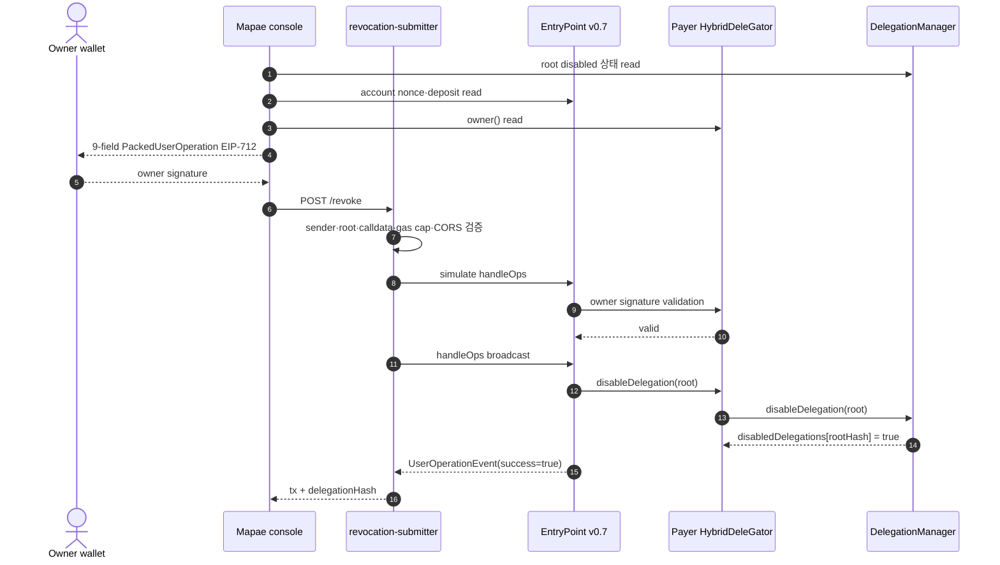

# Mapae 시스템 구조와 전체 실행 흐름

> D7 완료 시점 아카이브 · 2026-07-26  
> 기준: `main` merge commit `f13c6f2`

이 문서는 Mapae를 처음 보는 사람이 저장소 구조, 권한 모델, 오프체인 HTTP 흐름,
온체인 실행, 중복 방지, 회수까지 한 번에 이해하기 위한 스냅샷이다.

현재 코드를 설명하는 문서이며 장기 로드맵을 섞지 않는다. Dojang KYC, EAS 증빙,
프로덕션 원화 스테이블코인, 다중 replica용 영속 원장은 아직 이 실행 경로에 없다.

관련 정본:

- [README 한국어](../../README.ko.md)
- [기술 노트](../tech-notes.md)
- [배포 컨트랙트](../deployed-contracts.md)
- [GIWA 실행 런북](../giwa-demo-runbook.md)
- [회수 런북](../revocation-runbook.md)

---

## 0. 먼저 잡아야 할 한 문장

Mapae는 **사용자의 스마트계정에 자금을 남겨 둔 채**, AI 에이전트에게 금액·기간·
수취인·실행자 제한이 붙은 서명된 권한만 주고, 에이전트가 유료 HTTP 리소스를
요청하면 relayer가 그 권한을 GIWA에서 대신 집행하는 시스템이다.

가장 중요한 치환은 이것이다.

| 일반 자동 결제 봇 | Mapae |
|---|---|
| 에이전트가 자금 든 개인키를 보유 | 자금은 payer 스마트계정에 유지 |
| `MAX_PAYMENT` 같은 코드가 한도를 주장 | 배포된 caveat enforcer가 한도를 강제 |
| 프로세스가 뚫리면 지갑 전체 노출 | 세션키가 뚫려도 서명된 범위까지만 사용 |
| 결제자가 가스 지불 | settlement relayer가 가스 지불 |
| 키를 바꿔야 정지 | owner가 root 위임을 회수 |

### 60초 정신 모델

1. Owner가 스마트계정에서 세션키로 향하는 **root delegation**을 한 번 서명한다.
2. Root에는 `3 mUSDC / 60초`, 만료 시각 같은 상한이 새겨진다.
3. AI 에이전트가 유료 리소스를 요청하고 HTTP `402 Payment Required`를 받는다.
4. 에이전트는 그 결제의 토큰·금액·수취인·facilitator만 허용하는 **1회성 leaf**를 만든다.
5. Seller는 leaf와 root가 든 `permissionContext`를 facilitator에게 검증시킨다.
6. Facilitator relayer가 GIWA의 `DelegationManager.redeemDelegations`를 직접 호출한다.
7. DelegationManager가 모든 서명과 caveat을 검사한 뒤 payer 스마트계정에서 vendor로
   mUSDC를 전송한다.
8. 에이전트는 GIWA ETH를 쓰지 않고 리소스를 받는다.
9. Owner가 root를 회수하면 그 아래에서 만든 모든 leaf가 동시에 막힌다.

---

## 1. 네 프로토콜의 역할을 섞지 않기

Mapae는 하나의 표준이 모든 일을 하는 시스템이 아니다. 네 층이 다른 문제를 해결한다.

| 층 | 답하는 질문 | Mapae에서의 역할 |
|---|---|---|
| MCP | 에이전트가 어떤 행동을 호출하는가? | `mapae_pay_for_resource`라는 자율 결제 도구 |
| x402 v2 | HTTP 리소스가 어떤 결제 증명을 요구하는가? | `402 → X-PAYMENT → resource` 협상 |
| ERC-7710 / Delegation Framework | 에이전트에게 어떤 실행 권한이 있는가? | root·leaf 위임과 온체인 caveat 강제 |
| ERC-4337 EntryPoint v0.7 | Owner 권한의 account operation을 어떻게 실행하는가? | 현재는 **회수 UserOperation**에 사용 |

### 가장 자주 생기는 오해

**결제 정산 자체는 ERC-4337 UserOperation이 아니다.**

Settlement relayer의 EOA가 `DelegationManager.redeemDelegations`를 직접 호출하고
자기 GIWA ETH로 가스를 낸다. Payer 스마트계정은 DelegationManager의
`executeFromExecutor` 호출을 받아 토큰 전송을 실행한다.

ERC-4337 EntryPoint는 현재 다음에 쓰인다.

- HybridDeleGator 스마트계정이 신뢰하는 canonical EntryPoint
- Owner가 `disableDelegation`을 실행하는 회수 UserOperation
- 회수 nonce, 서명 검증, prefund 정산

따라서 “결제 relayer”, “ERC-4337 EntryPoint”, “paymaster”는 같은 것이 아니다.
Mapae는 자체 paymaster를 만들지 않는다.

---

## 2. 전체 배치도



점선은 오프체인 서명 전달, 실선은 네트워크 호출 또는 온체인 호출이다.

---

## 3. 저장소 구조

```text
mapae/
├── contracts/
│   ├── src/MockUSDC.sol
│   ├── script/DeployDelegationFramework.s.sol
│   ├── script/AcceptFrameworkOwnership.s.sol
│   ├── script/DeployOwnerAccount.s.sol
│   └── lib/delegation-framework/       pinned upstream source
│
├── deployments/
│   ├── giwa-sepolia.framework.json     38-unit active deployment 정본
│   ├── giwa-sepolia.framework-manifest.json
│   ├── giwa-sepolia.owner-account.json
│   └── d3-session-addresses.json
│
├── packages/
│   ├── shared/                         chain, token, x402 v2, error model
│   └── delegation/                     policy, signing, leaf, settlement,
│                                       status, revocation, live verification
│
├── apps/
│   ├── delegated-agent/                CLI형 위임 결제 에이전트
│   ├── agent-mcp/                      같은 결제 코어를 MCP tool로 노출
│   ├── delegated-seller/               ERC-7710 402 발행과 resource gate
│   ├── facilitator-erc7710/            verify, simulate, settle, receipt wait
│   ├── revocation-submitter/           owner 서명 UserOp만 전달
│   ├── console/                        위임·한도·영수증·회수 UI
│   └── delegation-lab/                 배포, permission, fork, E2E, 증거
│
├── facilitator/                        D2용 x402-rs 컨테이너
├── apps/agent/ · apps/seller/          D2 EIP-3009 기준선
└── docs/                               기술자료와 운영 런북
```

### 단일 진실 소스

| 정보 | 정본 |
|---|---|
| GIWA chain, CAIP-2 | `packages/shared/src/chain.ts` |
| MockUSDC 주소·EIP-712 도메인 | `packages/shared/src/token.ts` |
| x402 v2 타입 | `packages/shared/src/x402.ts` |
| Framework 주소·상태 | `deployments/giwa-sepolia.framework.json` |
| Owner account | `deployments/giwa-sepolia.owner-account.json` |
| 위임 정책 조립 | `packages/delegation/src/policy.ts` |
| Root 서명 구조 | `packages/delegation/src/signing.ts` |
| Facilitator 경계·intent | `packages/delegation/src/x402.ts` |
| 자율 결제 루프 | `packages/delegation/src/payment-client.ts` |
| 회수 UserOperation | `packages/delegation/src/revocation.ts` |

---

## 4. 역할과 키의 신뢰 경계

| 역할 | 보유 권한 | 가스 | 침해됐을 때 |
|---|---|---:|---|
| Owner EOA | 스마트계정 소유, root 서명, 회수 서명 | 직접 지불하지 않음 | 계정의 최상위 권한이므로 가장 치명적 |
| Payer 스마트계정 | mUSDC 보유, 위임의 root delegator | 결제 시 0 | 키가 아니라 컨트랙트 계정 |
| Agent session key | parent 아래 leaf 생성·서명 | 0 | parent의 금액·기간·수취인 범위로 제한 |
| Settlement relayer | `redeemDelegations` 브로드캐스트 | 지불 | 검열·지연·정확히 승인된 결제 집행 가능, 경로 변경은 caveat이 차단 |
| Revocation relayer | 서명된 `handleOps` 제출 | 선지불 후 EntryPoint 보전 | 허용한 회수 외 UserOp는 submitter가 거절 |
| Vendor / `payTo` | 토큰 수령 | 해당 없음 | 주소일 뿐 키를 seller에 넣지 않음 |
| Deployer | Framework·account 배포 | 지불 | 런타임 정산 권한과 분리 |
| Framework admin | `DelegationManager` ownership·pause | 관리 tx 시 지불 | 전체 Framework 일시정지 가능 |

Settlement relayer와 revocation relayer는 논리적으로 다른 서비스 자격증명이다. 같은
주소를 써야 하는 프로토콜 요구는 없으며 각 앱의 환경변수로 별도 주입할 수 있다.

### 현재 공개 배포 식별자

| 대상 | 값 |
|---|---|
| Network | GIWA Sepolia, chain ID `91342`, CAIP-2 `eip155:91342` |
| MockUSDC | `0xcfeb694719A09caeb80798e2011298F29CDa4e92` |
| DelegationManager | `0xF2F782FafBB278eBe46a4F4004B6d45d125EF40C` |
| EntryPoint v0.7 | `0x0000000071727De22E5E9d8BAf0edAc6f37da032` |
| Payer HybridDeleGator | `0xA4e4d00E5860d3700aF2247fFa818Fb62BDDF382` |
| HybridDeleGator implementation | `0xDd64e5D75aBe21Ea4f2a69c35dA23e09A37D8185` |
| Framework admin | `0x00A7b901abb908ecafEC72973906424c4fDdc100` |
| Deployer | `0x5Ea1FB5f222572c03220356cb2914Da2b5acc0DE` |

Relayer와 vendor는 컨트랙트 배포 상수가 아니라 운영 시점 설정이므로 이 표에 고정하지
않는다.

---

## 5. 온체인 구성

### 5.1 38-unit Delegation Framework

GIWA에는 결정적 주소로 다음 38개 유닛이 배포되어 있다.

- 코어: `DelegationManager`, `SimpleFactory`
- DeleGator 구현체: Hybrid, MultiSig, EIP-7702 Stateless
- P256 검증용 `SCL_RIP7212`
- Caveat enforcer 32개

Canonical EntryPoint는 체인에 이미 있던 표준 주소를 재사용하므로 38개에 포함하지 않는다.
MockUSDC도 Framework 유닛이 아니므로 별도다.

Mapae 결제 정책이 실제로 사용하는 enforcer는 주로 여섯 개다.

| Enforcer | 강제 내용 | 적용 위치 |
|---|---|---|
| `ERC20PeriodTransferEnforcer` | 주기별 누적 ERC-20 상한 | parent |
| `TimestampEnforcer` | 시작·만료 시각 | parent와 leaf |
| `AllowedCalldataEnforcer` | `transfer`의 vendor 주소 고정 | vendor parent, payment leaf |
| `ERC20TransferAmountEnforcer` | token·정확 금액, leaf 누적 1회 한도 | payment leaf |
| `RedeemerEnforcer` | 허용 facilitator만 상환 | payment leaf |
| `ValueLteEnforcer` | native value를 0으로 고정 | payment leaf |

32개 전체를 쓰는 것이 아니다. 감사받은 exact composition과 주소·바이트코드의 출처를
고정하기 위해 전체 조합을 배포했다.

Explorer 소스 상태는 Framework 38개 중 37개 verified이고 한 개가 미검증이다.
MockUSDC까지 합치면 39개 중 38개다. 미검증 유닛은
`SpecificActionERC20TransferBatchEnforcer`이며 Mapae의 단일 ERC-20 결제 정책에는
사용되지 않는다. 반면 실행 바이트코드와 예상 주소 검증은 Framework 38/38이다.

### 5.2 Payer 스마트계정

Payer는 `HybridDeleGator` ERC-1967 프록시다.

- 자금이 실제로 있는 주소다.
- Root delegation의 `delegator`다.
- Root 서명을 ERC-1271 `isValidSignature`로 검증한다.
- `DelegationManager`만 `executeFromExecutor`를 호출할 수 있다.
- `disableDelegation`은 EntryPoint 또는 자기 자신만 호출할 수 있다.

즉 세션키가 토큰 컨트랙트를 직접 호출하는 것이 아니다. DelegationManager가 권한을
검증한 뒤 payer 계정에게 실행을 요청한다.

---

## 6. 권한 생성: Owner에서 Agent까지

### 6.1 Root delegation

Root는 “이 세션키가 어디까지 쓸 수 있는가”를 정의한다.

기본 open-agent 정책:

- MockUSDC
- 3 mUSDC
- 60초 주기
- 기본 30분 만료
- 시작 시각 이전 사용 금지

Vendor 정책은 여기에 고정 수취인 caveat을 더한다. Team manager는 child에게 다시
위임할 수 있고, child의 개별 상한과 manager의 합산 상한을 모두 소비한다.



### 6.2 Root는 “등록 트랜잭션”이 아니다

Root delegation 구조체와 서명은 오프체인 permission artifact로 보관된다.
권한을 만들 때마다 체인에 등록하는 트랜잭션은 없다.

서명 도메인:

```text
name              DelegationManager
version           1
chainId           91342
verifyingContract 0xF2F782FafBB278eBe46a4F4004B6d45d125EF40C
primaryType       Delegation
```

Owner EOA가 Rabby 같은 지갑에서 EIP-712 데이터에 서명하지만, delegation의
`delegator`는 payer 스마트계정이다. 나중에 DelegationManager가 root를 검증할 때
delegator에 코드가 있음을 보고 payer 계정의 ERC-1271을 호출한다. Payer 계정은 그
서명이 자기 owner EOA의 것인지 확인한다.



### 6.3 Payment-specific leaf

Root는 재사용 가능한 상위 권한이다. 실제 결제마다 에이전트가 그 아래에 leaf를 새로
만든다.

Leaf에는 다음이 고정된다.

- 정확한 token
- 정확한 결제 금액
- 정확한 `payTo`
- 허용 facilitator/redeemer
- native value `0`
- 짧은 만료
- parent permission hash

Leaf의 `delegate`는 Framework의 `ANY_DELEGATE`다. 그래서 관찰자 누구나 실행할 수 있는
것처럼 보이지만 `RedeemerEnforcer`가 실제 호출자를 허용 facilitator로 제한한다.
이 때문에 서명된 `permissionContext`는 bearer authorization으로 취급해야 한다.

### 6.4 permissionContext 배열 순서

Delegation chain은 **leaf-first, root-last**다.

```text
직접 위임: [payment leaf, owner-signed root]
재위임:    [payment leaf, child delegation, manager/owner root]
```

따라서 신뢰할 payer는 별도 JSON 필드에서 얻지 않는다.

```text
canonicalPayer = decodeDelegations(permissionContext).at(-1).delegator
```

Wire의 `payload.delegator`는 주장일 뿐이며 `canonicalPayer`와 같은지 검사하는 용도로만
쓴다. 영수증과 정산 결과에는 canonical payer를 사용한다.

---

## 7. 오프체인 결제 전체 흐름

### 7.1 서비스 시작 시

Agent, seller, facilitator는 단순히 주소 문자열만 믿고 시작하지 않는다.

- 배포 artifact와 manifest 파싱
- exact Framework composition 확인
- manager owner와 pause 상태 확인
- 예상 admin 확인
- facilitator `/supported`의 GIWA signer 확인
- 세션키가 parent permission의 delegate인지 확인
- RPC·seller·facilitator URL의 scheme과 origin 확인

Agent runtime은 네트워크를 필요로 하므로 lazy load한다. 초기화 실패를 프로세스 종료로
숨기지 않고 MCP tool 결과의 `RUNTIME_UNAVAILABLE` 사유로 돌려준다. 성공한 runtime만
캐시하므로 설정을 고친 뒤 재시작 없이 복구할 수 있다.

### 7.2 x402 v2 협상

첫 요청에는 결제 헤더가 없다.

```json
{
  "x402Version": 2,
  "resource": {
    "url": "/delegated/deliverable/inv-001",
    "mimeType": "application/json"
  },
  "accepts": [{
    "scheme": "exact",
    "network": "eip155:91342",
    "amount": "1000000",
    "payTo": "<vendor>",
    "asset": "0xcfeb694719A09caeb80798e2011298F29CDa4e92",
    "extra": {
      "assetTransferMethod": "erc7710",
      "facilitatorAddresses": ["<redeemer>"]
    }
  }]
}
```

에이전트는 다음을 검증한다.

- x402 version이 2인지
- `scheme=exact`, `network=eip155:91342`인지
- asset과 amount가 유효한지
- seller가 광고한 facilitator와 로컬 신뢰 목록이 겹치는지
- 요청 경로가 seller의 같은 origin 안에 있는지
- redirect가 없는지

### 7.3 서명 전 preflight

Agent는 parent chain의 모든 delegation에 대해 enforcer 상태를 읽는다.

1. 회수됐는가
2. 시작 전이거나 만료됐는가
3. 현재 주기 잔액이 얼마인가
4. 모든 parent·child 중 가장 작은 잔액으로 이번 금액을 낼 수 있는가

이 검사는 보안의 최종 방어선이 아니다. 온체인 enforcer가 같은 내용을 다시 강제한다.
목적은 실패하기 전 정확한 이유를 돌려주고, 어차피 실패할 bearer leaf를 만들지 않는
것이다.

### 7.4 한 번의 MCP 호출이 끝나는 순서



Agent 자신은 트랜잭션을 브로드캐스트하지 않는다.

### 7.5 Wire에 실리는 결제 증명

두 번째 요청의 `X-PAYMENT`는 base64 JSON이며 핵심 형태는 다음과 같다.

```json
{
  "x402Version": 2,
  "accepted": "<seller가 제시한 requirements 전체>",
  "payload": {
    "delegationManager": "0xF2F782FafBB278eBe46a4F4004B6d45d125EF40C",
    "permissionContext": "<payment leaf + parent chain>",
    "delegator": "0xA4e4d00E5860d3700aF2247fFa818Fb62BDDF382"
  }
}
```

Seller가 facilitator에게 보내는 봉투는 다음 셋을 함께 담는다.

```text
x402Version
paymentPayload
paymentRequirements
```

Facilitator는 `paymentPayload.accepted`와 seller의 `paymentRequirements`가 필드 단위로
정확히 같은지 검사한다. JSON 문자열 해시나 필드 순서에 의존하지 않는다.

---

## 8. Facilitator의 오프체인 신뢰 경계

### 8.1 canonical payer

Facilitator는 `permissionContext`를 디코드하고 마지막 root의 `delegator`를 payer로
선택한다. 별도 `payload.delegator`는 반드시 이 값과 일치해야 한다.

그 결과 공격자가 정상 permission context에 다른 payer 주소를 붙여도 다음이
불가능하다.

- 가짜 payer 영수증 생성
- 다른 계정의 결제로 회계 귀속
- payer를 바꿔 별도 settlement identity 생성

### 8.2 paymentIntentId

Facilitator의 off-chain idempotency key는 다음 필드를 ABI 인코딩한 domain-separated
해시다.

```text
keccak256(
  domain = keccak256("mapae.erc7710.payment-intent.v1"),
  network,
  asset,
  amount,
  payTo,
  delegationManager,
  keccak256(permissionContext)
)
```

이 값은 온체인에서 발급되는 ID가 아니다. Facilitator가 동일 결제 의도를 식별하기 위한
오프체인 canonical key다.

포함되는 것:

- 체인
- 토큰과 금액
- 수취인
- manager
- 서명된 leaf·parent 전체

포함되지 않는 것:

- 리소스 URL이나 invoice ID
- 사업 의미상의 주문 번호

따라서 같은 `permissionContext`의 동시 요청은 같은 intent지만, 에이전트가 새 leaf를
다시 서명하면 새 intent다.

### 8.3 중복 방지의 세 층

| 층 | 방어 |
|---|---|
| 동시에 들어온 같은 intent | `PaymentIntentSingleFlight`가 Promise 하나로 합침 |
| 브로드캐스트 후 receipt timeout | intent → tx hash를 1시간 메모리에 먼저 기록 |
| 같은 payment leaf 온체인 재사용 | `ERC20TransferAmountEnforcer.spentMap`이 정확 금액을 이미 소비해 revert |

한계도 분명하다.

- Single-flight와 intent → tx map은 **프로세스 메모리**다.
- 여러 facilitator replica 사이에는 공유되지 않는다.
- 프로세스 재시작 후 pending tx를 복구하는 영속 원장이 없다.
- 새 leaf를 다시 만든 것은 동일 invoice인지 프로토콜이 알지 못한다.

그래서 `SETTLEMENT_UNKNOWN`에서는 자동 재시도하지 않는다. 프로덕션 다중 replica 전에
intent와 tx hash를 Redis나 Postgres 같은 durable store로 옮겨야 한다.

### 8.4 `/verify`와 `/settle`

`/verify`:

1. Framework가 active이고 예상 admin인지 확인
2. 요청 크기·network·asset·amount·manager·payer 검증
3. GIWA 현재 상태에 `redeemDelegations` 시뮬레이션
4. 예상 gas가 cap 이하인지 확인
5. 체인 쓰기 없이 `isValid=true`와 canonical payer 반환

`/settle`:

1. 같은 검증을 다시 수행
2. 같은 intent를 single-flight로 합침
3. **브로드캐스트 직전 다시 시뮬레이션**
4. relayer EOA로 transaction 전송
5. tx hash를 receipt 대기보다 먼저 기억
6. 1 confirmation receipt 확인

Verify와 settle 사이에 주기 잔액, pause, 회수 상태가 바뀔 수 있기 때문에 재시뮬레이션은
중복이 아니라 필수다.

---

## 9. 온체인에서 실제로 일어나는 일

Facilitator relayer가 다음을 호출한다.

```text
DelegationManager.redeemDelegations(
  permissionContexts = [leaf-first delegation chain],
  modes             = [SingleDefault],
  executionCallData = [MockUSDC.transfer(payTo, amount)]
)
```

### 9.1 DelegationManager 내부 순서



한 단계라도 revert하면 토큰 전송과 enforcer 상태 변경이 같은 트랜잭션에서 전부
되돌아간다.

### 9.2 서명 검증

DelegationManager는 각 delegation의 `delegator`를 본다.

- 코드가 없으면 EOA로 보고 ECDSA 복구
- 코드가 있으면 ERC-1271 `isValidSignature`

Payment leaf는 session EOA가 서명한다. Root는 payer 스마트계정이 delegator이므로
ERC-1271 경로로 들어가 owner EOA 서명을 검증한다.

### 9.3 권한 연결

각 child/leaf의 `authority`는 바로 위 parent delegation hash여야 한다. 마지막 root의
authority는 `ROOT_AUTHORITY`여야 한다.

```text
leaf.authority  == hash(parent)
parent.authority == ROOT_AUTHORITY
```

Manager → child 재위임이면 모든 중간 링크가 같은 방식으로 이어진다.

### 9.4 Caveat 실행

실행 calldata 자체는 delegation 서명에 직접 포함되지 않는다. Facilitator가
`redeemDelegations` 호출 시 `_executionCallDatas`를 공급한다. 그래서 침해된
facilitator가 calldata를 바꾸려 할 수 있고, **leaf caveat이 실제 보안 경계**다.

| 변조 시도 | 차단 장치 |
|---|---|
| vendor 대신 facilitator에게 지급 | `AllowedCalldataEnforcer` |
| 금액 부풀리기 | `ERC20TransferAmountEnforcer` |
| `transfer` 대신 `approve` | `ERC20TransferAmountEnforcer` selector 검사 |
| 다른 token/contract 호출 | `ERC20TransferAmountEnforcer` target 검사 |
| native value 끼워 넣기 | `ValueLteEnforcer` |
| 다른 사람이 bearer context 실행 | `RedeemerEnforcer` |
| 같은 leaf 재실행 | leaf `spentMap` |
| 주기 누적 상한 초과 | `ERC20PeriodTransferEnforcer` |
| 만료 후 실행 | `TimestampEnforcer` |
| 회수된 parent 사용 | `disabledDelegations` |

### 9.5 실제 자금 이동

DelegationManager는 chain의 root delegator, 즉 payer 스마트계정에
`executeFromExecutor`를 호출한다. Payer 계정이 MockUSDC에 다음 실행을 보낸다.

```text
target   = MockUSDC
value    = 0
calldata = transfer(payTo, amount)
```

토큰의 `msg.sender`는 payer 스마트계정이므로 vendor가 받는 mUSDC는 payer 계정 잔액에서
나간다. Relayer는 토큰을 보관하거나 중간에 받지 않는다.

### 9.6 누가 가스를 내는가

결제 transaction의 서명자와 `msg.sender`는 settlement relayer다.

- Payer mUSDC: 결제액만큼 감소
- Vendor mUSDC: 결제액만큼 증가
- Payer GIWA ETH: 변하지 않음
- Relayer nonce: 1 증가
- Relayer GIWA ETH: gas만큼 감소

이것이 “payer gasless”의 정확한 뜻이다. 가스가 사라진 것이 아니라 다른 역할이 낸다.

---

## 10. Seller가 리소스를 내주는 조건

Seller는 다음 순서를 모두 통과해야만 HTTP 200 리소스를 반환한다.

1. `X-PAYMENT`가 x402 v2 ERC-7710 형태로 디코드됨
2. Header의 `accepted`가 seller가 방금 제시한 requirements와 정확히 일치
3. Signed root에서 canonical payer 도출
4. Wire의 claimed delegator와 canonical payer 일치
5. Facilitator `/verify`가 `isValid=true`와 같은 payer 반환
6. Facilitator `/settle`가 success와 같은 payer 반환

Seller는 facilitator의 응답 body를 그대로 영수증으로 반사하지 않는다. 자기가 검증한
network, payer, amount, asset, payTo와 검증된 tx hash로 응답을 다시 조립한다.

에이전트도 seller를 완전히 신뢰하지 않는다.

- Redirect 거부
- 실패 응답 body를 읽지 않음
- Seller가 raw `permissionContext`나 `X-PAYMENT`를 성공 body에 반사하면 redaction
- 오직 2xx 응답만 구매한 리소스로 반환

---

## 11. 정상·거절·불명확 결과

결제 결과는 성공/실패 두 값으로 줄일 수 없다.

| 결과 | HTTP/agent 의미 | 돈의 상태 | 대응 |
|---|---|---|---|
| Settled | 200, resource + receipt | 이동 확인 | 완료 |
| Verification rejected | 403 | 브로드캐스트 전, 불변 | caveat·서명·offer 원인 수정 |
| Settlement failed | 422 | 알려진 실패 | 원인 확인 후 새 요청 가능 |
| Settlement unknown | 504 또는 연결 단절 | **이미 이동했을 수 있음** | **재시도 금지**, tx/잔액 확인 |

### `SETTLEMENT_UNKNOWN`이 별도 상태인 이유

GIWA에서 실제 D5 tx가 채굴됐지만 바깥 HTTP timeout이 먼저 끝나 호출자가 “거절”로
오해한 사건이 있었다. 그 상태에서 자동 재시도하면 새 leaf로 두 번 낼 수 있다.

현재 timeout은 안쪽에서 바깥쪽으로 증가한다.

```text
facilitator receipt 25s
seller → facilitator settle 35s
seller HTTP idle 45s
MCP agent request 50s
```

그래도 네트워크는 불확실할 수 있으므로 unknown 상태 자체는 없애지 않는다.

---

## 12. 대표 실패가 어디서 막히는가

| 상황 | 최초 판정 위치 | 결과 |
|---|---|---|
| Seller 금액·asset·network 위조 | Agent offer validation | 서명 전 거절 |
| 신뢰하지 않는 facilitator | Agent allowlist 교집합 | 서명 전 거절 |
| parent가 회수·만료됨 | Agent preflight, 최종적으로 DM | `PERMISSION_INACTIVE` 또는 on-chain revert |
| 현재 주기 잔액 부족 | Agent preflight, 최종적으로 period enforcer | `LIMIT_EXCEEDED` |
| Claimed payer 바꿔치기 | Seller/facilitator canonical payer 검사 | malformed/rejected |
| Vendor 주소 변경 | leaf `AllowedCalldataEnforcer` | `invalid-calldata` |
| 금액 부풀리기 | leaf amount enforcer | `allowance-exceeded` |
| 같은 leaf 재사용 | leaf `spentMap` | `allowance-exceeded` |
| 주기 합산 초과 | parent period enforcer | `transfer-amount-exceeded` |
| 만료 후 상환 | timestamp enforcer | `expired-delegation` |
| Framework 전체 pause | readiness gate와 DM `whenNotPaused` | settle 전 정지 |
| Relayer ETH 부족 | health/preflight | 운영 오류 |
| Receipt 확인 timeout | facilitator/seller/agent | `SETTLEMENT_UNKNOWN` |

---

## 13. 회수 전체 흐름

회수는 parent root delegation hash를 `DelegationManager.disabledDelegations`에 기록하는
작업이다. Root가 모든 payment leaf 아래에 있으므로 root 하나를 끄면 그 권한에서 파생된
결제가 전부 멈춘다.

### 13.1 왜 relayer가 직접 회수할 수 없는가

`DelegationManager.disableDelegation`은 해당 delegation의 delegator만 호출할 수 있다.
Root delegator는 payer 스마트계정이다.

Payer 계정의 `disableDelegation`은 `onlyEntryPointOrSelf`다. 따라서 relayer EOA가
직접 호출할 수 없고 owner가 승인한 UserOperation을 EntryPoint로 보내야 한다.

### 13.2 회수 시퀀스



### 13.3 UserOperation에 서명되는 아홉 필드

```text
sender
nonce
initCode
callData
accountGasLimits
preVerificationGas
gasFees
paymasterAndData
entryPoint
```

`callData`는 해당 root의 `disableDelegation(root)`와 바이트 단위로 같아야 한다.
Submitter는 다음을 추가로 강제한다.

- 지정 payer account 한 개만 허용
- root delegator가 sender와 일치
- `initCode=0x`
- `paymasterAndData=0x`
- call/verification/preVerification gas cap
- fee cap과 priority fee 관계
- signature가 비어 있지 않음
- EntryPoint deposit 충분
- 현재 base fee보다 `maxFeePerGas`가 낮지 않음
- revocation relayer 잔액 충분

서명 자체는 오프체인 `ecrecover`로 대신 판단하지 않는다. HybridDeleGator가 ERC-1271
계정이므로 EntryPoint simulation과 계정의 검증 결과가 권위다.

### 13.4 회수의 가스 모델

결제와 회수의 가스 모델은 다르다.

| | 결제 | 회수 |
|---|---|---|
| 진입점 | DelegationManager 직접 호출 | EntryPoint `handleOps` |
| 선지불 | Settlement relayer | Revocation relayer |
| 최종 부담 | Settlement relayer | Payer의 EntryPoint deposit |
| Payer 지갑 ETH | 0 유지 | 0 유지 가능 |

EntryPoint deposit이 없으면 `AA21`로 실패한다. 현재 GIWA payer 계정의 deposit은 0이며,
따라서 live 회수 버튼은 arming 전 비활성이다. Relayer가 `depositTo(payer)`로 미리
채울 수 있지만 그 예치금은 payer 계정에 귀속된다.

### 13.5 회수의 현재 증거 수준

회수 경로는 실제 GIWA 상태와 배포 바이트코드를 복제한 pinned fork에서 검증됐다.

- owner-signed UserOperation
- CORS preflight
- submitter validation
- simulate → `handleOps`
- `UserOperationEvent.success`
- 이후 동일 payment 거절
- replay nonce `AA25`
- 잘못된 owner signature `AA24`

아직 GIWA에 live revocation tx는 없고 실제 지갑이 아홉 필드를 사람에게 어떻게
렌더링하는지도 마지막 수동 검증 대상으로 남아 있다. 이는 D6/D7 기술 게이트 완료와
실제 자산 운영 GO를 구분하는 경계다.

Framework 전체 비상정지는 admin의 `DelegationManager.pause()`다. 개별 회수 deposit이
준비되지 않았을 때도 사용할 수 있는 별도 백스톱이다.

---

## 14. 콘솔은 무엇을 읽는가

콘솔에는 별도 사용자 DB나 결제 원장이 없다.

| 화면 | 온체인 출처 |
|---|---|
| Root 정보 | `permissionContext`를 디코드한 root |
| 현재 주기 잔액 | `ERC20PeriodTransferEnforcer.getAvailableAmount` |
| 시작·만료 | caveat terms + 최신 체인 시각 |
| 회수 여부 | `DelegationManager.disabledDelegations` |
| 회수 준비 | payer `owner()`, EntryPoint nonce·deposit |
| 영수증 | `TransferredInPeriod` 이벤트 |

영수증의 개별 결제액은 period running total의 전후 차이로 계산한다. 기본 조회창은
50,000블록이며 GIWA RPC의 100,000블록 `eth_getLogs` 한도를 넘지 않는다. 이 화면은
현재 페이징하지 않으므로 UI가 조회 시작 시각과 잘릴 수 있음을 직접 표시한다.

---

## 15. 상태는 어디에 저장되는가

### 온체인

| 상태 | 위치 |
|---|---|
| mUSDC 잔액 | MockUSDC |
| Root·leaf 주기 누적 | `ERC20PeriodTransferEnforcer` |
| Payment leaf 정확 금액 소비 | `ERC20TransferAmountEnforcer.spentMap` |
| 회수 여부 | `DelegationManager.disabledDelegations` |
| 회수 nonce·예치금 | EntryPoint |
| 정산 영수증 원천 | transaction receipt + enforcer events |
| Framework 전체 정지 | `DelegationManager.paused` |

### 오프체인 파일·메모리

| 상태 | 위치 |
|---|---|
| Owner-signed parent permission | gitignored permission artifact |
| Session private key | `.env` / `.secrets`, Git 제외 |
| Relayer private key | 각 facilitator/submitter `.env`, Git 제외 |
| Seller `payTo` | 환경변수의 공개 주소 |
| 동시 settlement | facilitator 프로세스의 single-flight map |
| intent → broadcast tx | facilitator 메모리, 1시간 |
| Demo evidence | gitignored evidence JSON 후 선별 문서화 |

Root permission은 DB 레코드가 아니라 서명된 capability다. 파일을 잃으면 권한을 사용할 수
없지만, 파일을 복사한 사람은 세션키와 함께 bearer 권한을 사용할 수 있다. 그래서
permission context와 signature를 로그·MCP transcript·HTTP 오류 body에 남기지 않는다.

---

## 16. D2 기준선과 D3–D5 제품 경로의 차이

Mapae는 두 결제 rail을 유지한다.

### D2: EIP-3009 + x402-rs

```text
agent EOA signs transferWithAuthorization
  → seller
  → x402-rs facilitator
  → MockUSDC.transferWithAuthorization
```

- Agent가 payer key를 직접 가진다.
- EIP-3009 서명에 `from`, `to`, `value`, 유효창, nonce가 고정된다.
- Token의 authorization nonce가 replay를 막는다.
- Relayer가 가스를 내므로 payer는 gasless다.
- x402 v2 wire와 가스리스 exact 정산의 기준선이다.

### D3–D5: ERC-7710 delegated payment

```text
owner smart account funds
  → reusable bounded parent delegation
  → payment-specific leaf
  → ERC-7710 facilitator
  → DelegationManager + enforcers
```

- Agent는 payer key가 아니라 session key를 가진다.
- Parent의 기간·주기 상한이 여러 결제에 걸쳐 누적된다.
- Leaf가 매 결제의 금액·vendor·facilitator를 좁힌다.
- Owner가 root 하나를 회수할 수 있다.
- 이 경로가 Mapae 제품의 본체다.

x402는 두 경로의 HTTP 협상 틀이고, 자산 집행 방식이 EIP-3009에서 ERC-7710으로
달라진다.

---

## 17. 침해 시 최대 피해

### Session key 침해

공격자는 유효한 parent 아래에서 leaf를 만들 수 있다. 그러나 다음을 넘을 수 없다.

- parent 주기 상한
- parent 만료
- 고정 vendor parent라면 그 vendor
- Framework pause·root revocation

Open-agent parent는 수취인이 자유롭다. 따라서 session key 침해 시 공격자가 자기 vendor를
선택해 남은 주기 한도까지 쓸 수 있다. Open profile의 개방성과 정확히 같은 위험이다.
제품 환경에서는 vendor allowlist나 더 짧은 TTL을 선택할 수 있다.

### Facilitator 침해

Facilitator는 이미 올바른 redeemer이므로 “낯선 호출자 차단”만으로는 충분하지 않다.
그래도 caveat 때문에 다음은 못 한다.

- 자기 주소로 경로 변경
- 금액 부풀리기
- approve로 전환
- 다른 token 호출
- native value 인출
- payer 계정 self-call로 회수 복구·예치금 인출·upgrade 진입
- 주기 한도·만료 우회

가능한 것은 다음이다.

- 정산 거부
- 만료창 안에서 지연·순서 조작
- 이미 서명된 정확 금액을 정확 vendor에게 실행
- Seller가 리소스를 주지 않아도 승인된 payment를 집행

즉 facilitator에는 가용성과 실행 시점은 맡기지만 자금의 목적지와 상한은 맡기지 않는다.

### Seller 침해

Seller는 잘못된 offer를 제시하거나 리소스를 주지 않을 수 있다. Agent는 chain·asset·
facilitator·origin을 검증하지만 “리소스 품질”을 온체인에서 판정하지 않는다.
Mapae MVP는 기계적으로 판정 가능한 API/resource 구매를 가정한다.

### Owner 또는 Framework admin 침해

- Owner 침해: 새 root를 서명하거나 account operation을 승인할 수 있어 최상위 위험
- Admin 침해: Framework pause 등 관리 권한 행사 가능

두 역할은 agent·relayer보다 강하며 운영 환경에서 키 보관과 역할 분리가 필요하다.

---

## 18. 실제 증거와 완료 상태

| 단계 | 증명 | 수준 |
|---|---|---|
| D1 | MockUSDC + x402-rs 연결 | GIWA |
| D2 | EIP-3009 `402 → settle → resource` | GIWA tx `0xc9ab58de064e88776cf2681851849cb4d79ad5c443d2675c60cbdd6ffaa3b7a9` |
| D3/D4 | Framework·payer 배포, root ERC-1271, 위임 정산 | GIWA |
| D4 정상 1 mUSDC | gasless settlement | GIWA tx `0xe897fe55048b91c0f6728d0af313e30db2b425af8955ee89f7174a16c6aaa97d` |
| D4 정상 2.5 mUSDC | 같은 parent의 추가 settlement | GIWA tx `0x71d7144213a04ae7b463f1c0e2b021c672938f10c7d92d5d4fe367e532f46ce4` |
| D4 초과·만료 | 배포 enforcer revert | GIWA state 대상 `eth_call`, broadcast 없음 |
| D5 | MCP 1회, 사람 개입 0, payer gas 0 | GIWA tx `0x533c5cb2945b89c7a56abf681ef049124deb4daf141e1a52b280385cefd9964c` |
| D6 | 콘솔·회수 submitter·UserOp | pinned GIWA fork, live tx 없음 |
| D7 | 문서·로깅·advisory·수치 gate, 보안 반례 | `main` CI 성공 |

D7 완료 시점 검증:

- TypeScript 375
- Foundry 14
- Hermetic negative path 23/23
- GIWA fork negative path 23/23
- Revocation submitter E2E 8/8
- Framework runtime/address 38/38
- Explorer source 38/39, 미검증 1개는 미사용 upstream revision artifact

### 이 완료가 뜻하지 않는 것

- Live GIWA revocation 완료
- 실제 지갑 승인 화면의 사람 대상 검증 완료
- 프로덕션 원화 스테이블코인 동작 검토 완료
- 다중 replica durable idempotency 완료
- Dojang/EAS 경로 완료

따라서 **D1–D7 기술 범위는 완료**지만 실제 자산 production GO는 별도 판정이다.

---

## 19. 한 건의 결제를 숫자로 따라가기

조건:

- Payer 스마트계정: 10 mUSDC, GIWA ETH 0
- Root: 3 mUSDC / 60초
- 현재 주기 소비: 0
- Seller 가격: 1 mUSDC

순서:

1. Agent가 1 mUSDC offer를 받는다.
2. Enforcer가 답한 남은 잔액 3 mUSDC를 확인한다.
3. 1 mUSDC·vendor·facilitator가 고정된 leaf를 서명한다.
4. `/verify` simulation이 성공한다. 상태 변화는 없다.
5. `/settle`이 재시뮬레이션 후 tx를 보낸다.
6. Parent period 상태가 `0 → 1 mUSDC`로 바뀐다.
7. Leaf exact amount 상태가 `0 → 1 mUSDC`로 바뀌어 같은 leaf 재사용이 막힌다.
8. Payer 잔액은 9 mUSDC, vendor는 1 mUSDC 증가한다.
9. Payer ETH는 0 그대로다.
10. Seller가 리소스와 tx 영수증을 준다.

같은 60초 주기에서 새 leaf로 2.5 mUSDC를 시도하면 parent 누적이 3.5가 되므로
`ERC20PeriodTransferEnforcer:transfer-amount-exceeded`로 `/verify` 단계에서 막힌다.
실패 tx를 브로드캐스트하지 않으므로 자금과 relayer gas가 보존된다.

60초가 지나면 parent의 새 period가 시작되어 주기 잔액이 다시 계산된다. Root가
만료됐거나 disabled라면 주기가 바뀌어도 사용할 수 없다.

---

## 20. 코드 읽는 순서

전체 구현을 직접 확인하려면 다음 순서가 가장 짧다.

1. `packages/shared/src/x402.ts` — wire format
2. `packages/delegation/src/policy.ts` — parent caveat
3. `packages/delegation/src/signing.ts` — owner·manager 서명
4. `packages/delegation/src/agent-runtime.ts` — runtime·preflight
5. `packages/delegation/src/payment-client.ts` — 자율 HTTP loop
6. `packages/delegation/src/x402.ts` — canonical payer·intent·execution
7. `apps/delegated-seller/index.ts` — resource gate
8. `apps/facilitator-erc7710/index.ts` — simulate·single-flight·settle
9. `DelegationManager.sol` — 실제 authority·hook·execution 순서
10. `packages/delegation/src/revocation.ts` — owner UserOperation
11. `packages/delegation/src/revocation-submission.ts` — submitter boundary
12. `apps/console/src/App.tsx` — chain read model

재현 명령과 운영 안전장치는 [GIWA 실행 런북](../giwa-demo-runbook.md)과
[회수 런북](../revocation-runbook.md)을 따른다.

---

## 21. 용어 사전

| 용어 | 이 문서에서의 뜻 |
|---|---|
| Payer | 실제 mUSDC가 빠져나가는 root 스마트계정 |
| Owner | Payer 스마트계정을 제어하는 사람의 EOA |
| Delegator | 특정 delegation에서 권한을 주는 주소 |
| Delegate | 권한을 받는 다음 주소 또는 `ANY_DELEGATE` |
| Root delegation | Payer가 session/manager에게 준 최상위 권한 |
| Parent permission | Agent가 leaf를 만들 때 기반으로 쓰는 서명된 chain |
| Payment leaf | 특정 결제 한 건으로 권한을 좁힌 최하위 delegation |
| permissionContext | leaf-first, root-last delegation chain의 ABI encoding |
| Caveat | delegation 실행 전에 온체인 enforcer가 검사하는 제약 |
| Redeemer | DelegationManager에 권한을 상환해 실행시키는 호출자 |
| Facilitator | verify·settle API와 settlement relayer를 운영하는 서비스 |
| canonical payer | Signed permissionContext의 마지막 root delegator |
| paymentIntentId | 동일한 off-chain 결제 의도를 합치기 위한 canonical hash |
| Settlement | 검증된 권한으로 실제 토큰 전송 tx를 실행하는 단계 |
| UserOperation | EntryPoint가 account 대신 실행하는 서명된 ERC-4337 operation |
| Prefund | EntryPoint가 UserOperation gas를 보전받기 위해 account deposit에서 확보하는 값 |
| Settlement unknown | tx가 갔을 수 있지만 결과를 확인하지 못한 상태 |

---

## 마지막 요약

Mapae의 제품 가치는 “AI가 결제한다” 자체가 아니다. 일반 자동화도 결제는 할 수 있다.

핵심은 다음 세 문장이 동시에 참이라는 점이다.

1. **AI 에이전트가 사람 없이 결제를 시작한다.**
2. **자금은 에이전트가 아니라 사용자의 스마트계정에 있다.**
3. **에이전트가 쓸 수 있는 최대 범위는 애플리케이션 약속이 아니라 GIWA의 enforcer가
   강제한다.**

x402는 결제를 요청하고 증명을 운반한다. ERC-7710 delegation은 권한을 표현한다.
DelegationManager와 caveat enforcer는 그 권한의 한계를 실행한다. Relayer는 가스를
대신 내지만 자금을 보관하지 않는다. Owner는 root를 회수해 전체 하위 권한을 멈춘다.

그 결합이 Mapae다.
