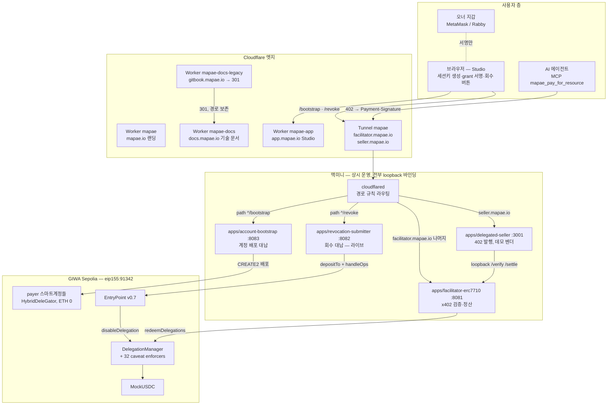
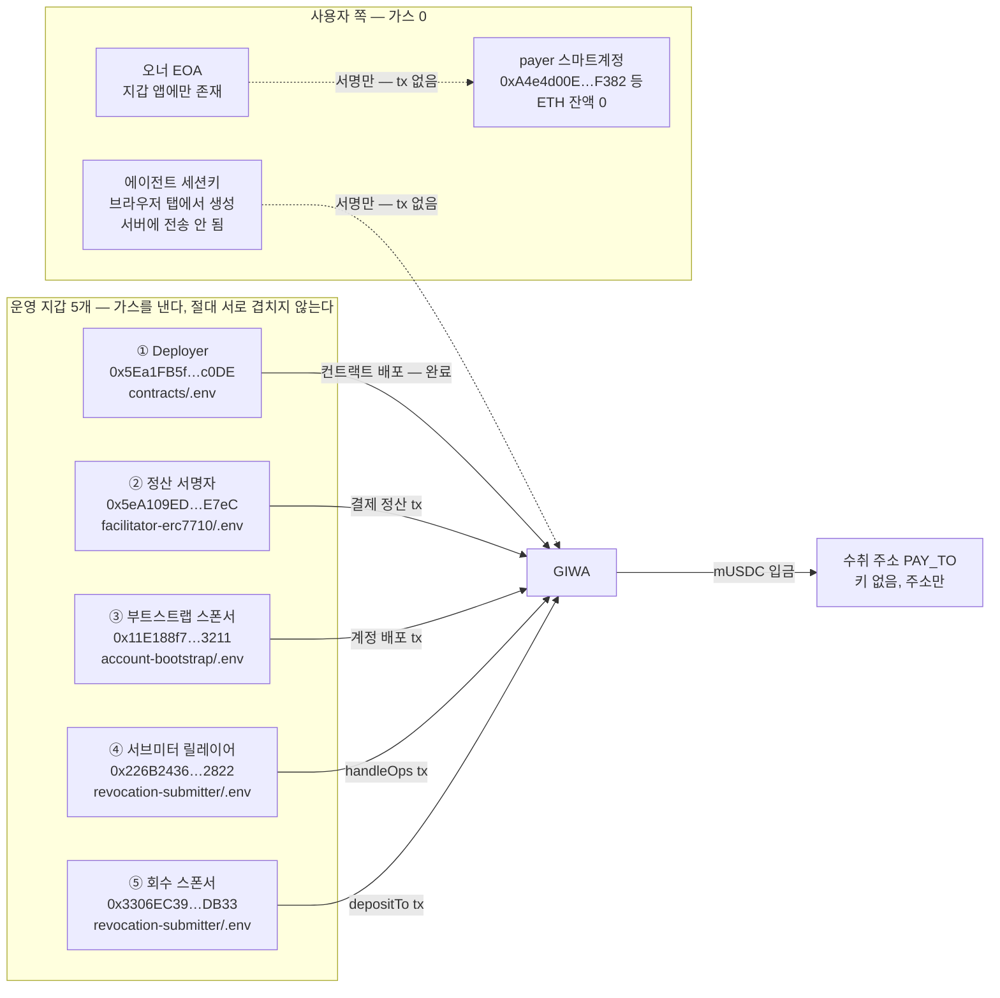
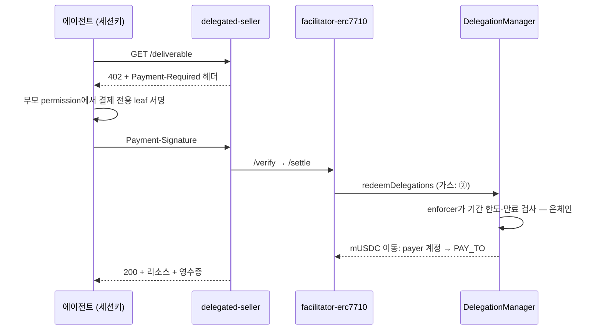
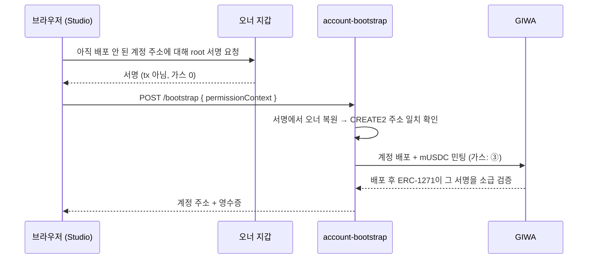
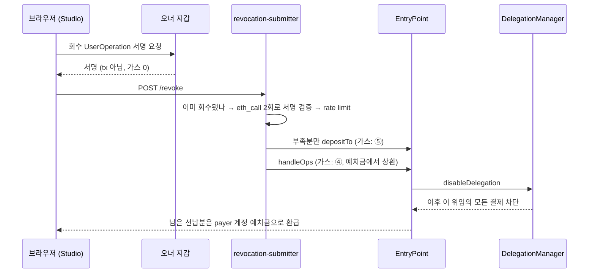

# 마패 인프라 지도 — 머신 · 서비스 · 지갑 · 흐름

이 문서는 한 가지 질문에 답한다: **어떤 지갑이 어디에 있고, 어떤 서비스가 무엇을
하며, 누가 가스를 내는가.** 지갑 변수명은 전역 규약을 따른다 — 지갑 하나에 이름
하나, 어느 파일에서든 같은 이름은 같은 지갑이다.

주소·포트·경로는 전부 이 저장소와 GIWA 체인에 이미 공개된 값이다. 상태 표기는
2026-08-04 기준이다.

---

## 0. 세 줄 정신 모델

1. **가스를 내는 지갑은 운영 지갑 5개뿐이고, 서로 절대 겹치면 안 된다.**
   겹치는 순간 한쪽 장애가 다른 쪽 장애가 된다 — 그래서 코드가 부팅 시점에 거부한다.
2. **사용자 쪽 세 identity(오너 지갑, payer 스마트계정, 에이전트 세션키)는 가스를
   한 푼도 내지 않는다.** 그게 제품이다. payer 계정의 ETH 잔액은 설계상 정확히 0이다.
3. **지갑 하나 = 변수명 하나, 어느 파일에서든 동일.** `FACILITATOR_SIGNER_ADDRESS`는
   어디에 적혀 있든 정산 서명자이고, `REVOCATION_RELAYER_ADDRESS`는 어디서든 서브미터의
   발신 지갑이다. 서비스마다 뜻이 바뀌는 상대적 이름은 쓰지 않는다.

---

## 1. 전체 토폴로지

네 개 층이다: 사용자 → Cloudflare 엣지 → 맥미니(운영) → GIWA 체인.
맥북은 개발·배포 전용이고 운영 트래픽을 받지 않는다.

맥북(개발 전용)에는 그림에 없는 두 가지가 더 있다: x402-rs Rust 컨테이너(:8080,
D1–D2 EOA 흐름 개발용)와 delegation-lab(fork 시뮬레이션·e2e). 어느 것도 운영
트래픽을 받지 않는다.

---

## 2. 서비스는 각자 무엇을 하나

| 서비스 | 머신 | 포트 | 공개 경로 | 쓰는 지갑 | 한 줄 역할 |
|---|---|---|---|---|---|
| `apps/facilitator-erc7710` | 미니 | 8081 | `facilitator.mapae.io` | **정산 서명자** | ERC-7710 결제를 검증하고 `redeemDelegations`로 정산. 가스를 대신 낸다 |
| `apps/delegated-seller` | 미니 | 3001 | `seller.mapae.io` | 없음 (수취 주소는 상점 파일의 판매자 행) | 호스티드 상점. `/s/:slug` 매니페스트, `/s/:slug/:key` 402 → 티켓, `/metrics`(`METRICS_TOKEN`). 판매자·상품·주문은 `STORE_PATH`의 SQLite 파일이고 시드는 `bun run seed`. 받기만 하므로 키가 없다 |
| `apps/account-bootstrap` | 미니 | 8083 | `facilitator.mapae.io/bootstrap` | **부트스트랩 스폰서** | 서명만 있고 배포 안 된 payer 계정을 스폰서 가스로 배포 |
| `apps/revocation-submitter` | 미니 | 8082 | `facilitator.mapae.io/revoke` (라이브, 2026-08-04) | **서브미터 릴레이어 + 회수 스폰서** | 오너가 서명한 회수 UserOp을 EntryPoint에 실어 보낸다 |
| Worker `mapae` / `mapae-app` | Cloudflare | — | `mapae.io` / `app.mapae.io` | 없음 | 랜딩 / Studio. 브라우저 코드만 서빙, 키 없음 |
| Worker `mapae-docs` | Cloudflare | — | `docs.mapae.io` | 없음 | 기술 문서. 스크립트 없이 정적 파일만 서빙 |
| Worker `mapae-docs-legacy` | Cloudflare | — | `gitbook.mapae.io` | 없음 | GitBook 시절 주소를 경로째 301로 넘긴다. 제출 폼에 적힌 링크가 여기로 온다 |

같은 도메인(`facilitator.mapae.io`) 아래 세 서비스가 사는 이유: cloudflared가
**경로 규칙**으로 가른다. `^/bootstrap` → 8083, `^/revoke` → 8082, 나머지 → 8081.
경로 규칙이 호스트 전역 규칙보다 위에 있어야 하고, 경로는 그대로 전달되므로 각
서비스의 `/health`는 밖에서 닿지 않는다.

---

## 3. 지갑 지도

### 3.1 그림 — 누가 어디서 체인에 브로드캐스트하나

### 3.2 표 — 일곱 지갑, 키가 사는 곳

| # | 역할 | 주소 | 키 위치 | 가스 | 겹치면 무엇이 죽나 |
|---|---|---|---|---|---|
| ① | Deployer | `0x5Ea1FB5f222572c03220356cb2914Da2b5acc0DE` | `contracts/.env` `PRIVATE_KEY` | 냈음 (배포 완료) | 정산 (nonce 충돌) |
| ② | 정산 서명자 | `0x5eA109EDC7E89b6A752032Aa2B6F1092e081E7eC` | `apps/facilitator-erc7710/.env` — 맥북·미니 같은 값이라 **동시 1인스턴스만** | **낸다** | 모든 결제 |
| ③ | 부트스트랩 스폰서 | `0x11E188f7E5beea0BdE3016D0dcCB2b91226c3211` | `apps/account-bootstrap/.env` `BOOTSTRAP_PRIVATE_KEY` | **낸다** | 온보딩 + 잔고 합쳐짐 |
| ④ | 서브미터 릴레이어 | `0x226B24364e573162Fa68fB0752748B5eE6312822` | `apps/revocation-submitter/.env` `REVOCATION_RELAYER_PRIVATE_KEY` | **낸다** | ②와 겹치면 정산이 죽는다 |
| ⑤ | 회수 스폰서 | `0x3306EC395Aefa0c0d78d10fCFB45c4390a8eDB33` | `apps/revocation-submitter/.env` `REVOCATION_SPONSOR_PRIVATE_KEY` | **낸다** | ④와 겹치면 자력 회수까지 죽는다 |
| ⑥ | Payer 스마트계정 | `0xA4e4d00E5860d3700aF2247fFa818Fb62BDDF382` 등 | **키 없음** — 오너가 지갑에서 서명 | **0** | — |
| ⑦ | 수취 (`PAY_TO`) | 벤더별 | **키 없음** — 주소만 | — | — |

에이전트 세션키는 표 밖이다: Studio가 브라우저 탭 메모리에서 만들고, 서버에
전송되지 않으며, 온체인 caveat(기간 한도·만료) 안에서만 유효하다. 유출돼도
피해 상한이 caveat이다.

### 3.3 명명 규약 — 지갑 하나, 이름 하나

| 변수명 | 지갑 | 키가 있는 곳 | 참조(주소만)로 쓰는 곳 |
|---|---|---|---|
| `FACILITATOR_SIGNER_*` | ② | `apps/facilitator-erc7710/.env` | 부트스트랩·서브미터 (충돌 검사) |
| `BOOTSTRAP_*` | ③ | `apps/account-bootstrap/.env` | 서브미터 (충돌 검사) |
| `REVOCATION_RELAYER_*` | ④ | `apps/revocation-submitter/.env` | — |
| `REVOCATION_SPONSOR_*` | ⑤ | `apps/revocation-submitter/.env` | 부트스트랩 (충돌 검사) |
| `DEPLOYER_ADDRESS` | ① | `contracts/.env` (`PRIVATE_KEY`) | 부트스트랩·서브미터 (충돌 검사) |

과거에는 `RELAYER_ADDRESS`라는 이름이 세 서비스에서 세 지갑을 가리켰고, 부트스트랩
`.env`의 정산 서명자 *참조*를 서브미터의 *발신 지갑*으로 읽는 실수가 실제로
일어났다. 지금은 이름 자체가 지갑을 특정하고, 두 가지가 그 실수를 코드로 막는다:
라이브 서비스에서 옛 철자는 경고와 함께 읽히다 값이 갈리면 부팅이 거부되고,
서브미터에서는 옛 철자가 보이기만 해도 부팅이 거부된다.

### 3.4 왜 절대 겹치면 안 되나 — 서로 다른 두 위험

- **프로세스 사이: nonce 공간.** 두 프로세스가 한 주소로 브로드캐스트하면 둘 다
  `eth_getTransactionCount(pending)`에서 nonce를 채우다 충돌한다. 프로세스가 다르면
  어떤 라이브러리도 이를 조정해 줄 수 없다. ②를 ④로 재사용하면 죽는 것은 회수가
  아니라 **정산**이고, 장애가 반대편에 나타나므로 원인을 찾기 어렵다.
- **한 프로세스 안: 잔고.** viem의 공유 nonceManager는 같은 키로 만든 두 계정도
  직렬화한다(실측: 동시 8건 8/8, 관리 없는 대조군 1/8). 그래서 ④·⑤를 가르는 이유는
  nonce가 아니라 **자금이 합쳐지는 것**이다. 예치금을 스스로 채운 계정은 스폰서
  없이도 회수할 수 있는데(아래 4.3), 키를 합치면 스폰서 예산을 노린 공격이 그
  자력 경로까지 무장해제한다.

---

## 4. 세 가지 흐름

### 4.1 결제 — 에이전트가 한도 안에서 지불한다

한도를 넘거나 만료된 결제는 백엔드가 아니라 **enforcer 컨트랙트가** 거부한다.
그 대체가 제품의 핵심 주장이다.

### 4.2 온보딩 — 지갑에 ETH 없이 계정을 갖는다

배포 전에 한 서명이 배포 후에 유효해지는 것(late binding)이 이 흐름의 기둥이다.
요청 본문이 `permissionContext` 하나뿐인 것도 설계다 — 오너·salt를 받으면 아무나
남의 계정 배포 비용을 우리에게 물릴 수 있다.

### 4.3 회수 — 킬 스위치, 두 등급

두 등급이 있다:

- **계정이 예치금을 미리 채운 경우 — 검열 불가.** `handleOps`는 누구나 부를 수 있고
  EntryPoint가 실행자에게 예치금에서 지급하므로, 채워진 예치금은 공개 현상금이다.
  우리 서비스가 전부 꺼져도 제3자가 대신 실어 보내면 회수는 성사된다.
- **스폰서가 회수 시점에 채우는 경우(공개 `/revoke`) — 우리 가용성에 의존.**
  ETH가 전혀 없는 스폰서드 온보딩 계정을 위한 경로다. 실가치를 태우는 위임이라면
  소유자가 자기 예치금을 직접 채워 첫 등급으로 올라가는 것이 맞다.

---

## 5. 규제 포지션과 범위 선언 (2026-09-01)

이 절은 사실과 범위만 적는다. 법적 판단은 적지 않는다 — 규제에 닿는 항목은 전부
"마패는 …하지 않는다"라는 범위 선언이거나 "…에 해당하는지는 질의 중"이라는 열린
질문이다. **법률 검토 진행 중 — 질의서 발송 후 회신 대기(2–4주).** 회신은 이 절에
날짜와 함께 반영한다.

### 5.1 범위 선언 — 마패가 하는 것과 하지 않는 것

- **자금을 경유하지 않는다.** 정산 자산은 `redeemDelegations` 한 트랜잭션 안에서 payer 스마트계정 → 판매자 주소(`PAY_TO`)로 직접 이동한다(4.1). 마패의 어떤 지갑도 토큰 경로에 없다. 퍼실리테이터는 영수증의 `Transfer` 로그가 payer → `PAY_TO`·금액과 일치할 때만 성공을 보고한다(`reconcileSettlementReceipt`).
- **수취인은 판매자 주소다.** 에이전트가 leaf에 고정하고 온체인 enforcer가 강제한다. 침해된 퍼실리테이터가 수취인을 자기 주소로 바꾸려는 시도가 `invalid-calldata`로 거절되는 것까지 반례표(fork 측정)에 있다 — [기술 노트 "facilitator 신뢰 경계"](tech-notes.md#facilitator-신뢰-경계).
- **환전하지 않는다. 원화를 받지도 지급하지도 않는다.** 오프램프는 Phase 4에도 "개인 거래소 계정으로 직접 판매" 안내 링크까지다. Phase 3의 답은 "지금은 바꿀 수 없습니다"다.
- **수수료 0.** 퍼실리테이터는 무료 공개이고 Phase 3 과금은 없다. 정산 수수료를 붙이는 것은 Phase 4 검토 항목이며, 붙이면 이 선언과 아래 5.3의 질의 결과를 함께 갱신한다.
- **정산 자산은 테스트넷 USDC(tUSDC), 즉 마패가 배포한 MockUSDC다.** `mint`가 무권한이라 누구나 발행할 수 있고, 거래소에 상장돼 있지 않다. 실가치 자산으로 정산한 거래는 없다(2026-09-01 기준).
- **호스티드 키는 Phase 3에 없다.** 소비자의 에이전트 세션키는 브라우저 탭·소비자 기기에서 만들어지고 서버로 전송되지 않는다(3.2). 가게 등록 폼(Phase 3 계획)이 키를 만들어 주더라도 키는 브라우저 안에서 태어나 키 파일로 나가고 서버는 보관하지 않는다. Phase 4에서 서버 보관 키를 열더라도 **테스트넷 자산에만** 쓴다. 그 설계 노트는 공개 저장소 밖에 둔다.
- **메인넷 전환은 아래 5.3 질의의 회신이 있어야 한다.** GIWA 화이트리스트와 회신 없이 실가치 자산에 배포하지 않는다.

### 5.2 스폰서 가스 두 종류 — 왜 갈라 적나

마패가 가스를 내는 트랜잭션은 성격이 다른 두 묶음이다. 지갑 번호는 표 3.2의 것이다.

| 종류 | 지갑 | 트랜잭션 | 자산 이동 |
|---|---|---|---|
| 온보딩·회수 | ③ ④ ⑤ | 계정 배포 CREATE2·faucet 민팅(4.2), 회수 `depositTo`·`handleOps`(4.3) | 사용자 자산을 옮기는 트랜잭션이 아니다. faucet은 테스트 토큰을 사용자 계정에 직접 발행하며(마패 지갑을 거치지 않음), 배포 아티팩트의 chain id가 테스트넷일 때만 켜진다 |
| 정산 릴레이 | ② | `redeemDelegations`(4.1) | 그 트랜잭션 안에서 payer → 판매자 주소. 마패 지갑은 경로 밖이고 가스만 낸다 |

가르는 이유는 규제 질문이 붙는 자리가 다르기 때문이다. 온보딩·회수 스폰서는 위임
권한이 없어 사용자 자금·한도·정산에 닿지 못하고, 결제와 무관한 계정 생명주기(배포)와
안전장치(킬 스위치)의 비용이다. 정산 릴레이는 마패 지갑이 정산 트랜잭션의 `tx.from`
이라는 점에서 "정산에 관여" 또는 "이전 대행"으로 읽히는지가 바로 질의 항목이다. 그래서
질의서도 둘을 따로 묻고, 테스트넷 ETH일 때와 메인넷 ETH일 때를 나눠 묻는다. 운영상으로도
이 지갑들은 겹치면 안 된다(3.4).

### 5.3 질의 중인 것 — 결론이 아니라 질문

- 전자금융거래법 **전자지급결제대행(PG) 등록** — 자금을 수취·보관·이전하지 않고 검증과 정산 tx 방송만 하는 구조가 "정산 정보만 제공"에 해당하는지, 정산 tx의 발신자라는 점이 "정산에 관여"로 읽히는지 질의 중. 다수 판매자를 호스팅하되 자금을 수취하지 않는 상점 구조가 달리 평가되는지도 함께 묻는다.
- 특정금융정보법 **가상자산사업자(VASP)** — 가스 대납·위임 방송이 "가상자산 이전 대행"에 해당하는지, "수수료 없이 플랫폼만 제공" 제외가 적용되는지, Phase 4의 서버 보관 키가 "개인 암호키를 보관하되 독립적 통제권이 없는" 경우인지(테스트넷·메인넷을 구분), 테스트넷 MockUSDC가 "가상자산"에 해당하는지 질의 중.
- **메인넷 실가치 정산 시 운영자 의무**, 오프램프 "안내"의 경계, 페이코인 선례(2023-02 반려, 2025-02 재개)가 자금을 수취하지 않는 구조에 어떻게 적용되는지 질의 중.
- 회신이 오면 Phase 4 키 보관의 형태(서버 보관 vs 패스키 세션 키)를 정한다. 회신 전까지 위 5.1의 선언이 그대로 유지된다.

### 5.4 근거 — URL · 조회일 · 확인/미확인

- 전자지급결제대행(PG) 등록 — 결제대금 정산에 관여하면 등록 대상, 외부 PG가 정산하거나 플랫폼이 정산 정보만 제공하면 불필요(금융위 보도설명 2024-06-24). https://fsc.go.kr/no010102/82523 (2026-08-28 조회) — 확인. 금융위 2026-07-23 발표(스테이블코인 결제·정산은 전금법 규율, PG 등록·인가 세부는 입법에서)는 예고이며 현행 기준이 아니라고 이해하고 있다 — 원문 URL 미확인, 이 이해가 맞는지를 질의서에서 함께 묻는다.
- 가상자산사업자(VASP) 신고 매뉴얼 — 사업자가 개인 암호키를 보관하되 독립적 통제권이 없으면 제외, 수수료 없이 플랫폼만 제공하면 제외. https://www.fsc.go.kr/comm/getFile?srvcId=BBSTY1&upperNo=75409&fileTy=ATTACH&fileNo=6 (2021-02, 2026-08-28 재확인) — 확인. 마패의 구조가 어느 쪽인지는 미확인(5.3).
- 법인의 가상자산 거래소 이용 — 2단계(상장법인·전문투자자 법인) 미시행, 3단계(일반 법인) 미정; 개인은 실명계좌 거래소에서 매도 가능. https://www.fsc.go.kr/no010101/84000 (2025-02-13, 2026-08-28 재확인) — 확인.
- 거래소 개인지갑 등록 — 업비트는 본인 소유가 확인된 개인지갑만 등록 후 입출금. https://www.upbit.com/service_center/notice?id=2530 (2026-08-28 조회) — 확인. GIWA 네트워크 입금 지원 여부는 미확인.
- 페이코인 — 2023-02 VASP 변경신고 반려로 원화 직접결제 중단, 2025-02 "앱은 중개만, 거래소가 매도 후 원화 송금" 구조로 재개. https://www.decenter.kr/article/14030850 (2025-02-21, 2026-08-29 재확인) — 확인.

---

## 6. 더 읽기

- 흐름별 근거와 반례표 — [기술 노트](tech-notes.md)
- 배포된 모든 컨트랙트 주소 — [deployed-contracts](deployed-contracts.md)
- 회수를 로컬에서 완주해 보기 — [회수 런북](revocation-runbook.md)
