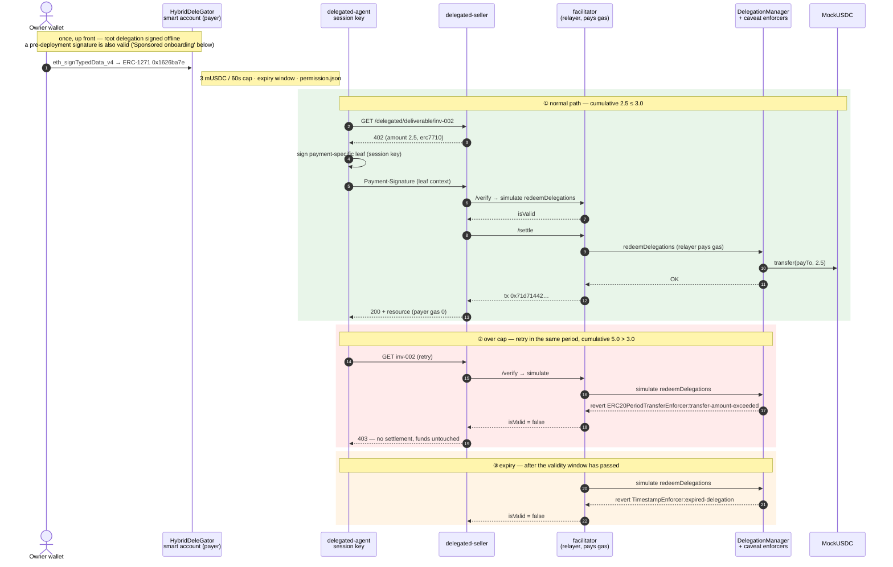

# Mapae — Technical notes

> The Mapae was not a token of privilege but a token of limits.
> The engraved horse count was not the authority granted — it was where that authority ended.

Infrastructure on GIWA Chain where an agent executes settlement **within a delegated limit** and leaves that execution as a verifiable record.

**This file is the source of truth.** The GitBook rendering (`docs/SUMMARY.md` + `docs/tech/`) is
generated from this file by `bun run gitbook:build`, and the drift
gate in `bun run check` refuses any mismatch between the generated output and the source.

---

## 1. System architecture

| Component | Role | Runtime |
|---|---|---|
| `contracts/` | MockUSDC (EIP-3009) | Solidity 0.8.28 / Foundry |
| `facilitator/` | x402 payment verification and settlement broadcast | x402-rs (Rust, operated as a container) |
| `apps/seller` | Issues the 402 (paid resource) | Bun + Hono |
| `apps/agent` | Receives the 402 → signs → retries | Bun (→ MCP client) |
| `packages/shared` | Chain, token, x402 types, error model | TypeScript |
| `packages/delegation` | Framework environment, caveats, signing, re-delegation, revocation, ERC-7710 | Smart Accounts Kit 1.7 |
| `apps/facilitator-erc7710` | ERC-7710 verify/settle adapter | Bun + viem |
| `apps/delegated-agent` | Builds a payment-specific leaf from a parent delegation | Bun |
| `apps/delegated-seller` | Issues the ERC-7710 402, gates the resource | Bun + Hono |
| `apps/agent-mcp` | Exposes the payment loop as an MCP tool | Bun + MCP SDK (stdio) |
| `apps/revocation-submitter` | Receives an owner-signed revocation UserOp → `handleOps` — two modes: pinned (single payer, loopback) / sponsored (public, sponsor-funded deposit) | Bun + Hono |
| `apps/account-bootstrap` | Recovers the owner from a pre-deployment signature → sponsored CREATE2 deploy of the payer account + mUSDC mint | Bun + Hono |
| `apps/delegation-lab` | Deployment previews, negative-path and e2e suites, fork orchestration | Bun |
| `apps/web` | Public landing + Studio (sponsored onboarding; grant, inspect, and revoke a delegation) | TanStack Start + Cloudflare |

**Language rationale** — The delegation layer depends on MetaMask Smart
Accounts Kit (formerly Delegation Toolkit), the ERC-7710/7715 TS SDK, which is
TypeScript-only, so the application layer is TS. The on-chain Delegation
Framework contracts are a separate artifact from that SDK, deployed on GIWA.
The facilitator's position is to **operate** the x402-rs container rather than
implement its own.

---

## 2. Payment flows

Mapae maintains two regression-testable paths in parallel.

### EIP-3009 direct payment

```
agent → resource request
      ← 402 Payment Required (amount · recipient · asset · EIP-712 domain)
      → check the limit, sign an EIP-3009 authorization (off-chain)
facilitator → verify the signature → broadcast the settlement transaction to GIWA
      ← resource + receipt
```

The payer pays no gas. It is the facilitator's relayer signer that broadcasts the
transaction, and because the authorization pins `from`, `to`, and `value` under the
signature, the relayer holds no authority beyond that of a broadcaster.

### ERC-7710 delegated payment

```text
account owner wallet → HybridDeleGator owner account
            (if the account does not exist yet: pre-deployment signature → account-bootstrap deploys with sponsor gas)
            → erc20PeriodTransfer parent delegation
agent       → receives 402
            → signs a payment-specific leaf with amount/payTo/facilitator pinned
seller      → ERC-7710 facilitator /verify → /settle
facilitator → DelegationManager.redeemDelegations
            → mUSDC.transfer(payTo, amount)
```

In this document, permission and delegation refer to the same signed artifact — the
difference is ERC-7715 versus ERC-7710 terminology. The parent caveat enforces the
60-second period cap and the expiry window (30 minutes by default, extended via
`PERMISSION_TTL_SECONDS` for the demo) on-chain. The vendor profile also pins the
recipient position in the ERC-20 `transfer` calldata. In manager-to-child
re-delegation, the child's individual cap and the manager's aggregate cap apply
simultaneously.

The sequence below shows three paths for one and the same delegation — a normal
settlement, an over-cap refusal, and an expiry refusal. What decides a refusal is
the on-chain caveat, not a backend.



#### Settlement evidence — GIWA Sepolia (2026-07-24 ~ 2026-08-04)

Evidence levels are stated separately. **Mined** is a transaction that entered a
GIWA block and opens in the explorer; **simulated** is an `eth_call` against GIWA's
current state — the verdict is handed down by the deployed enforcer bytecode reading
the real period counter, but nothing entered a block.

| Path | Result | Evidence level | Evidence |
|---|---|---|---|
| Framework deployment | 38-unit + 2-step ownership + owner smart account | **mined** | manager `0xF2F782Fa…F40C`, owner account `0xA4e4d00E…DDF382` |
| Normal settlement (inv-001, 1 mUSDC) | success, payer gas 0 | **mined** | tx `0xe897fe55…a97d`, block 31555419 |
| Normal settlement (inv-002, 2.5 mUSDC) | success | **mined** | tx `0x71d71442…6ce4`, block 31558282 |
| **Period cap exceeded** (cumulative 5.0 > 3.0) | **refused, funds untouched** | simulated | revert `ERC20PeriodTransferEnforcer:transfer-amount-exceeded` |
| **Expiry** (validity window passed) | **refused** | simulated | revert `TimestampEnforcer:expired-delegation` |
| Sponsored onboarding — account deployment | CREATE2 deploy from the owner recovered out of a pre-deployment signature, new user gas 0 | **mined** | account `0x15286FE9…3301`, tx `0xed21ac71…9902` |
| Sponsored onboarding — mUSDC float | 3 mUSDC minted | **mined** | tx `0x9d14588b…baa0` |
| Post-hoc acceptance of a pre-deployment signature (late binding) | live `isValidSignature` = `0x1626ba7e` | simulated | account `0x15286FE9…3301` |

That the two refusals have no transaction hash is a consequence of the design. The
facilitator's `/verify` filters first with `simulate.redeemDelegations`, so no gas
is spent on a transaction destined to revert. The same 2.5 mUSDC payment settles
while balance remains in the period and is refused once the cumulative total crosses
the cap — the limit is state enforced by the deployed enforcer, not a promise made
by application code.

### Sponsored onboarding (account bootstrap)

A new user signs the root delegation against a payer smart account that **does not
exist yet**, and `apps/account-bootstrap` deploys that account with sponsor gas.
Nobody needs to hold GIWA ETH to create a delegation.

Two measurements decided the design. First, **deploying at settlement time is
impossible** — `DelegationManager` runs the signature loop before any execution, a
codeless delegator falls into the EOA branch, and `ECDSA.recover` returns the owner
rather than the account, so it ends in `InvalidEOASignature`. There is no ERC-6492
anywhere in the Framework. Second, **late binding holds** — a signature made against
a codeless account passes ERC-1271 after deployment, because `HybridDeleGator`
compares against `owner()` and the owner is baked into the CREATE2 initcode. The
`0x1626ba7e` in the table above is the value with which the live chain answered
that fact.

The request body is `{permissionContext}` and nothing else. The owner is recovered
from the signature; the account is `CREATE2(recovered owner)` and must match the
delegator the permission names. Accepting an owner or salt from the caller would let
anyone nominate an address for us to pay to deploy — in this structure, the caller
has to solve a fixed point that cannot be solved without the key. The signature is
also checked offline for canonical form (low-s, `v ∈ {27,28}`). viem accepts
signatures that OZ `ECDSA` reverts on, so without this check we would pay to deploy
accounts whose every grant reverts forever.

Per-account idempotency is identity, not a budget — keypairs are free offline, so
the real bounds on a griefing run are the per-IP rate limit, the daily gas budget
(`BOOTSTRAP_DAILY_WEI`), and the sponsor balance kept deliberately small. The
sponsor holds no delegation authority, so it cannot reach payer funds, caps, or
settlement. Verification is `bun run test:e2e:bootstrap` — 15 cases on a GIWA fork
(kill switch, approval mismatch, shared-relayer refusal, foreign signer, high-s,
deployment, late binding, gas accounting, faucet, idempotency, concurrency, rate
limit, budget exhaustion, chain-failure leak guard), 15/15.

### Agent automation (MCP)

The payment loop converges on a single `payForDelegatedResource` in
`packages/delegation/src/payment-client.ts`, and the CLI agent and the MCP server
share the same implementation. Two copies of an implementation drift apart.

`apps/agent-mcp` exposes two tools.

| tool | Role |
|---|---|
| `mapae_pay_for_resource` | receive 402 → sign a leaf within the caveat → retry the request → resource |
| `mapae_status` | session key, endpoints, deployment verification state (never returns keys or the permission context) |

The procedure for registering the server in an MCP client, and the environment
variables, are in the [MCP connection guide](mcp-guide.md).

This path has run to completion on GIWA Sepolia. One MCP tool call settled a payment
with no human intervention, and in transaction
[`0x533c…9964c`](https://sepolia-explorer.giwa.io/tx/0x533c5cb2945b89c7a56abf681ef049124deb4daf141e1a52b280385cefd9964c)
(block 31634935) the payer is −1 mUSDC, the vendor +1 mUSDC, and the payer's ETH
spend is `0`. The evidence level for this path is **mined on GIWA**, not a local
fork. The same transaction is also §3's timeout case — the on-chain settlement
succeeded, and the reporting path's timeout budgets were redesigned afterwards.

**Failures are returned as reasons.** The core returns a discriminated result
instead of throwing, and points at the cause with `SELLER_OFFER_INVALID`,
`FACILITATOR_UNTRUSTED`, `MANAGER_MISMATCH`, `LIMIT_EXCEEDED`,
`PERMISSION_INACTIVE`, `SIGNING_FAILED`, `PAYMENT_REJECTED`, and the like.

**On-chain pre-flight.** Before signing, the agent reads the enforcer's own
accounting directly and filters out payments that cannot succeed. The chain enforces
the cap either way, so the purpose of this step is not safety but **accuracy of the
reason** — instead of going all the way to the seller and receiving a 403, it states
the cause, as in `payment of 2500000 exceeds 2000000 left in this period`. A side
effect is that no leaf is signed for a payment that cannot succeed (a leaf is a
bearer authorization).

The pre-flight verdict (`judgePreflight`) is factored out as a pure function, with
chain reads injected as callbacks. Status lookup runs `readDelegationStatus` over
**every link** of the parent permission — looking only at the root misses the
narrower cap of a re-delegated child. Two verdict rules are pinned by tests: **an
inactive reason takes precedence over the cap** (reporting a permission that cannot
spend any amount as `LIMIT_EXCEEDED` sends the operator adjusting the cap, which is
not the cause), and **the cap is the chain's minimum, not the root's value.**

Two runtime behaviours:

- **Runtime loading is lazy and caches only success.** An env or network failure at
  boot returns a reason in the tool result instead of killing the process, and
  fixing the environment recovers it without a restart.
- **stdout is the JSON-RPC channel.** All logging goes to stderr.

### Studio (wallet module)

Both screens read their data directly from chain.

| Screen | Source |
|---|---|
| Delegation and limits | `ERC20PeriodTransferEnforcer.getAvailableAmount` (remaining period balance), caveat terms (cap, validity window), `DelegationManager.disabledDelegations` (revocation state) |
| Receipts | `TransferredInPeriod` events |

A settlement that consumes the cap always leaves this event, so the receipts need no
separate ledger. The remaining balance is not self-aggregated off-chain because that
would become a second truth, able to drift from the side that actually enforces.

The validity-window interpretation reflects what a 0 value means to the
`TimestampEnforcer` — the enforcer checks each half of the window only when it is
`> 0`, so a 0 in the terms means **unbounded**, not 1970.

**The receipt query window.** The query takes `fromBlock` as a required argument.
GIWA refuses `eth_getLogs` beyond 100,000 blocks, so an unbounded default would
either fail or return a truncated history as if it were complete. The default window
is 50,000 blocks, and with GIWA producing roughly 1 block per second (measured
over the 31634888→31634935 span) that is less than a day. So the screen header and
the empty-list message both show the time at which the window opens, and that time
is read from chain as the timestamp of the `fromBlock` block, not derived from an
assumed block time. If the node cannot serve that block (pruned), the message falls
back to a block-count notation and the screen stays up. When `fromBlock === 0` it is
labelled "full history". The window is fixed at 50,000 blocks; Studio does not
paginate, and the panel says so.

**The boundary of revocation.** `DeleGatorCore.disableDelegation` is
`onlyEntryPointOrSelf`, so the owner EOA cannot call it directly — it must be an
EntryPoint UserOperation. The suite exercises both branches — the *self* branch
proves the outcome via impersonation (after revocation `disabledDelegations` is
true, and the same payment is refused with `PERMISSION_INACTIVE`), and the
*EntryPoint* branch sends a UserOperation signed with the real owner key through
`handleOps`. That UserOperation's `callData` is `buildRevocationCall(...).data`
verbatim, not wrapped in `execute()` — wrapping would make it an EntryPoint →
`execute` → self call, folding back into the *self* branch already covered. Each
dependency carries a control.

| Control | What it proves | Actual result |
|---|---|---|
| `revocation-userop` | the normal path | success — `UserOperationEvent.success == true`, `disabledDelegations` true |
| `revocation-userop-unfunded` | the deposit is the real gate | `FailedOp(0,AA21 didn't pay prefund)` |
| `revocation-userop-wrong-signer` | the account verifies `owner()` | `FailedOp(0,AA24 signature error)` |
| `revocation-userop-tampered-field` | the signed `entryPoint` field is in force | `FailedOp(0,AA24 signature error)` |
| `revocation-submitter` | a JSON wire submission passes the validator and revokes | success — the validated struct matches the signed struct in all 9 fields |
| `revocation-submitter-foreign-sender` | a foreign account's revocation is refused before any chain read | `sender is not the account this submitter serves` |

**The submission endpoint (`apps/revocation-submitter`).** Anyone can call
`handleOps` and the relayer fronts the gas, so a service that forwards whatever it
is handed becomes a general-purpose UserOperation relay running on someone else's
funds. `validateRevocationSubmission` narrows it to one operation on one account — a
`sender` allowlist, the root's `delegator == sender`, `initCode` and
`paymasterAndData` forced empty, ceilings on the 4 gas fields, and **byte
equality of `callData` against a re-encode**. The last check is not a decode because
a decode passes bytes appended at the end.

The signature is deliberately not verified offline. The account is a
`HybridDeleGator` and validates through ERC-1271, so an offline `ecrecover` can
silently disagree with the account. The authority on the signature is the `AA24` the
EntryPoint returns in pre-broadcast simulation.

`judgeSubmissionReadiness` returns, as distinct reasons, the refusals that can be
judged from chain state — `prefund_short` (the payer holds ETH 0 by design, so the
deposit is the only funding source, and this is the most common state),
`fee_below_basefee` (the EntryPoint reimburses at
`min(maxFeePerGas, baseFee+priority)` while the relayer's transaction cannot be
included below `baseFee`, so sending it anyway succeeds while only the operator
loses), `base_fee_unreadable` (the base fee could not be read — a case for retry,
not re-signing, which is why its reason is kept separate from the previous one),
`relayer_unfunded`.

Success is judged by checking `UserOperationEvent.success` directly, not the receipt
status. The EntryPoint absorbs an inner call's revert into
`UserOperationRevertReason` and lets the transaction itself succeed
(`EntryPoint.sol:340-353`), so by the receipt alone a reverted `disableDelegation`
still reads as success.

**Service boot verification** (`bun run test:e2e:revoke`). Unit tests and the
negative-path suite cover the validator and the on-chain enforcement, but the boot
of the process itself — env parsing, reading the deployment artifacts, the relayer
cross-check at boot, `/health`, single-flight, simulate→broadcast — is round-tripped
by a separate e2e that actually starts the service on a GIWA fork. The suite counts
its own cases and prints `PASS — N cases (ABC…)`.

Two designs in this suite are non-obvious. First, **replay defence splits into two
cases.** The first line of defence against re-sending the same body is the deposit
gate, and in that state the nonce has never been executed. So the suite refills the
deposit to remove the gate, re-sends the identical body, and confirms that the one
remaining line of defence — the EntryPoint nonce — cuts it off with
`AA25 invalid account nonce`. Second, **the success case verifies the relayer's
balance sheet.** On GIWA the well-known Anvil development addresses carry an
EIP-7702 designator whose target is a sweeper that transfers away any incoming
balance in full. `EntryPoint._compensate` pays the beneficiary with
`call{value:…}`, so using such an address as the beneficiary empties the relayer in
a single `handleOps` (fork measurement: 1 ETH → 0.00024 ETH, transaction cost
0.00017 ETH). The suite enforces at startup that the beneficiary address has no
code.

The browser leg also checks the responses directly. The browser client (local dev
:5173) and the submitter (:8082) are different origins and the request carries
`content-type: application/json`, so the browser sends a preflight first — if the
preflight fails, the POST never goes out. The suite checks each case: that an
allowed origin's preflight gets 204, that an unknown origin gets 403, and that a
request with no `Origin` (a server-side call) works as-is.

**Studio's revoke button (`apps/web/src/dapp/RevokeButton.tsx`).** Connect the
wallet → check against `owner()` → read the nonce → build → `signTypedData` → POST
to the submission endpoint. Three design decisions: (1) **the connected wallet is
checked against the account's `owner()` before signing**
(`HybridDeleGator.sol:233`) — a signature from another wallet surfaces as `AA24` at
the EntryPoint, indistinguishable from a nonce or gas problem. (2) **The nonce is
read at click time and the operation is built in one pass** — if the value is
re-read between building and signing, the digest goes stale and the result is again
`AA24`. That is why `buildRevocationUserOperation` is a pure function. (3) The wire
body is produced by `buildRevocationSubmissionBody` from the same module the
submission endpoint uses for validation — a round-trip test pins byte-level
reproduction so the encoder and the decoder cannot diverge.

Each reason the button locks shows its own message — revocation endpoint not
configured, already revoked, wallet not connected, chain mismatch, not the owner. A
short deposit is not a lock reason — on the public path the sponsor tops up the
deposit at revoke time, and that is the reason sponsored mode exists. An owner
mismatch is reported first — the wallet is the only element the person in front of
the screen can change.

**The unverified stretch:** whether the wallet extension renders the
signature-request struct (9 fields) legibly for a human can only be confirmed with a
real wallet open. It remains the one stretch automation cannot cover.

The **funding state** of self-funded (pinned-mode) revocation — the EntryPoint
deposit, the per-revocation requirement
(`revocationPrefund(DEFAULT_REVOCATION_GAS)`), and the shortfall — is answered by
the submission endpoint's `/health`. The former D6 console displayed these values on
screen at all times (even at 0 — as long as gaslessness is the central claim, a row
that appears only when the value is not 0 is a row that cannot confirm the
invariant holds), and that principle carries over into Studio's status display.

**How the kill switch is funded.** Payments never pass through the EntryPoint — the
relayer calls `redeemDelegations` directly, so the payer's zero-ETH invariant holds
for payments. Revocation alone cannot avoid the EntryPoint, and the EntryPoint
collects gas not from the account's native balance but from the deposit
(`StakeManager.deposits`). `DeleGatorCore._payPrefund` (:559-566) absorbs a failed
transfer, so with no deposit it is the EntryPoint, not the account, that refuses
with `AA21` — not `AA23`. `EntryPoint.depositTo(address)` is `public payable` with
no access control, so the relayer can fill another account's deposit, and the
payer's native balance stays at 0 while it does. But `withdrawTo` reads
`deposits[msg.sender]`, so this is a one-way cost the relayer cannot claw back. The
procedure for completing the revocation path locally is in the
[revocation runbook](revocation-runbook.md).

**The Framework kill switch.** Where revocation severs one delegation,
`DelegationManager.pause()` stops the entire framework (`onlyOwner` — an ordinary
EOA transaction that needs no deposit). The defence is two layers: the facilitator's
`verifyFrameworkOperationalState` checks `paused` on every request and refuses
before settling, and on-chain the `whenNotPaused` on `redeemDelegations`
(`DelegationManager.sol:132`) reverts even a bypass of that gate. The suite confirms
that executing `pause()` on a fork with an impersonated owner has the payment
refused with `PAYMENT_REJECTED 403` and `/health` reporting `ok=false` with the
reason `DelegationManager is not operationally active`.

### Reproduction

```bash
bun run check                      # full-stack regression, no keys or network
cd apps/delegation-lab
bun run test:negative              # caveat cases — the default target is a disposable chain
SUITE_TARGET=fork bun run test:negative   # the same cases on a GIWA fork
bun run test:e2e:mcp               # full payment run → over-cap pre-flight refusal → pause → revocation
bun run test:e2e:revoke            # actually starts the submission endpoint and round-trips it
SUITE_FORK_BLOCK=<recent block> bun run test:e2e:bootstrap   # 15 onboarding-service cases
bun run preflight:giwa             # read-only GO/NO-GO against GIWA head state
```

`test:negative`'s default target is a disposable chain. The GIWA fork target must be
run separately with `SUITE_TARGET=fork`; no single line runs both targets. All four
suites count their own cases and print the count alongside the pass verdict
(`N/N cases passed`, `PASS — N cases (ABC…)`, `GO — N개 조건 전부 충족`).

The execution requirements differ per command. `bun run check` and `test:negative`
run from a clean clone with no keys, no network, and no deployment artifacts —
`test:negative` deploys the 38-unit Framework itself onto a disposable Anvil and
tests against it. `test:e2e:mcp`, by contrast, requires a root permission artifact
signed by the owner, so it does not run from a bare clone without the wallet that
owns the deployed account. `test:e2e:bootstrap` deploys a fresh account onto a GIWA
fork and therefore reads state no cache has ever held — a recent block must be
passed as `SUITE_FORK_BLOCK` (GIWA prunes old state).

`test:e2e:mcp` refuses to start unless every child process is pinned to a loopback
RPC, and after finishing it re-reads the real GIWA relayer nonce to confirm that
nothing was broadcast.

**Fork-source credentials are never exposed in argv.** The private GIWA endpoint
carries its API key in the URL path, so the whole URL is a credential, and argv is
visible via `ps`. `anvil --fork-url` has no environment-variable alias, so
`apps/delegation-lab/fork-source-proxy.ts` holds the key in memory and hands anvil a
keyless `http://127.0.0.1:<ephemeral port>`. All four places that spawn a fork use
this path.

---

## 3. Error model

A discriminated union that assigns a tag to every failure mode on the settlement
path (`packages/shared/src/errors.ts`).

Blockchain code has a wide error surface — RPC timeouts, rate limits, reverts,
nonce contention, signature verification failures, relayer gas exhaustion.
Collapsing these into a single `catch` destroys the information recovery needs.
Each tag distinguishes:

- **Retryable** (`RpcUnavailable`, `RpcRateLimited`) — retry after backoff
- **Operational failure** (`RelayerOutOfGas` and the like) — 503, not the caller's fault, alert-worthy
- **Caller error** (`InvalidSignature`, `DomainMismatch`, `MalformedPayload`) — 4xx, the cause is returned

Why `DomainMismatch` is its own tag: an EIP-712 domain mismatch is the most
common failure in an x402 integration, and if it goes out as a generic 500 the
cause cannot be pinpointed.

**The two paths have different response policies (deliberately).** It is the
EIP-3009 direct payment path (`apps/seller`) that carries the tag union verbatim
in the response body. The ERC-7710 delegated path behaves differently.

| | Direct payment (`apps/seller`) | Delegated payment (`apps/delegated-seller`, `apps/facilitator-erc7710`) |
|---|---|---|
| External response | `SettlementError._tag` + `describe()` cause | **Opaque reasons** such as `delegation_rejected` / `settlement_unknown` |
| Status code | `httpStatusFor()` | 402 / 400 / 403 / 422 / 504 |
| Client branching | Tag | `DelegatedPaymentFailureCode` (the agent's own classification) |

The delegated path is opaque because of the threat model. Returning detailed
failure reasons would let an attacker probe the caveat boundaries — remaining
allowance, expiry status, re-delegation structure — from responses alone. The
cause goes to the server log. `redactForLog` keeps the revert reason
(`ERC20PeriodTransferEnforcer:transfer-amount-exceeded`) and removes the
bearer-length hex viem embeds in the error (the signed permission context),
leaving only its size. The operator sees the cause; the caller does not.

### How absent state is judged

One rule applies across the guard code: **a value that could not be read, or
does not exist, placed in a judgment position must produce a refusal or a
distinct reason — never satisfaction.**

- **`PERMISSION_EMPTY`.** The correct ABI encoding of an empty `Delegation[]` is
  a 130-character string that passes the hex-shape guard, and `decodeDelegations`
  turns it back into `[]`. In that state every pre-flight check would pass for
  lack of anything to compare against, so it is refused under its own tag.
  `PERMISSION_INACTIVE` is not reused because the two tags direct different
  actions — the former means regenerate the artifact, the latter means check the
  chain for revocation or expiry. The guard sits in both places: boot validation
  (`loadDelegatedAgentRuntime`) and the judgment function
  (`judgePreflight`).
- **Absent period caveat.** If the link carries no `ERC20PeriodTransferEnforcer`
  caveat, the remaining balance stays `undefined`. Two consumers judge that
  state differently because they ask different questions.

| | Question | `tightest === undefined` |
|---|---|---|
| `judgePreflight` (runtime) | Will the chain refuse this payment? | Pass — without a cap it is not refused |
| `giwa-preflight` (human gate) | Does the configuration match the intent? | Fail — there is no value to check against |

  The computation (`tightestPeriodRemaining`) is shared in
  `packages/delegation`; each side keeps its own judgment, and the two are
  linked by cross-reference comments.
- **Absent input to the fee judgment.** `judgeSubmissionReadiness` refuses the
  state where the base fee could not be read as `base_fee_unreadable`. The
  reason is kept separate from `fee_below_basefee` because the two direct
  opposite actions — `fee_below_basefee` tells the owner to re-sign with a
  higher fee, `base_fee_unreadable` says retry the chain read.

### Standing gates

`bun run check` mechanically verifies the claims of documentation and
configuration alongside the code. Every gate runs without keys or network, and
gives the same result on a clean clone.

| Gate | What it verifies |
|---|---|
| `check:docs` | That every `bun run` and `make` command in the documentation actually exists, that every relative link resolves, and that every address matches the deployment artifacts and the canonical token source |
| `check:gitbook` | That the GitBook chapters, SUMMARY, and configuration match, byte for byte, what is derived from the canonical source (`docs/tech-notes.md`) |
| `check:logging` | That no raw error reaches a `console.*` argument in `apps/`, `packages/`, or `scripts/` — viem embeds the transport URL in error messages, so this blocks the path by which an RPC URL with a key in its path leaks into logs |
| `check:advisories` | That every `bun audit` finding is either fixed or an acceptance carrying a `prove` function that is re-measured on every run |
| `check:counts` | That the test counts the repository README states match what bun and forge actually collect — it checks agreement with the suites, not agreement among the numbers in the documentation |

### The semantic distinction between 422 and 504

Among the opaque reasons, these two must be distinguished. `settlement_failed`
(422) means "the payer was not charged"; `settlement_unknown` (504) means
"whether the payer was charged could not be established." The former is an
answer that invites a retry, and retrying an unconfirmed state becomes a double
payment.

The distinction is grounded in a real incident. GIWA `0x533c5cb2…9964c`
(block 31634935) actually transferred 1.00 mUSDC from the payer, yet the caller
received `PAYMENT_REJECTED` — the receipt-wait timeout had been configured
longer than the seller's HTTP timeout. The timeout budgets were then redesigned
to grow toward the outer layers (25 → 35 → 45 → 50 s), and a payment whose
outcome is unresolved is returned as `SETTLEMENT_UNKNOWN`.

The judgment is isolated in a pure function, `decideSettlement()`
(`packages/delegation/src/x402.ts`), and the criterion string
(`SETTLEMENT_UNCONFIRMED`) and the response type are taken from the same module
by producer and consumer alike. The decision ladder leans toward `unknown`.

| Observation | Result | Reason |
|---|---|---|
| No response received (connection refused, non-2xx, not JSON, timeout) | `unknown` 504 | "The request never arrived" and "the response was lost after broadcast" cannot be told apart |
| `errorReason === SETTLEMENT_UNCONFIRMED` | `unknown` 504 (+hash) | Without the hash the caller has no way to verify |
| `success !== true` | `failed` 422 | Explicit refusal — no funds moved |
| `success === true`, payer mismatch | `unknown` 504 | A broadcast was claimed but the identity did not line up, and the balance was not confirmed |
| `success === true`, payer match | `settled` 200 | |

This path can be forced on a fork — shrinking the facilitator's receipt wait to
1ms exercises the unconfirmed-after-broadcast branch.

```bash
cd apps/delegation-lab && SETTLEMENT_RECEIPT_TIMEOUT_MS=1 bun run test:e2e:mcp
```

The run does not only check status codes; it reads the enforcer events directly
from the fork and cross-checks whether funds actually moved.

### Effect migration plan

The current implementation is a discriminated union, with the `_tag`
discriminator kept isomorphic to [Effect](https://effect.website)'s
`Data.TaggedError`.

| Stage | State |
|---|---|
| Now | Discriminated union + explicit branching. Every failure mode enumerated at the type level |
| Next | Migrate the settlement path to `Effect<A, SettlementError, R>` — typed error channel, `Schedule`-based retry/backoff, resource-safe RPC connections |

It was not adopted during the MVP window because partial adoption is hard.
Effect propagates through the entire call chain, so adopting it before the core
payment loop was proven would have been an execution risk. Fixing the shape of
the error model first turns the migration into a mechanical substitution rather
than a rewrite.

---

## 4. Security considerations

### Facilitator trust boundary

The facilitator holds the relayer key, receives the signed `Payment-Signature`, and is
itself the redeemer the leaf pins. In other words, it sits in a position where every
identity check passes. The trust boundary is therefore defined not by whether the
facilitator is trusted, but by the **maximum damage when it is fully compromised**.

The crux is the signature scope of `redeemDelegations`. The permission context is signed,
but **the execution is not** — `_executionCallDatas` is supplied as calldata by the
caller at redemption time (`DelegationManager.sol:126-133`). A compromised facilitator
can submit an arbitrary execution alongside a valid leaf, and the only thing standing in
the way is the set of caveats attached to that leaf. The `wrong-redeemer` case does not
cover this threat — what that case proves is that a third party cannot redeem, and the
facilitator is not a third party.

| Attempt by a compromised facilitator | Refusing enforcer | On-chain revert |
|---|---|---|
| Pay its own address instead of the vendor | `AllowedCalldataEnforcer` | `invalid-calldata` |
| Inflate the amount (even within the period cap) | `ERC20TransferAmountEnforcer` | `allowance-exceeded` |
| Turn a one-shot payment into a standing allowance (`approve` drain) | `ERC20TransferAmountEnforcer` | `invalid-method` |
| Redirect the call to another contract | `ERC20TransferAmountEnforcer` | `invalid-contract` |
| Attach native value | `ValueLteEnforcer` | `value-too-high` |
| **Target the payer account itself** (entering the self branch) | `ERC20TransferAmountEnforcer` | `invalid-contract` |
| Redeem the same leaf again | `ERC20TransferAmountEnforcer` | `allowance-exceeded` |
| Redeem after expiry | `TimestampEnforcer` | `expired-delegation` |
| Accumulate beyond the period cap | `ERC20PeriodTransferEnforcer` | `transfer-amount-exceeded` |

The self-target case is the least obvious. Because execution happens through
`IDeleGatorCore(root.delegator).executeFromExecutor`
(`DelegationManager.sol:252-253`), an execution whose target is the payer account makes
the account call itself, and `msg.sender == address(this)` — the *self* branch of
`onlyEntryPointOrSelf` — holds (`DeleGatorCore.sol:106-109`). Through this branch lie
`withdrawDeposit`(:356), `enableDelegation`(:373 — undoes a revocation), and
`_authorizeUpgrade`(:526 — swaps the implementation). DeleGatorCore has nothing that
blocks a self call; the only thing standing in that spot is the caveat. The case uses
`withdrawDeposit(address,uint256)` as its payload because that calldata is exactly
68 bytes, so it passes the length gate of `ERC20TransferAmountEnforcer` (:87) and is
then caught by the contract check (:92) — making clear that it is not blocked by size
by accident.

The `approve` case is constructed to pass every address check — the pinned vendor
address goes into the spender slot. The only thing that refuses it is the selector
check, and it does refuse.

What remains available to a compromised facilitator is limited to the following.

- **Refusing to settle (liveness).** Funds are safe, but the payment does not proceed.
  The seller returns 504 `settlement_unknown` — an availability problem, not a safety
  problem.
- **Reordering and delay.** Within the expiry window.
- **Actually executing an amount the payer has already authorized, to the designated
  vendor.** Even if the seller never delivered the resource. A loss can occur, but the
  recipient is always the vendor the agent pinned and can never be the facilitator
  itself.

**Theft of funds, redirection, and exceeding the cap are impossible; what remains is
availability and ordering.** This is the rationale for a structure that entrusts the
relayer with gas but not with funds.

The nine rows in the table above are cases that `negative-path-suite.ts` executes, and
the six tampering cases carry a control — same leaf, same redeemer, an execution with
only the tampering removed settles normally. Without the controls, the six refusals
could also come from reasons unrelated to the tampering (an exhausted period, a stale
account). All cases pass on both a disposable chain and a GIWA fork.

The same public host as the facilitator also routes the onboarding sponsor under the
`/bootstrap` path — a separate process, a separate key. The request body is
`{permissionContext}` and nothing else, the owner is recovered from the signature, and
`CREATE2(owner)` must match the permission's delegator, so the caller cannot nominate
an address we would pay to deploy. Responses emit only a closed refusal enum. Even if
the sponsor key is compromised, all it yields is wasted gas up to the balance — holding
no delegation authority, it cannot reach payer funds, caps, or settlement. If the
sponsor coincides with the relayer or the deployer, the service refuses to boot:
sharing a key that answers unauthenticated requests with the settlement key lets
griefing spread into a settlement outage.

### Attack vectors and countermeasures

| Vector | Countermeasure |
|---|---|
| Signature replay | EIP-3009 nonce consumption (`authorizationState`), verified by tests |
| Smart-account signatures | OZ `SignatureChecker` — supports EOA and EIP-1271 alike. Bare `ecrecover` fails silently on 4337 accounts |
| Authorization front-running | An observer can submit `transferWithAuthorization` first, but funds move only to the signed `to` — an ordering issue, not theft. Use `receiveWithAuthorization` where logic depends on the fact of receipt |
| Validity window | `validAfter`/`validBefore` enforced. The L2 sequencer's timestamp manipulation margin (seconds) is negligible against the validity window (minutes to hours) |
| Relayer authority | Amount and recipient are fixed in the signature and cannot be changed |
| Signature exposure in logs | Facilitator error logs never record the signature or the full payload — only chain, asset, amount, address, and nonce metadata |
| Facilitator attack surface | The API is exposed only on loopback/private networks; the container image is pinned by digest with read-only, cap-drop, and no-new-privileges applied |
| Redirect hijacking | Payment requests from the agent and seller refuse HTTP redirects, so the authorization in the payment headers (`Payment-Signature`/`X-PAYMENT`) never travels to another origin |
| Malicious DelegationManager | Single-manager allowlist from the GIWA deployment artifacts; canonical EntryPoint and required enforcer addresses verified |
| Permission context exposure | Excluded from Git, size-limited, never printed in logs or error detail |
| Forged payer receipts | The canonical payer is derived from the last/root delegator in the `permissionContext`; a mismatched wire claim is refused |
| verify→settle race | Re-simulation immediately before settle |
| Duplicate settle | Deduplicated by a `paymentIntentId` over the canonical payment terms and the context bytes; the broadcast tx hash is stored before the receipt |
| Gas DoS via complex delegations | Estimate first, then refuse anything above the configured gas cap |
| Unauthorized relayer | The intersection of the leaf's `RedeemerEnforcer` and the 402's `facilitatorAddresses` is enforced |
| Onboarding griefing (repeated deploy requests) | Per-IP rate limit + daily gas budget + a small dedicated sponsor wallet — exhaustion stops only that day's onboarding and never touches settlement or funds |
| Nominating the deploy target address | The request body is `{permissionContext}` only — the owner is recovered from the signature, and the account is `CREATE2(owner)`, which must match the delegator |
| Non-canonical signatures (high-s, `v ∉ {27,28}`) | Deploy only after an offline canonical-form check — viem accepts them but OZ `ECDSA` reverts, so without the check we would pay to deploy an account whose every grant reverts |
| Vulnerable dependencies | `bun audit` runs in the gate. Every finding is either fixed or accepted with a re-measurable proof attached |

### Acceptance criteria for dependency advisories

A finding reported by `bun audit` is either fixed or explicitly accepted with a
rationale attached. One is accepted today — the Windows path traversal (moderate) in
`@hono/node-server <2.0.5`. The MCP server uses only the stdio transport, and the
adapter in question is something the SDK pulls in for its streamable HTTP transport, so
it is not part of the bundle (0 references to `hono` across the 974 modules of the
entrypoint bundle). No compatible update closes it — the fix landed in 2.0.5, and the
SDK (declares `^1.19.9`; the final 1.x is 1.19.15) does not include it.

The basis for an acceptance is code, not prose. Each accepted item in
`scripts/check-advisories.ts` carries a `prove` function that re-measures its own claim
on every run, and there are three failure directions — a new finding that is not
accepted, an acceptance whose proof has broken, and an acceptance that is no longer
reported (an unused exception outlives its rationale). To rule out a detector that
always returns zero, the gate trusts the real entrypoint's zero only after it has found
the references in a control that imports the transport on purpose (measured 3 versus
0). A run that cannot reach the registry is distinguished from zero findings — in that
case it prints that the comparison was skipped, and the `prove` functions still run
offline as-is.

### Logging and credentials

viem embeds the full transport URL in its error messages, and on an RPC endpoint that
carries its API key in the path, the URL itself is a credential. `redactUrls` in
`packages/shared` reduces any URL that reaches a log to `scheme://host`, and the
`check:logging` gate refuses, repository-wide, any code where a raw error reaches a
`console.*` argument. Signed payloads and permission contexts are bearer authorizations
and are never printed in logs or error detail.

---

## 5. Verified on-chain environment

| Item | Value |
|---|---|
| Network | GIWA Sepolia (`eip155:91342`) |
| RPC | `https://sepolia-rpc.giwa.io` |
| MockUSDC | `0xcfeb694719A09caeb80798e2011298F29CDa4e92` |
| EIP-712 domain | name `Mock USDC` / version `2` / decimals `6` |
| EntryPoint | canonical v0.7 `0x0000000071727De22E5E9d8BAf0edAc6f37da032` |
| Delegation Framework v1.3 | **Deployed and verified on GIWA** — DelegationManager `0xF2F782Fa…F40C` (active, owner=admin, unpaused), 38-unit exact composition |
| Owner smart account (payer) | `0xA4e4d00E5860d3700aF2247fFa818Fb62BDDF382` (HybridDeleGator, owner EOA `0x011234B8…B901`) |
| ERC20PeriodTransferEnforcer | `0x700330288f6f094780121ea54cd2eDEfe45b3625` |
| First sponsored onboarding account | `0x15286FE9A48d52504607bEaaa021B29194353301` (a pre-deployment signature returned `0x1626ba7e` from live ERC-1271, mUSDC balance 3.0) |

This table holds only entries verified by reading them directly, address in
hand. Dojang appears in the roadmap, but this repository has never verified its
addresses, so it is not included here — what is verified and what is planned do
not share a table.

---

## 6. Verification status and roadmap

This records what has been verified, and to what level, together with the grade
of evidence. By the same rule as the §2 evidence table, what was mined, what
completed on a fork, and what was confirmed by simulation are never mixed in
the same sentence.

- **Delegated payment pipeline — mined on GIWA** — the Framework deployment,
  the owner account deployment, the root delegation signature (verified through
  ERC-1271), and a normal settlement are all mined on GIWA. The cap and expiry
  refusals are simulations against current GIWA state, not mined transactions
  (§2 evidence table)
- **Agent automation — mined on GIWA** — `0x533c…9964c`, a settlement executed
  by a single MCP tool call with no human step, was mined at block 31634935,
  and the payer's gas spend is `0`
- **Sponsored onboarding — mined on GIWA** — account `0x15286FE9…3301` was
  sponsor-deployed from the owner recovered out of a pre-deployment signature
  (`0xed21ac71…9902`), 3 mUSDC was minted (`0x9d14588b…baa0`), and live
  ERC-1271 answered `0x1626ba7e` to that prior signature. The new user's gas
  spend is `0`. The service itself is verified by 15 cases on a GIWA fork
  (`test:e2e:bootstrap`)
- **Negative-path suite — ephemeral chain and GIWA fork** —
  `negative-path-suite.ts` runs the same case set (normal, period cap, period
  reset, expiry, wrong-redeemer, recipient mismatch, replay, 6
  facilitator-tampering cases plus a control, payer mismatch, root revocation,
  4 revocation-UserOp cases, 2 submission-endpoint cases, manager
  aggregation) on both an ephemeral chain and a GIWA fork through chain
  parameterization, and checks each case down to its on-chain revert reason.
  The suite counts and prints the case count itself
- **Revocation submission endpoint — GIWA fork + 1 live run** — on a fork
  pinned to real GIWA state and deployed bytecode, the submitter E2E and an
  EntryPoint revocation completed end to end, including the browser CORS leg,
  and on 2026-08-04 **the first live revocation was mined on GIWA** through
  the public sponsored path — also a run in which a real person passed the
  wallet (MetaMask) approval screen. Pre-funding on the self-funded
  (pinned-mode) path still remains the owner's responsibility
- **Standing gates — local + GIWA read-only** — `bun run check`, which bundles
  the type, test, docs, and dependency gates, passes in full. The Framework is
  re-verified 38/38 against runtime bytecode and deterministic addresses.
  Explorer source verification stands at 38 of 39 (38 units + MockUSDC); the
  single unverified unit does not match current source due to a MetaMask SDK
  artifact/source revision difference and is not used on any Mapae policy path
  (detailed evidence in [Deployed contracts](deployed-contracts.md))
- **Numeric discipline on the public web** — the figures the public web
  (`apps/web`) displays are restricted to three sources: direct chain reads,
  mined hashes, and revert reasons checked by the negative-path suite

To be built:

- **Settlement brain** — triggers and schedulers, compound delegations
  (recipient, period, cap), a ledger, retries
- **KYC and attestation verification path** — Dojang KYC gate + EAS
  contract/receipt schemas + resolvers
- **Fulfillment verification** — an optimistic structure (default pass,
  challenge window, bond). Designed on the premise that it is not trustless,
  because the final adjudicator is arbitration rather than re-execution
