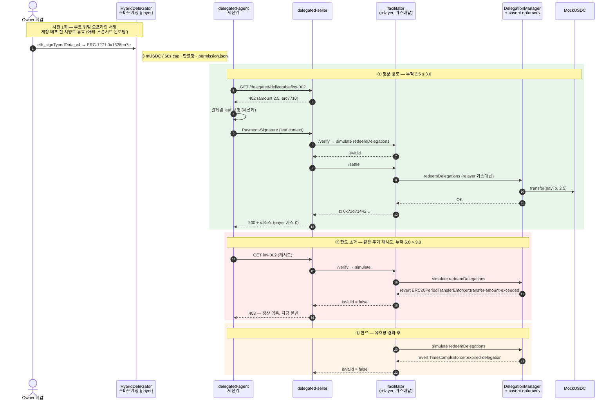

# Mapae — 기술자료

> 마패는 특권의 증표가 아니라 한계의 증표다.
> 새겨진 말의 수는 쓸 수 있는 권한이 아니라, 그 권한이 끝나는 지점이었다.

GIWA Chain 위에서 에이전트가 **위임받은 한도 안에서** 정산을 집행하고, 그 집행을 검증 가능한 기록으로 남기는 인프라.

**이 파일이 정본이다.** GitBook 렌더링(`docs/SUMMARY.md` + `docs/tech/`)은
`bun run gitbook:build`가 이 파일에서 생성하며, `bun run check`의 드리프트
게이트가 생성물과 정본의 불일치를 거절한다.

---

## 1. 시스템 구성

| 컴포넌트 | 역할 | 런타임 |
|---|---|---|
| `contracts/` | MockUSDC (EIP-3009) | Solidity 0.8.28 / Foundry |
| `facilitator/` | x402 결제 검증·정산 브로드캐스트 | x402-rs (Rust, 컨테이너 운영) |
| `apps/seller` | 402 발행 (유료 리소스) | Bun + Hono |
| `apps/agent` | 402 수신 → 서명 → 재요청 | Bun (→ MCP 클라이언트) |
| `packages/shared` | 체인·토큰·x402 타입·에러 모델 | TypeScript |
| `packages/delegation` | Framework 환경·caveat·서명·재위임·취소·ERC-7710 | Smart Accounts Kit 1.7 |
| `apps/facilitator-erc7710` | ERC-7710 verify/settle 어댑터 | Bun + viem |
| `apps/delegated-agent` | parent 위임에서 결제별 leaf 생성 | Bun |
| `apps/delegated-seller` | ERC-7710 402 발행·리소스 게이트 | Bun + Hono |
| `apps/agent-mcp` | 결제 루프를 MCP tool로 노출 | Bun + MCP SDK (stdio) |
| `apps/revocation-submitter` | owner 서명 회수 UserOp 수신 → `handleOps` — 핀(단일 payer·loopback) / 스폰서드(공개, 예치금 대납) 두 모드 | Bun + Hono |
| `apps/account-bootstrap` | 배포 전 서명에서 owner 복원 → payer 계정 CREATE2 대납 배포 + mUSDC 민팅 | Bun + Hono |
| `apps/delegation-lab` | 배포 preview·negative-path·e2e 수트·fork 오케스트레이션 | Bun |
| `apps/web` | 공개 랜딩 + Studio (스폰서드 온보딩·위임 발급·조회·회수) | TanStack Start + Cloudflare |

**언어 선택 근거** — 위임 레이어가 ERC-7710/7715 TS SDK인 MetaMask Smart
Accounts Kit(구 Delegation Toolkit)에 의존하고 이는 TypeScript 전용이므로
애플리케이션 계층은 TS다. 온체인 Delegation Framework 컨트랙트는 이 SDK와
별개의 산출물로 GIWA에 배포되어 있다. facilitator는 자체 구현 대신 x402-rs
컨테이너를 **운영**하는 포지션이다.

---

## 2. 결제 흐름

Mapae는 회귀 가능한 두 경로를 병렬 유지한다.

### EIP-3009 직접 결제

```
에이전트 → 리소스 요청
        ← 402 Payment Required (금액·수취인·asset·EIP-712 도메인)
        → 한도 확인 후 EIP-3009 authorization 서명 (오프체인)
facilitator → 서명 검증 → GIWA에 정산 트랜잭션 브로드캐스트
        ← 리소스 + 영수증
```

지불자는 가스를 내지 않는다. 트랜잭션을 브로드캐스트하는 것은 facilitator의
릴레이어 서명자이며, authorization에 `from`·`to`·`value`가 서명으로 고정되어
있어 릴레이어는 브로드캐스터 이상의 권한을 갖지 못한다.

### ERC-7710 위임 결제

```text
account owner wallet → HybridDeleGator owner account
            (계정이 아직 없으면: 배포 전 서명 → account-bootstrap이 대납 배포)
            → erc20PeriodTransfer parent delegation
agent       → 402 수신
            → amount/payTo/facilitator가 고정된 결제별 leaf 서명
seller      → ERC-7710 facilitator /verify → /settle
facilitator → DelegationManager.redeemDelegations
            → mUSDC.transfer(payTo, amount)
```

이 문서에서 권한(permission)과 위임(delegation)은 같은 서명 아티팩트를 가리킨다
— ERC-7715와 ERC-7710의 표기 차이다. parent caveat는 60초 주기 한도와
만료창(기본 30분, 데모에서는 `PERMISSION_TTL_SECONDS`로 연장)을 온체인으로
강제한다. Vendor 프로필은 ERC-20
`transfer` calldata의 수취인 위치도 고정한다. Manager→Child 재위임에서는
child의 개별 한도와 manager의 합산 한도가 동시에 적용된다.

아래 시퀀스는 같은 위임 하나에 대한 세 경로 — 정상 정산, 주기 한도 초과 거절,
만료 거절 — 를 보여준다. 거절의 판정 주체는 백엔드가 아니라 온체인 caveat이다.



#### 정산 증거 — GIWA Sepolia (2026-07-24 ~ 2026-08-04)

증거 수준을 구분해 표기한다. **채굴됨**은 GIWA에 블록으로 들어가 익스플로러에서
열리는 트랜잭션이고, **시뮬레이션**은 GIWA의 현재 상태를 상대로 한 `eth_call`이다
— 판정은 배포된 enforcer 바이트코드가 실제 주기 카운터를 읽어 내리지만, 블록에
들어간 것은 없다.

| 경로 | 결과 | 증거 수준 | 증거 |
|---|---|---|---|
| Framework 배포 | 38-unit + 2단계 ownership + owner 스마트계정 | **채굴됨** | manager `0xF2F782Fa…F40C`, owner account `0xA4e4d00E…DDF382` |
| 정상 정산 (inv-001, 1 mUSDC) | 성공, payer 가스 0 | **채굴됨** | tx `0xe897fe55…a97d`, block 31555419 |
| 정상 정산 (inv-002, 2.5 mUSDC) | 성공 | **채굴됨** | tx `0x71d71442…6ce4`, block 31558282 |
| **주기 한도 초과** (누적 5.0 > 3.0) | **거절, 자금 불변** | 시뮬레이션 | revert `ERC20PeriodTransferEnforcer:transfer-amount-exceeded` |
| **만료** (유효창 경과) | **거절** | 시뮬레이션 | revert `TimestampEnforcer:expired-delegation` |
| 스폰서드 온보딩 — 계정 배포 | 배포 전 서명에서 복원한 owner로 CREATE2 배포, 새 사용자 가스 0 | **채굴됨** | account `0x15286FE9…3301`, tx `0xed21ac71…9902` |
| 스폰서드 온보딩 — mUSDC 플로트 | 3 mUSDC 민팅 | **채굴됨** | tx `0x9d14588b…baa0` |
| 배포 전 서명의 사후 수락 (late binding) | 라이브 `isValidSignature` = `0x1626ba7e` | 시뮬레이션 | account `0x15286FE9…3301` |

거절 두 건에 트랜잭션 해시가 없는 것은 설계의 결과다. facilitator의 `/verify`가
`simulate.redeemDelegations`로 먼저 걸러내므로, revert가 예정된 트랜잭션에는
가스를 쓰지 않는다. 동일한 2.5 mUSDC 결제가 잔량이 있을 때는 정산되고 누적이
cap을 넘으면 거절된다 — 한도는 애플리케이션 코드의 약속이 아니라 배포된
enforcer가 강제하는 상태다.

### 스폰서드 온보딩 (계정 부트스트랩)

새 사용자는 **아직 존재하지 않는** payer 스마트계정에 대해 root 위임을 서명하고,
`apps/account-bootstrap`이 그 계정을 스폰서 가스로 배포한다. 위임을 만들기 위해
GIWA ETH를 들 필요가 있는 사람은 아무도 없다.

설계를 결정한 실측 두 가지. 첫째, **정산 시점 배포는 불가능하다** —
`DelegationManager`는 어떤 실행보다 먼저 서명 루프를 돌고, 코드 없는 delegator는
EOA 분기로 빠져 `ECDSA.recover`가 계정이 아닌 owner를 돌려주므로
`InvalidEOASignature`로 끝난다. Framework 어디에도 ERC-6492는 없다. 둘째,
**late binding은 성립한다** — 코드 없는 계정을 상대로 만든 서명이 배포 뒤
ERC-1271을 통과한다. `HybridDeleGator`가 `owner()`와 비교하고 owner는 CREATE2
initcode에 박혀 있기 때문이다. 위 표의 `0x1626ba7e`가 라이브 체인에서 그 사실을
답한 값이다.

요청 본문은 `{permissionContext}` 하나다. owner는 서명에서 복원하고, 계정은
`CREATE2(복원된 owner)`이며 permission이 지목한 delegator와 일치해야 한다.
호출자에게 owner나 salt를 받으면 누구든 우리가 돈 내고 배포할 주소를 지명할 수
있게 된다 — 이 구조에서는 키 없이 풀 수 없는 고정점을 호출자가 풀어야 한다.
서명은 오프라인에서 canonical 형식(low-s, `v ∈ {27,28}`)까지 검사한다. viem은
OZ `ECDSA`가 revert하는 서명도 수락하므로, 이 검사가 없으면 모든 grant가 영원히
revert하는 계정을 돈 내고 배포하게 된다.

계정 단위 중복방지는 예산이 아니라 신원이다 — 키페어는 오프라인에서 공짜이므로,
그리핑의 실제 상한은 계정당 24시간 1회의 faucet 창, 일일 가스 예산
(`BOOTSTRAP_DAILY_WEI`), 그리고 일부러 작게 유지하는 스폰서 잔액이다. IP당
제한은 두지 않는다 — IP는 공유되고 키는 공짜라, 그리퍼는 못 막고 같은 사무실의
두 사람은 막았다. faucet은 잔액이 1000 tUSDC(테스트넷, 실제 돈 아님) 미만인
계정을 목표까지 채운다(`packages/delegation/src/faucet-policy.ts`). 스폰서에는
위임 권한이 없어 payer 자금·한도·정산에는 닿지 못한다. 검증은
`bun run test:e2e:bootstrap` — GIWA fork에서 15케이스(킬 스위치·승인 불일치·
relayer 공유 거부·타인 서명·high-s·배포·late binding·가스 회계·faucet 목표
보충·중복·동시성·faucet 24시간 창·예산 소진·체인 실패 누출 가드) 15/15.

### 에이전트 자동화 (MCP)

결제 루프는 `packages/delegation/src/payment-client.ts`의
`payForDelegatedResource` 하나로 수렴하며, CLI 에이전트와 MCP 서버가 같은
구현을 공유한다. 구현이 두 벌이면 어긋난다.

`apps/agent-mcp`가 노출하는 tool은 둘이다.

| tool | 역할 |
|---|---|
| `mapae_pay_for_resource` | 402 수신 → caveat 안에서 leaf 서명 → 재요청 → 리소스 |
| `mapae_status` | 세션키·엔드포인트·배포 검증 여부 (키·permission context는 반환하지 않음) |

서버를 MCP 클라이언트에 등록하는 절차와 환경 변수는
[MCP 연결 가이드](mcp-guide.md)에 있다.

이 경로는 GIWA Sepolia에서 완주했다. MCP tool 호출 한 번이 사람 개입 없이 결제를
정산했고, 트랜잭션
[`0x533c…9964c`](https://sepolia-explorer.giwa.io/tx/0x533c5cb2945b89c7a56abf681ef049124deb4daf141e1a52b280385cefd9964c)
(block 31634935)에서 payer −1 mUSDC, vendor +1 mUSDC, payer의 ETH 지출은 `0`이다.
이 경로의 증거 수준은 로컬 fork가 아니라 **GIWA 채굴**이다. 같은 트랜잭션이
§3의 타임아웃 사례이기도 하다 — 온체인 정산은 성공했고, 보고 경로의 타임아웃
예산은 이후 재설계되었다.

**실패는 이유로 반환된다.** 코어는 예외 대신 판별된 결과를 돌려주며
`SELLER_OFFER_INVALID`·`FACILITATOR_UNTRUSTED`·`MANAGER_MISMATCH`·`LIMIT_EXCEEDED`·
`PERMISSION_INACTIVE`·`SIGNING_FAILED`·`PAYMENT_REJECTED` 등으로 원인을 가리킨다.

**온체인 pre-flight.** 서명 전에 enforcer의 회계를 직접 읽어, 성공할 수 없는
결제를 미리 거른다. 한도는 어차피 온체인이 강제하므로 이 단계의 목적은 안전이
아니라 **사유의 정확도**다 — 판매자까지 갔다가 403을 받는 대신
`payment of 2500000 exceeds 2000000 left in this period`처럼 원인을 말한다.
성공할 수 없는 결제에 leaf를 서명하지 않는 부수 효과도 있다(leaf는 bearer
authorization이다).

pre-flight 판정(`judgePreflight`)은 순수 함수로 분리되어 있고, 체인 읽기는
콜백으로 주입된다. 상태 조회는 부모 permission의 **모든 링크**에 대해
`readDelegationStatus`로 수행한다 — root만 보면 재위임된 child의 더 좁은 한도를
놓친다. 판정 규칙 두 가지가 테스트로 고정되어 있다: **비활성 사유가 한도보다
우선한다**(어떤 금액으로도 쓸 수 없는 permission을 `LIMIT_EXCEEDED`로 보고하면
운영자가 원인이 아닌 한도를 조정하게 된다), 그리고 **한도는 체인의 최솟값이지
root의 값이 아니다.**

런타임 동작 두 가지:

- **런타임 로딩은 lazy이며 성공만 캐시한다.** 부팅 시점의 env·네트워크 실패가
  프로세스를 죽이는 대신 tool 결과로 사유가 반환되고, 환경을 고치면 재시작 없이
  복구된다.
- **stdout은 JSON-RPC 채널이다.** 로깅은 전부 stderr로 나간다.

### Studio (지갑 모듈)

두 화면 모두 데이터를 체인에서 직접 읽는다.

| 화면 | 출처 |
|---|---|
| 위임·한도 | `ERC20PeriodTransferEnforcer.getAvailableAmount` (남은 주기 잔액), caveat terms (한도·유효창), `DelegationManager.disabledDelegations` (회수 여부) |
| 영수증 | `TransferredInPeriod` 이벤트 |

캡을 소모한 정산은 반드시 이 이벤트를 남기므로 영수증에 별도 원장이 필요 없다.
남은 잔액을 오프체인에서 자체 집계하지 않는 이유는 그것이 두 번째 진실이 되어
실제로 강제하는 쪽과 어긋날 수 있기 때문이다.

유효창 해석에는 `TimestampEnforcer`의 0 값 의미가 반영되어 있다 — enforcer는
유효창의 각 절반을 `> 0`일 때만 검사하므로, term의 0은 1970이 아니라
**무제한**이다.

**영수증 조회 창.** 조회는 `fromBlock`을 필수 인자로 받는다. GIWA는
`eth_getLogs` 10만 블록 초과를 거절하므로 무제한 기본값은 실패하거나 잘린 이력을
완전한 것처럼 반환하게 된다. 기본 창은 50,000 블록이며, GIWA의 블록 생성이 약
1초에 1개(31634888→31634935 구간 측정)이므로 하루가 되지 않는다. 그래서 화면
헤더와 빈 목록 문구가 창이 열린 시각을 함께 표시하고, 그 시각은 가정한
블록타임이 아니라 `fromBlock` 블록의 타임스탬프를 체인에서 읽어 쓴다. 노드가 그
블록을 주지 못하면(pruned) 문구는 블록 수 표기로 후퇴하고 화면은 유지된다.
`fromBlock === 0`이면 "전체 이력"으로 표기한다. 창은 50,000
블록으로 고정이며, Studio는 페이징하지 않고 패널에 그렇게 적혀 있다.

**회수의 경계.** `DeleGatorCore.disableDelegation`은 `onlyEntryPointOrSelf`라
owner EOA가 직접 호출할 수 없고 EntryPoint UserOperation이어야 한다. 두 분기
모두 수트가 실행한다 — *self* 분기는 impersonation으로 결과(회수 후
`disabledDelegations`가 참, 동일 결제가 `PERMISSION_INACTIVE`로 거절)를
증명하고, *EntryPoint* 분기는 실제 owner 키로 서명한 UserOperation을
`handleOps`로 태운다. 이 UserOperation의 `callData`는
`buildRevocationCall(...).data` 그대로이며 `execute()`로 감싸지 않는다 — 감싸면
EntryPoint → `execute` → self 호출이 되어 이미 덮은 *self* 분기로 되돌아간다.
각 의존 요소에는 대조군이 붙는다.

| 대조군 | 증명 대상 | 실제 결과 |
|---|---|---|
| `revocation-userop` | 정상 경로 | 성공 — `UserOperationEvent.success == true`, `disabledDelegations` 참 |
| `revocation-userop-unfunded` | 예치금이 실제 게이트다 | `FailedOp(0,AA21 didn't pay prefund)` |
| `revocation-userop-wrong-signer` | 계정이 `owner()`를 검증한다 | `FailedOp(0,AA24 signature error)` |
| `revocation-userop-tampered-field` | 서명된 `entryPoint` 필드가 유효하다 | `FailedOp(0,AA24 signature error)` |
| `revocation-submitter` | JSON 와이어 제출이 검증기를 거쳐 회수된다 | 성공 — 검증된 struct가 서명된 struct와 9필드 동일 |
| `revocation-submitter-foreign-sender` | 타 계정 회수는 체인 읽기 전에 거절 | `sender is not the account this submitter serves` |

**제출 엔드포인트 (`apps/revocation-submitter`).** `handleOps`는 누구나 호출할
수 있고 릴레이어가 가스를 선지급하므로, 받은 것을 그대로 전달하는 서비스는 타인
자금으로 구동되는 범용 UserOperation 릴레이가 된다. `validateRevocationSubmission`이
이를 한 계정의 한 연산으로 좁힌다 — `sender` 허용목록, 루트의
`delegator == sender`, `initCode`·`paymasterAndData` 빈 값 강제, 가스 4종 상한,
그리고 `callData`의 **재인코딩 바이트 일치**. 마지막 검사가 decode가 아닌 이유는
decode가 뒤에 덧붙은 바이트를 통과시키기 때문이다.

서명은 의도적으로 오프라인에서 검증하지 않는다. 계정이 `HybridDeleGator`라
ERC-1271로 검증되므로 오프라인 `ecrecover`는 계정과 조용히 어긋날 수 있다.
서명의 권위는 브로드캐스트 전 시뮬레이션에서 EntryPoint가 돌려주는 `AA24`다.

`judgeSubmissionReadiness`는 체인 상태에서 판정 가능한 거절 사유를 구분해
반환한다 — `prefund_short`(payer는 설계상 ETH 0이라 예치금이 유일한 재원이며,
가장 흔한 상태), `fee_below_basefee`(EntryPoint는
`min(maxFeePerGas, baseFee+priority)`로 보전하는데 릴레이어의 트랜잭션은
`baseFee` 아래로 포함되지 못하므로, 그대로 태우면 성공하면서 운영자만 손해를
본다), `base_fee_unreadable`(base fee를 읽지 못한 상태 — 재서명이 아니라 재시도
대상이므로 앞의 것과 사유를 분리한다), `relayer_unfunded`.

성공 판정은 receipt status가 아니라 `UserOperationEvent.success`를 직접
확인한다. EntryPoint는 내부 호출의 revert를 `UserOperationRevertReason`으로
흡수하고 트랜잭션 자체는 성공시키므로(`EntryPoint.sol:340-353`), receipt만 보면
`disableDelegation`이 revert해도 성공으로 읽힌다.

**서비스 기동 검증** (`bun run test:e2e:revoke`). 검증기와 온체인 강제는 단위
테스트와 반례 수트가 덮지만, 프로세스 자체의 기동 — env 파싱, 배포 아티팩트
읽기, 부팅 시 릴레이어 대조, `/health`, single-flight, simulate→broadcast — 은
별도 e2e가 GIWA fork 위에 서비스를 실제로 띄워 왕복한다. 케이스 수는 수트가
스스로 세어 `PASS — N cases (ABC…)`로 출력한다.

이 수트의 두 설계가 비자명하다. 첫째, **리플레이 방어는 두 케이스로 나뉜다.**
같은 바디의 재전송을 막는 첫 방어선은 예치금 게이트인데, 그 상태에서 nonce는
실행된 적이 없다. 그래서 예치금을 다시 채워 게이트를 치운 뒤 동일 바디를
재전송하고, 남은 유일한 방어선인 EntryPoint nonce가
`AA25 invalid account nonce`로 끊는 것까지 확인한다. 둘째, **성공 케이스는
릴레이어의 수지를 검증한다.** GIWA에서 잘 알려진 Anvil 개발 주소들은 EIP-7702
designator가 붙어 있고 그 대상은 유입 잔액을 전액 이체하는 스위퍼다.
`EntryPoint._compensate`가 beneficiary에게 `call{value:…}`로 지급하므로 그런
주소를 beneficiary로 쓰면 `handleOps` 한 번에 릴레이어가 비워진다(fork 측정:
1 ETH → 0.00024 ETH, 트랜잭션 비용 0.00017 ETH). 수트는 beneficiary 주소에
코드가 없음을 시작 시점에 강제한다.

브라우저 레그도 응답을 직접 확인한다. 브라우저 클라이언트(로컬 dev :5173)와 제출기(:8082)는 출처가
다르고 요청이 `content-type: application/json`을 실으므로 브라우저는 preflight를
먼저 보낸다 — preflight가 실패하면 POST는 나가지 않는다. 수트는 허용된 출처의
preflight가 204인지, 낯선 출처가 403인지, `Origin` 없는 요청(서버 사이드
호출)이 그대로 동작하는지를 각각 검사한다.

**Studio 회수 버튼 (`apps/web/src/dapp/RevokeButton.tsx`).** 지갑 연결 → `owner()` 대조 → nonce 읽기 → 빌드
→ `signTypedData` → 제출 엔드포인트 POST. 설계 결정 세 가지: (1) **서명 전에
연결 지갑을 계정의 `owner()`와 대조한다**(`HybridDeleGator.sol:233`) — 다른
지갑의 서명은 EntryPoint에서 `AA24`로 나타나 nonce·가스 문제와 구별되지 않는다.
(2) **nonce를 클릭 시점에 읽고 한 번에 빌드한다** — 빌드와 서명 사이에 값이
다시 읽히면 digest가 낡고 역시 `AA24`가 된다. `buildRevocationUserOperation`이
순수 함수인 이유다. (3) 와이어 바디는 제출 엔드포인트가 검증에 쓰는 것과 같은
모듈의 `buildRevocationSubmissionBody`가 만든다 — 인코더와 디코더가 갈라지지
않도록 라운드트립 테스트가 바이트 단위 재현을 고정한다.

버튼이 잠기는 사유는 각각 다른 문구를 표시한다 — 회수 엔드포인트 미설정, 이미
회수됨, 지갑 미연결, 체인 불일치, 소유자 아님. 예치금 부족은 잠금 사유가 아니다
— 공개 경로에서는 스폰서가 회수 시점에 예치를 채우기 때문이고, 그게 스폰서드
모드의 존재 이유다. 소유자 불일치는 가장 먼저 알린다 — 지갑은 화면 앞의 사람이
바꿀 수 있는 유일한 요소이기 때문이다.

**검증되지 않은 구간:** 지갑 확장이 서명 요청 구조체(9개 필드)를 사람이 읽을 수
있게 렌더링하는지는 실제 지갑을 띄워야 확인된다. 자동화가 덮지 못하는 유일한
구간으로 남아 있다.

자력(핀 모드) 회수의 **재원 상태** — EntryPoint 예치금, 1회 필요액
(`revocationPrefund(DEFAULT_REVOCATION_GAS)`), 부족분 — 는 제출 엔드포인트의
`/health`가 답한다. 과거 D6 콘솔이 이 값들을 화면에 상시 표시했고(0일 때도 —
가스리스가 핵심 주장인 이상, 값이 0이 아닐 때만 나타나는 행은 불변식 준수를
확인할 수 없는 행이다), 그 원칙은 Studio의 상태 표시에 승계되어 있다.

**킬 스위치의 가스 재원.** 결제는 EntryPoint를 거치지 않는다 — relayer가
`redeemDelegations`를 직접 호출하므로 payer의 zero-ETH 불변식은 결제에 대해
유지된다. 회수만은 EntryPoint를 피할 수 없고, EntryPoint는 계정의 native 잔액이
아니라 예치금(`StakeManager.deposits`)에서 가스를 걷는다.
`DeleGatorCore._payPrefund`(:559-566)는 실패한 송금을 흡수하므로 예치금이
없으면 계정이 아니라 EntryPoint가 `AA21`로 거절한다 — `AA23`이 아니다. `EntryPoint.depositTo(address)`는 접근
제어 없는 `public payable`이라 relayer가 타 계정의 예치금을 채울 수 있고, 이때
payer의 native 잔액은 0으로 유지된다. 단 `withdrawTo`는 `deposits[msg.sender]`를
읽으므로 relayer가 회수할 수 없는 편도 비용이다. 로컬에서 회수 경로를 완주하는
절차는 [회수 런북](revocation-runbook.md)에 있다.

**Framework 킬 스위치.** 회수가 위임 하나를 끊는다면
`DelegationManager.pause()`는 프레임워크 전체를 멈춘다(`onlyOwner` — 예치금이
필요 없는 평범한 EOA 트랜잭션). 방어는 두 겹이다: facilitator의
`verifyFrameworkOperationalState`가 매 요청마다 `paused`를 확인해 정산 전에
거절하고, 온체인에서는 `redeemDelegations`에 걸린
`whenNotPaused`(`DelegationManager.sol:132`)가 게이트 우회조차 revert시킨다.
fork에서 owner를 impersonate해 `pause()`를 실행하면 결제가
`PAYMENT_REJECTED 403`으로 거절되고 `/health`가 `ok=false`와
`DelegationManager is not operationally active` 사유를 보고하는 것까지 수트가
확인한다.

### 재현

```bash
bun run check                      # 키·네트워크 없이 전 계층 회귀
cd apps/delegation-lab
bun run test:negative              # caveat 케이스 — 기본 타깃은 일회용 체인
SUITE_TARGET=fork bun run test:negative   # 같은 케이스를 GIWA fork 위에서
bun run test:e2e:mcp               # 결제 완주 → 한도 초과 pre-flight 거절 → pause → 회수
bun run test:e2e:revoke            # 제출 엔드포인트를 실제로 띄워 왕복
SUITE_FORK_BLOCK=<최근 블록> bun run test:e2e:bootstrap   # 온보딩 서비스 15케이스
bun run preflight:giwa             # GIWA 헤드 상태 읽기 전용 GO/NO-GO
```

`test:negative`의 기본 타깃은 일회용 체인이다. GIWA fork 타깃은
`SUITE_TARGET=fork`로 별도 실행해야 하며, 한 줄이 두 타깃을 모두 돌지 않는다.
네 수트 모두 통과 판정과 함께 케이스 수를 스스로 세어 출력한다
(`N/N cases passed`, `PASS — N cases (ABC…)`, `GO — N개 조건 전부 충족`).

실행 요건은 명령마다 다르다. `bun run check`와 `test:negative`는 키·네트워크·
배포 아티팩트 없이 깨끗한 클론에서 돈다 — `test:negative`는 일회용 Anvil에
38유닛 Framework를 직접 배포해 검사한다. 반면 `test:e2e:mcp`는 owner가 서명한
root permission 아티팩트를 요구하므로, 배포된 계정을 소유한 지갑 없이 맨
클론에서는 돌지 않는다. `test:e2e:bootstrap`은 GIWA fork에 계정을 새로 배포하므로
어떤 캐시에도 없는 상태를 읽는다 — 최근 블록을 `SUITE_FORK_BLOCK`으로 넘겨야
한다(GIWA는 오래된 상태를 prune한다).

`test:e2e:mcp`는 자식 프로세스가 loopback RPC에 고정되지 않으면 시작하지 않고,
종료 후 실제 GIWA relayer nonce를 다시 읽어 아무것도 브로드캐스트되지 않았음을
확인한다.

**fork 소스의 자격증명은 argv에 노출되지 않는다.** 사설 GIWA 엔드포인트는 URL
경로에 API 키를 담으므로 URL 전체가 크리덴셜이고, argv는 `ps`로 노출된다.
`anvil --fork-url`에는 환경변수 별칭이 없으므로
`apps/delegation-lab/fork-source-proxy.ts`가 키를 메모리에 보관하고 anvil에는
키 없는 `http://127.0.0.1:<임시포트>`를 전달한다. fork를 띄우는 네 곳 모두 이
경로를 사용한다.

---

## 3. 에러 모델

정산 경로의 모든 실패 모드에 태그를 부여한 판별 유니온이다
(`packages/shared/src/errors.ts`).

블록체인 코드는 에러 표면이 넓다 — RPC 타임아웃, 레이트리밋, revert, nonce
경합, 서명 검증 실패, 릴레이어 가스 고갈. 이를 하나의 `catch`로 합치면 복구에
필요한 정보가 사라진다. 각 태그는 다음을 구분한다.

- **재시도 가능** (`RpcUnavailable`, `RpcRateLimited`) — 백오프 후 재시도
- **운영 장애** (`RelayerOutOfGas` 등) — 503, 호출자 잘못이 아님, 알림 대상
- **호출자 오류** (`InvalidSignature`, `DomainMismatch`, `MalformedPayload`) — 4xx, 원인을 반환

`DomainMismatch`가 별도 태그인 이유: EIP-712 도메인 불일치는 x402 통합에서 가장
흔한 실패이며, generic 500으로 나가면 원인을 특정할 수 없다.

**두 경로는 응답 정책이 다르다 (의도적).** 태그 유니온을 응답 본문에 그대로
싣는 것은 EIP-3009 직접 결제 경로(`apps/seller`)다. ERC-7710 위임 경로는 다르게
동작한다.

| | 직접 결제 (`apps/seller`) | 위임 결제 (`apps/delegated-seller`, `apps/facilitator-erc7710`) |
|---|---|---|
| 외부 응답 | `SettlementError._tag` + `describe()` 원인 | `delegation_rejected` / `settlement_unknown` 등 **불투명한 사유** |
| 상태 코드 | `httpStatusFor()` | 402 / 400 / 403 / 422 / 504 |
| 클라이언트 분기 | 태그 | `DelegatedPaymentFailureCode` (에이전트 측 자체 분류) |

위임 경로가 불투명한 것은 위협 모델 때문이다. 실패 사유를 상세히 반환하면
공격자가 응답만으로 caveat 경계 — 남은 한도, 만료 여부, 재위임 구조 — 를 탐색할
수 있다. 원인은 서버 로그로 간다. `redactForLog`는 revert 사유
(`ERC20PeriodTransferEnforcer:transfer-amount-exceeded`)는 남기고, viem이 에러에
포함시키는 bearer 길이의 hex(서명된 permission context)는 크기만 남기고
제거한다. 운영자는 원인을 보고, 호출자는 보지 못한다.

### 상태 부재의 판정 규칙

가드 코드 전반에 다음 규칙을 적용한다: **읽지 못했거나 존재하지 않는 값이 판정
자리에 놓이면 충족이 아니라 거절 또는 별도 사유여야 한다.**

- **`PERMISSION_EMPTY`.** 빈 `Delegation[]`의 올바른 ABI 인코딩은 hex 형태
  가드를 통과하는 130자 문자열이고 `decodeDelegations`는 이를 `[]`로 되돌린다.
  이 상태에서 pre-flight의 모든 검사는 비교 대상이 없어 통과하게 되므로, 별도
  태그로 거절한다. `PERMISSION_INACTIVE`를 재사용하지 않는 이유는 두 태그의
  지시가 다르기 때문이다 — 전자는 아티팩트 재생성, 후자는 체인에서 회수·만료
  확인. 가드는 부팅 검증(`loadDelegatedAgentRuntime`)과 판정 함수
  (`judgePreflight`) 양쪽에 있다.
- **주기 caveat 부재.** 링크에 `ERC20PeriodTransferEnforcer` caveat이 없으면
  남은 잔량이 `undefined`로 남는다. 이 상태를 두 소비자가 서로 다르게 판정하는
  것은 질문이 다르기 때문이다.

| | 질문 | `tightest === undefined` |
|---|---|---|
| `judgePreflight` (런타임) | 체인이 이 결제를 거절하는가 | 통과 — 한도가 없으면 거절되지 않는다 |
| `giwa-preflight` (사람 게이트) | 설정이 의도와 일치하는가 | 실패 — 대조할 값이 없다 |

  계산(`tightestPeriodRemaining`)은 `packages/delegation`에서 공유하고, 판정은
  각자 유지하며 상호 참조 주석으로 연결되어 있다.
- **수수료 판정의 입력 부재.** `judgeSubmissionReadiness`는 base fee를 읽지
  못한 상태를 `base_fee_unreadable`로 거절한다. `fee_below_basefee`와 사유를
  나누는 이유는 지시가 반대이기 때문이다 — 전자는 소유자에게 더 높은 수수료로
  재서명하라는 뜻이고, 후자는 체인 읽기를 재시도하라는 뜻이다.

### 상시 게이트

`bun run check`는 코드와 함께 문서·설정의 주장을 기계적으로 검증한다. 전부 키와
네트워크 없이 동작하며, 깨끗한 클론에서 같은 결과를 낸다.

| 게이트 | 검증 내용 |
|---|---|
| `check:docs` | 문서의 모든 `bun run`·`make` 명령이 실제로 존재하는지, 상대 링크가 열리는지, 모든 주소가 배포 아티팩트·토큰 정본과 일치하는지 |
| `check:gitbook` | GitBook 챕터·SUMMARY·설정이 정본(`docs/tech-notes.md`)에서 유도한 것과 바이트 단위로 일치하는지 |
| `check:logging` | `apps/`·`packages/`·`scripts/`의 `console.*` 인자에 날것의 에러가 닿지 않는지 — viem은 전송 URL을 에러 메시지에 포함시키므로, 경로에 키가 든 RPC URL이 로그로 새는 경로를 차단한다 |
| `check:storage` | `apps/web/src` 전역에서 브라우저 저장소 **쓰기**가 승인된 한 모듈(`lib/grant-store.ts`) 밖으로 나가지 않는지 — 그 모듈의 투영은 에이전트 세션 키를 뺀 화이트리스트이고, 다른 곳의 두 번째 쓰기는 그 화이트리스트도 그 테스트도 물려받지 않는다. 읽기와 삭제는 어디서나 허용한다 |
| `check:mcp-stdio` | MCP 서버의 엔트리포인트 번들이 HTTP 어댑터에 닿지 않는지 — 대조군에서 참조를 먼저 찾아낸 뒤에야 그 0을 신뢰한다. 출력이 부재 그 자체라 항상 0을 내는 탐지기가 곧 fail-open이다 |
| `check:advisories` | `bun audit`의 모든 발견이 수정되었거나, 매 실행 재측정되는 `prove` 함수가 딸린 수용인지 |
| `check:counts` | 저장소 README가 적은 테스트 수가 bun·forge가 실제로 수집하는 수와 일치하는지 — 문서의 숫자끼리의 일치가 아니라 수트와의 일치를 검사한다 |

### 422와 504의 의미 구분

불투명 사유 중 이 둘은 구분이 필수다. `settlement_failed`(422)는 "지불자는
청구되지 않았다"이고 `settlement_unknown`(504)은 "청구 여부를 확인하지
못했다"이다. 전자는 재시도를 부르는 답이고, 미확인 상태의 재시도는 이중 지불이
된다.

이 구분의 근거는 실제 사례다. GIWA `0x533c5cb2…9964c`(block 31634935)는
지불자에게서 1.00 mUSDC를 실제로 이체했지만 호출자는 `PAYMENT_REJECTED`를
받았다 — 영수증 대기 타임아웃이 판매자의 HTTP 타임아웃보다 길게 설정되어
있었기 때문이다. 이후 타임아웃 예산은 바깥 계층일수록 길어지도록 재설계되었고
(25 → 35 → 45 → 50초), 결과 미확정 결제는 `SETTLEMENT_UNKNOWN`으로 반환된다.

판정은 순수 함수 `decideSettlement()`로 분리되어 있고
(`packages/delegation/src/facilitator-contract.ts`), 판정 기준 문자열
(`SETTLEMENT_UNCONFIRMED`)과 응답 타입은 생산자·소비자가 같은 모듈에서
가져간다. 판정 사다리는 `unknown` 쪽으로 기운다.

| 관찰 | 결과 | 이유 |
|---|---|---|
| 응답 못 받음 (연결 거부·non-2xx·JSON 아님·타임아웃) | `unknown` 504 | "요청이 닿지 않음"과 "브로드캐스트 후 응답 유실"을 구분할 수 없다 |
| `errorReason === SETTLEMENT_UNCONFIRMED` | `unknown` 504 (+해시) | 해시가 없으면 호출자가 확인할 수단이 없다 |
| `success !== true` | `failed` 422 | 명시적 거절 — 자금이 이동하지 않았다 |
| `success === true`, payer 불일치 | `unknown` 504 | 브로드캐스트는 주장되었으나 신원이 어긋났고, 잔액은 확인되지 않았다 |
| `success === true`, payer 일치 | `settled` 200 | |

이 경로는 fork에서 강제 재현할 수 있다 — facilitator의 영수증 대기를 1ms로
줄이면 브로드캐스트 후 미확정 분기를 태운다.

```bash
cd apps/delegation-lab && SETTLEMENT_RECEIPT_TIMEOUT_MS=1 bun run test:e2e:mcp
```

이 실행은 상태 코드만 확인하지 않고, enforcer 이벤트를 fork에서 직접 읽어
자금이 실제로 이동했는지까지 대조한다.

### Effect 이관 계획

현재는 판별 유니온으로 구현하되, `_tag` 판별자는
[Effect](https://effect.website)의 `Data.TaggedError`와 동형으로 유지한다.

| 단계 | 상태 |
|---|---|
| 현재 | 판별 유니온 + 명시적 분기. 타입 레벨에서 실패 모드가 전부 열거됨 |
| 다음 | 정산 경로를 `Effect<A, SettlementError, R>`로 이관 — 타입드 에러 채널, `Schedule` 기반 재시도/백오프, 리소스 안전한 RPC 커넥션 |

MVP 기간에 도입하지 않은 이유는 부분 도입이 어렵기 때문이다. Effect는 호출 체인
전체에 전파되므로, 핵심 결제 루프 검증 전의 도입은 실행 리스크가 된다. 에러
모델의 형태를 먼저 확정하면 이관은 재작성이 아니라 기계적 치환이 된다.

---

## 4. 보안 고려

### facilitator 신뢰 경계

facilitator는 릴레이어 키를 쥐고, 서명된 `Payment-Signature`를 넘겨받고, leaf가 지정한
redeemer 본인이다. 즉 모든 신원 검사를 통과하는 위치에 있다. 따라서 신뢰
경계는 facilitator의 신뢰 여부가 아니라 **완전히 침해되었을 때의 최대 피해**를
기준으로 정의한다.

핵심은 `redeemDelegations`의 서명 범위다. permission context는 서명되지만
**execution은 서명되지 않는다** — `_executionCallDatas`는 상환 시점에 호출자가
calldata로 공급한다(`DelegationManager.sol:126-133`). 침해된 facilitator는
유효한 leaf와 함께 임의의 execution을 제출할 수 있고, 이를 막는 것은 그 leaf에
붙은 caveat 집합뿐이다. `wrong-redeemer` 케이스는 이 위협을 덮지 못한다 — 그
케이스가 증명하는 것은 제3자가 상환할 수 없다는 사실이고, facilitator는
제3자가 아니다.

| 침해된 facilitator의 시도 | 거절하는 enforcer | 온체인 revert |
|---|---|---|
| 벤더 대신 자기 주소로 지급 | `AllowedCalldataEnforcer` | `invalid-calldata` |
| 금액 부풀리기 (주기 상한 이내라도) | `ERC20TransferAmountEnforcer` | `allowance-exceeded` |
| 1회성 지불을 상시 allowance로 전환 (`approve` 드레인) | `ERC20TransferAmountEnforcer` | `invalid-method` |
| 다른 컨트랙트로 호출 변경 | `ERC20TransferAmountEnforcer` | `invalid-contract` |
| native 값 동봉 | `ValueLteEnforcer` | `value-too-high` |
| **payer 계정 자신을 target으로** (self 분기 진입) | `ERC20TransferAmountEnforcer` | `invalid-contract` |
| 같은 leaf 재상환 | `ERC20TransferAmountEnforcer` | `allowance-exceeded` |
| 만료 후 상환 | `TimestampEnforcer` | `expired-delegation` |
| 주기 상한 초과 누적 | `ERC20PeriodTransferEnforcer` | `transfer-amount-exceeded` |

self-target 케이스가 가장 비자명하다. 실행은
`IDeleGatorCore(root.delegator).executeFromExecutor`로 일어나므로
(`DelegationManager.sol:252-253`), execution의 target이 payer 계정이면 계정이
자기 자신을 호출하게 되고 `msg.sender == address(this)` — `onlyEntryPointOrSelf`의
*self* 분기 — 가 성립한다(`DeleGatorCore.sol:106-109`). 이 분기로
`withdrawDeposit`(:356), `enableDelegation`(:373 — 회수를 되돌린다),
`_authorizeUpgrade`(:526 — 구현체 교체)에 닿는다. DeleGatorCore에는 self 호출을
막는 장치가 없고, 그 자리에 서 있는 것은 caveat뿐이다. 케이스의 페이로드로
`withdrawDeposit(address,uint256)`을 쓰는 이유는 그 calldata가 정확히
68바이트라 `ERC20TransferAmountEnforcer`의 길이 게이트(:87)를 통과한 뒤
컨트랙트 검사(:92)에서 걸리기 때문이다 — 크기로 우연히 막히는 것이 아님을
분명히 한다.

`approve` 케이스는 주소 검사를 전부 통과하도록 구성되어 있다 — spender 슬롯에
고정된 벤더 주소가 들어간다. 이를 거절하는 것은 셀렉터 검사뿐이고, 실제로
거절한다.

침해된 facilitator에게 남는 능력은 다음으로 한정된다.

- **정산 거부 (liveness).** 자금은 안전하나 결제가 진행되지 않는다. seller는
  504 `settlement_unknown`을 반환한다 — 안전성이 아니라 가용성 문제다.
- **순서 조작·지연.** 만료 창 안에서.
- **지불자가 이미 승인한 금액을, 지정된 벤더에게, 실제로 집행.** seller가
  리소스를 주지 않았더라도. 손실이 발생할 수 있으나 수취인은 언제나 에이전트가
  고정한 벤더이며 facilitator 자신이 될 수 없다.

**자금 탈취·경로 변경·한도 초과는 불가능하고, 남는 것은 가용성과 순서다.**
릴레이어에게 가스를 맡기면서 자금을 맡기지 않는 구조의 근거가 이것이다.

위 표의 9행은 `negative-path-suite.ts`가 실행하는 케이스이며, 6개 변조 케이스에는
대조군이 붙는다 — 같은 leaf, 같은 redeemer, 변조만 제거한 execution은 정상
정산된다. 대조군이 없으면 6개의 거절이 변조와 무관한 이유(소진된 주기, 낡은
계정)로도 나올 수 있다. 전체 케이스는 일회용 체인과 GIWA fork 양쪽에서
통과한다.

facilitator와 같은 공개 호스트는 `/bootstrap` 경로로 온보딩 스폰서도 라우팅한다
— 별도 프로세스, 별도 키다. 요청 본문은 `{permissionContext}` 하나이고 owner는
서명에서 복원하며 `CREATE2(owner)`가 permission의 delegator와 일치해야 하므로,
호출자는 우리가 배포비를 낼 주소를 지명할 수 없다. 응답은 닫힌 거절 enum만
내보낸다. 스폰서 키가 침해되어도 얻는 것은 잔액만큼의 가스 낭비다 — 위임 권한이
없으므로 payer 자금·한도·정산에는 닿지 못한다. 스폰서가 relayer·deployer와
겹치면 서비스가 기동을 거부한다: 인증 없는 요청에 응답하는 키를 정산 키와
공유하면, 그리핑이 정산 중단으로 번지기 때문이다.

### 공격 벡터 대응표

| 벡터 | 대응 |
|---|---|
| 서명 리플레이 | EIP-3009 nonce 소비 (`authorizationState`), 테스트로 검증 |
| 스마트어카운트 서명 | OZ `SignatureChecker` — EOA와 EIP-1271 동시 지원. `ecrecover` 단독은 4337 계정에서 조용히 실패 |
| authorization 프론트런 | `transferWithAuthorization`은 관찰자가 먼저 제출 가능하나 자금은 서명된 `to`로만 이동 — 절도가 아닌 순서 문제. 수취 사실에 로직을 거는 경우 `receiveWithAuthorization` 사용 |
| 유효 기간 | `validAfter`/`validBefore` 강제. L2 시퀀서의 타임스탬프 조작 폭(초)은 유효창(분·시간) 대비 무의미 |
| 릴레이어 권한 | 금액·수취인이 서명에 고정되어 변경 불가 |
| 서명 로그 노출 | facilitator 오류 로그에는 signature·전체 payload를 남기지 않고 체인·자산·금액·주소·nonce 메타데이터만 기록 |
| facilitator 공격면 | API를 loopback/사설망에만 노출하고, 컨테이너 이미지를 digest로 고정하며 read-only·cap-drop·no-new-privileges 적용 |
| 리다이렉트 탈취 | agent와 seller의 결제 요청은 HTTP redirect를 거부해 결제 헤더(`Payment-Signature`/`X-PAYMENT`)의 authorization이 다른 origin으로 전달되지 않게 함 |
| 악성 DelegationManager | GIWA 배포 아티팩트에서 단일 manager allowlist, canonical EntryPoint와 필수 enforcer 주소 검증 |
| permission context 노출 | Git 제외, 크기 제한, 로그·오류 상세 미출력 |
| payer 영수증 위조 | `permissionContext`의 마지막/root delegator를 canonical payer로 도출하고 wire claim 불일치 거절 |
| verify→settle 경합 | settle 직전 재시뮬레이션 |
| 중복 settle | canonical 결제 조건과 context 바이트의 `paymentIntentId`로 단일화, broadcast tx hash를 receipt보다 먼저 저장 |
| 복잡한 delegation gas DoS | estimate 후 설정 gas cap 초과 거절 |
| 비인가 relayer | leaf의 `RedeemerEnforcer`와 402 `facilitatorAddresses` 교집합 강제 |
| 온보딩 그리핑 (배포 요청 반복) | 계정당 24시간 1회 faucet 창 + 일일 가스 예산 + 소액 전용 스폰서 지갑 — 소진 시 그날의 온보딩만 멈추고 정산·자금과 무관 |
| 배포 대상 주소 지명 | 요청 본문은 `{permissionContext}`뿐 — owner는 서명에서 복원, 계정은 `CREATE2(owner)`이며 delegator와 일치해야 함 |
| 비-canonical 서명 (high-s, `v ∉ {27,28}`) | 오프라인 canonical 검사 후에만 배포 — viem은 수락하지만 OZ `ECDSA`는 revert하므로, 검사 없이는 모든 grant가 revert하는 계정을 돈 내고 배포하게 된다 |
| 취약 의존성 | `bun audit`을 게이트에서 실행. 모든 발견은 수정하거나, 재측정 가능한 증명을 붙여 수용 |

### 의존성 권고의 수용 기준

`bun audit`이 보고하는 발견은 수정하거나, 근거를 붙여 명시적으로 수용한다.
현재 수용된 것은 없다.

수용의 근거는 산문이 아니라 코드다. `scripts/check-advisories.ts`의 수용
항목은 매 실행 자기 주장을 재측정하는 `prove` 함수를 가지며, 실패 방향은 셋이다
— 수용되지 않은 신규 발견, 증명이 깨진 수용, 더 이상 보고되지 않는 수용(쓰지
않는 예외는 근거보다 오래 남는다). 레지스트리에 닿지 못한 실행은 발견 0건과
구분된다 — 그 경우 비교를 건너뛴 사실을 출력하고, `prove` 함수는 오프라인으로
그대로 실행된다.

세 번째 방향이 실제로 발동한 적이 있다. `@hono/node-server <2.0.5`의 Windows
경로 traversal(moderate)을 수용하고 있었는데, 이후 권고의 영향 범위가
`< 1.19.15`와 `>= 2.0.0, < 2.0.5` 둘로 개정되었다 — 수정이 1.x로 백포트되었고,
락파일은 이미 그 1.19.15를 물고 있었다. 수용할 것이 남지 않아 항목을 지웠다.
수용문에 적혀 있던 "1.19.15가 published된 마지막 1.x"는 맞는 사실이었고, 그
1.19.15가 백포트였다는 것만 당시에 알 수 없었다.

### MCP 서버는 stdio 전용이다

위 수용 항목이 달고 있던 증명은 권고와 함께 사라지지 않고
`scripts/check-mcp-stdio.ts`로 남았다. 증명하려던 성질이 권고와 무관하기
때문이다 — `apps/agent-mcp`는 stdio로만 말하고 HTTP 리스너를 열지 않는다.
이것은 사고가 아니라 설계이며, 코드 어디에도 그렇게 적혀 있지 않고 `import`
한 줄이면 깨진다.

게이트는 엔트리포인트를 번들해 HTTP 어댑터 참조가 0인지 본다. 출력이 부재
그 자체이므로 항상 0을 반환하는 탐지기 — 이름이 바뀐 패키지, 문자열을
minify하는 번들러, 조용히 실패한 빌드 — 는 아무것도 증명하지 않은 채
통과한다. 그래서 대조군을 먼저 잰다. `apps/agent-mcp/http-transport-control.ts`는
실제 서버가 쓰지 않는 트랜스포트를 일부러 import하며, 거기서 참조를 찾아낸
뒤에야(측정값 3 대 0) 엔트리포인트의 0을 신뢰한다.

### 로깅과 자격증명

viem은 전송 URL 전체를 에러 메시지에 포함시키며, 경로에 API 키가 든 RPC
엔드포인트에서는 URL 자체가 크리덴셜이다. `packages/shared`의 `redactUrls`가
로그에 남는 URL을 `scheme://host`로 축약하고, `check:logging` 게이트가
`console.*` 인자에 날것의 에러가 닿는 코드를 저장소 전체에서 거절한다. 서명된
payload와 permission context는 bearer 권한이므로 로그·오류 상세에 출력하지
않는다.

---

## 5. 확인된 온체인 환경

| 항목 | 값 |
|---|---|
| 네트워크 | GIWA Sepolia (`eip155:91342`) |
| RPC | `https://sepolia-rpc.giwa.io` |
| MockUSDC | `0xcfeb694719A09caeb80798e2011298F29CDa4e92` |
| EIP-712 도메인 | name `Mock USDC` / version `2` / decimals `6` |
| EntryPoint | canonical v0.7 `0x0000000071727De22E5E9d8BAf0edAc6f37da032` |
| Delegation Framework v1.3 | **GIWA 배포·검증 완료** — DelegationManager `0xF2F782Fa…F40C` (active, owner=admin, unpaused), 38-unit exact composition |
| owner 스마트계정 (payer) | `0xA4e4d00E5860d3700aF2247fFa818Fb62BDDF382` (HybridDeleGator, owner EOA `0x011234B8…B901`) |
| ERC20PeriodTransferEnforcer | `0x700330288f6f094780121ea54cd2eDEfe45b3625` |
| 첫 스폰서드 온보딩 계정 | `0x15286FE9A48d52504607bEaaa021B29194353301` (배포 전 서명이 라이브 ERC-1271에서 `0x1626ba7e`, mUSDC 잔액 3.0) |

이 표는 주소를 갖고 직접 읽어 확인한 항목만 담는다. Dojang은 로드맵에
등장하지만 이 저장소가 주소를 확인한 적이 없으므로 여기 포함하지 않는다 —
확인된 것과 계획된 것을 같은 표에 두지 않는다.

---

## 6. 검증 상태와 로드맵

무엇이 어느 수준까지 검증되었는지를 증거 수준과 함께 기록한다. §2 증거표와 같은
규칙으로, 채굴된 것·fork에서 완주한 것·시뮬레이션으로 확인한 것을 같은 문장에
섞지 않는다.

- **위임 결제 파이프라인 — GIWA 채굴** — Framework 배포, owner account 배포,
  root 위임 서명(ERC-1271 검증), 정상 정산까지 GIWA에 채굴됨. 한도·만료 거절은
  GIWA 현재 상태를 상대로 한 시뮬레이션이며 채굴된 트랜잭션이 아니다(§2 증거표)
- **에이전트 자동화 — GIWA 채굴** — MCP tool 한 번으로 사람 개입 없이 정산한
  `0x533c…9964c`가 block 31634935에 채굴됐고 payer 가스 지출은 `0`이다
- **스폰서드 온보딩 — GIWA 채굴** — 배포 전 서명에서 복원한 owner로 계정
  `0x15286FE9…3301`이 대납 배포되고(`0xed21ac71…9902`), 3 mUSDC가
  민팅됐으며(`0x9d14588b…baa0`), 라이브 ERC-1271이 그 사전 서명에 `0x1626ba7e`를
  답했다. 새 사용자의 가스 지출은 `0`. 서비스 자체의 검증은 GIWA fork
  15케이스(`test:e2e:bootstrap`)
- **negative-path 수트 — 일회용 체인·GIWA fork** — `negative-path-suite.ts`가
  동일한 케이스 집합(정상·주기 cap·주기 reset·만료·wrong-redeemer·수취인
  불일치·replay·facilitator 변조 6종 + 대조군·payer mismatch·root 취소·회수
  UserOp 4종·제출 엔드포인트 2종·manager 합산)을 일회용 체인과 GIWA fork
  양쪽에서 체인 파라미터화로 실행하며, 각 케이스의 온체인 revert 사유까지
  대조한다. 케이스 수는 수트가 스스로 세어 출력한다
- **회수 제출 엔드포인트 — GIWA fork + 라이브 1건** — 실제 GIWA 상태·배포
  바이트코드를 고정한 fork에서 브라우저 CORS leg를 포함해 제출기 E2E와
  EntryPoint 회수를 완주했고, 2026-08-04에는 공개 스폰서드 경로로 **첫 라이브
  회수가 GIWA에 채굴됐다** — 지갑(MetaMask) 승인 화면을 실제 사람이 통과한
  건이기도 하다. 자력(핀 모드) 경로의 선예치는 여전히 소유자 몫으로 남아 있다
- **상시 게이트 — 로컬 + GIWA 읽기 전용** — 타입·테스트·문서·의존성 게이트를
  묶은 `bun run check` 전체 통과. Framework는 실행 bytecode·결정 주소 38/38 재검증.
  익스플로러 소스 검증은 39개(38유닛 + MockUSDC) 중 38이며, 유일한 미검증
  유닛은 MetaMask SDK artifact/source 리비전 차이로 현재 소스와 일치하지 않고
  Mapae 정책 경로에서 사용되지 않는다(세부 근거는
  [배포 컨트랙트](deployed-contracts.md))
- **공개 웹의 수치 규율** — 공개 웹(`apps/web`)이 표시하는 수치의 출처는 세
  가지로 제한한다: 체인 직접 읽기, 채굴된 해시, negative-path 수트가 대조한
  revert 사유

앞으로 만들 것:

- **정산 두뇌** — 트리거·스케줄러, 복합 위임(수취인·주기·상한), 원장, 재시도
- **KYC·증명 검증 경로** — Dojang KYC 게이트 + EAS 계약/영수증 스키마 + 리졸버
- **이행검증** — optimistic 구조(기본 통과·이의제기 창·본드). 최종 판정자가
  재실행이 아닌 중재이므로 trustless가 아님을 전제로 설계
