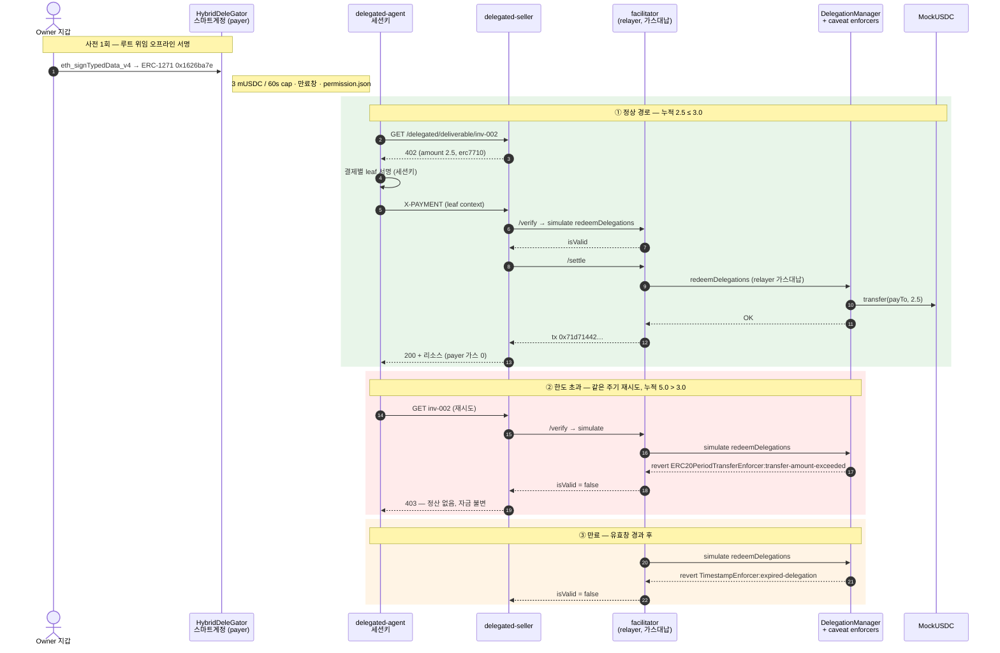

# Mapae — 기술자료

> 마패는 특권의 증표가 아니라 한계의 증표다.
> 새겨진 말의 수는 쓸 수 있는 권한이 아니라, 그 권한이 끝나는 지점이었다.

GIWA Chain 위에서 에이전트가 **위임받은 한도 안에서** 정산을 집행하고, 그 집행을 검증 가능한 기록으로 남기는 인프라.

---

## 1. 시스템 구성

| 컴포넌트 | 역할 | 런타임 |
|---|---|---|
| `contracts/` | MockUSDC (EIP-3009) | Solidity 0.8.28 / Foundry |
| `facilitator/` | x402 결제 검증·정산 브로드캐스트 | x402-rs (Rust, 컨테이너 운영) |
| `apps/seller` | 402 발행 (유료 리소스) | Bun + Hono |
| `apps/agent` | 402 수신 → 서명 → 재요청 | Bun (→ MCP 클라이언트) |
| `apps/console` | 위임·한도 관리, 영수증 조회 | Vite + TanStack + wagmi |
| `packages/shared` | 체인·토큰·x402 타입·에러 모델 | TypeScript |
| `packages/delegation` | Framework 환경·caveat·서명·재위임·취소·ERC-7710 | Smart Accounts Kit 1.7 |
| `apps/facilitator-erc7710` | ERC-7710 verify/settle 어댑터 | Bun + viem |
| `apps/delegated-agent` | parent 위임에서 결제별 leaf 생성 | Bun |
| `apps/delegated-seller` | ERC-7710 402 발행·리소스 게이트 | Bun + Hono |
| `apps/agent-mcp` | 결제 루프를 MCP tool로 노출 | Bun + MCP SDK (stdio) |

**언어 선택 근거** — 위임 레이어가 ERC-7710/7715 구현체(MetaMask Delegation Toolkit)에 의존하고 이는 TypeScript 전용이므로 애플리케이션 계층은 TS. facilitator는 자체 구현 대신 x402-rs 컨테이너를 **운영**하는 포지션.

---

## 2. 결제 흐름

Mapae는 회귀 가능한 두 경로를 병렬 유지한다.

### D2 — EIP-3009 직접 결제

```
에이전트 → 리소스 요청
        ← 402 Payment Required (금액·수취인·asset·EIP-712 도메인)
        → 한도 확인 후 EIP-3009 authorization 서명 (오프체인)
facilitator → 서명 검증 → GIWA에 정산 트랜잭션 브로드캐스트
        ← 리소스 + 영수증
```

지불자는 가스를 내지 않는다. 트랜잭션을 실제로 쏘는 건 facilitator의 릴레이어 서명자이며, authorization에 `from`·`to`·`value`가 서명으로 고정되어 있어 릴레이어는 **브로드캐스터 이상의 권한을 갖지 못한다.**

### D3/D4 — ERC-7710 위임 결제

```text
account owner wallet → HybridDeleGator owner account
            → erc20PeriodTransfer parent delegation
agent       → 402 수신
            → amount/payTo/facilitator가 고정된 결제별 leaf 서명
seller      → ERC-7710 facilitator /verify → /settle
facilitator → DelegationManager.redeemDelegations
            → mUSDC.transfer(payTo, amount)
```

parent caveat는 60초 주기 한도와 만료창(기본 30분, 데모는 `PERMISSION_TTL_SECONDS`로
연장)을 온체인으로 강제한다. Vendor 프로필은 ERC-20 `transfer` calldata의 수취인
위치도 고정한다. Manager→Child 재위임에서는 child의 개별 한도와 manager의 합산
한도가 동시에 적용된다.

아래 시퀀스는 데모의 세 경로 — 정상 정산, 주기 한도 초과 거절, 만료 거절 — 를
같은 위임 하나에 대해 보여준다. 거절은 백엔드가 아니라 온체인 caveat이 판정한다.



#### 라이브 데모 증거 — GIWA Sepolia (2026-07-24)

| 경로 | 결과 | 증거 |
|---|---|---|
| Framework 배포 | 38-unit + 2단계 ownership + owner 스마트계정 | manager `0xF2F782Fa…F40C`, owner account `0xA4e4d00E…DDF382` |
| 정상 정산 (inv-001, 1 mUSDC) | 성공, payer 가스 0 | tx `0xe897fe55…a97d`, block 31555419 |
| 정상 정산 (inv-002, 2.5 mUSDC) | 성공 | tx `0x71d71442…6ce4`, block 31558282 |
| **주기 한도 초과** (누적 5.0 > 3.0) | **온체인 거절, 자금 불변** | revert `ERC20PeriodTransferEnforcer:transfer-amount-exceeded` |
| **만료** (유효창 경과) | **온체인 거절** | revert `TimestampEnforcer:expired-delegation` |

거절 두 경우 모두 relayer는 트랜잭션을 브로드캐스트하지 않는다 — facilitator의
`/verify`가 `simulate.redeemDelegations`로 미리 걸러 가스를 낭비하지 않는다.
동일한 2.5 mUSDC 결제가 여유가 있을 땐 정산되고 누적이 cap을 넘으면 거절된다는
점이 핵심이다: **한도는 코드의 약속이 아니라 온체인 enforcer가 강제하는 사실이다.**

### D5 — 에이전트 자동화 (MCP)

결제 루프는 `packages/delegation/src/payment-client.ts`의
`payForDelegatedResource` 하나로 모여 있고, CLI 에이전트와 MCP 서버가 그것을
공유한다. 두 벌로 두면 x402 도메인이 두 벌일 때와 같은 방식으로 어긋난다.

`apps/agent-mcp`가 노출하는 tool은 둘이다.

| tool | 하는 일 |
|---|---|
| `mapae_pay_for_resource` | 402 수신 → caveat 안에서 leaf 서명 → 재요청 → 리소스 |
| `mapae_status` | 세션키·엔드포인트·배포 검증 여부 (키·permission context는 반환하지 않음) |

**실패는 죽지 않고 이유가 된다.** 코어는 예외 대신 판별된 결과를 돌려주며,
`SELLER_OFFER_INVALID`·`FACILITATOR_UNTRUSTED`·`MANAGER_MISMATCH`·`LIMIT_EXCEEDED`·
`PERMISSION_INACTIVE`·`SIGNING_FAILED`·`PAYMENT_REJECTED` 등으로 원인을 가리킨다.
서명 실패를 `TRANSPORT_ERROR`에 뭉개면 읽는 사람이 네트워크를 들여다보게 된다.

**온체인 pre-flight.** 서명 전에 enforcer 자신의 회계를 읽어 못 낼 결제를 먼저
거른다. 한도는 어차피 온체인이 강제하므로 이건 안전장치가 아니라 **사유의 정확도**를
위한 것이다 — seller까지 갔다가 403을 받고 "거절됨"이라고 말하는 대신
`payment of 2500000 exceeds 2000000 left in this period`라고 말한다. 낼 수 없는
결제에 leaf를 서명하지 않는다는 부수 효과도 있다(leaf는 bearer authorization이다).

pre-flight는 콜백으로 주입한다. 결제 코어 자체는 체인 비의존으로 남아야 mock
fetch만으로 단위 테스트가 되기 때문이다. 실제 구현은 `agent-runtime`이 부모
permission의 root 위임에 대해 `readDelegationStatus`로 제공한다.

두 가지 비자명한 결정:

- **런타임 로딩은 lazy이고 성공만 캐시한다.** 즉시 부팅하면 env·네트워크 실패가
  "서버 기동 실패"로 프로세스를 죽여, 이유를 돌려주기로 한 설계를 정면으로
  위반한다. lazy면 tool 결과로 사유가 나가고 환경을 고친 뒤 재시작 없이 복구된다.
- **stdout은 JSON-RPC 채널이다.** 로깅은 전부 stderr. `console.log` 한 줄이
  스트림을 깨뜨린다.

### D6 — 콘솔 (지갑 모듈)

두 화면 모두 데이터를 체인에서 직접 읽는다.

| 화면 | 출처 |
|---|---|
| 위임·한도 | `ERC20PeriodTransferEnforcer.getAvailableAmount` (남은 주기 잔액), caveat terms (한도·유효창), `DelegationManager.disabledDelegations` (회수 여부) |
| 영수증 | `TransferredInPeriod` 이벤트 |

캡을 소모한 정산은 반드시 그 이벤트를 남기므로 **영수증에는 별도 원장도 계정
체계도 필요 없다.** 지갑 연결이 곧 신원이다.

남은 잔액을 오프체인에서 자체 집계하지 않는 이유는 그것이 곧 두 번째 진실이
되어, 실제로 강제하는 쪽과 어긋날 수 있기 때문이다.

영수증 조회는 `fromBlock`을 필수 인자로 받는다. GIWA가 `eth_getLogs` 10만 블록
초과를 거절하므로 `earliest` 기본값은 실패하거나 **잘린 이력을 완전한 것처럼**
돌려준다.

**회수의 경계.** `DeleGatorCore.disableDelegation`은 `onlyEntryPointOrSelf`라
owner EOA가 직접 호출할 수 없고 EntryPoint UserOperation이어야 한다. 두 분기 모두
수트에서 돈다.

*self* 분기는 impersonation으로 태워 **결과**를 증명한다 — 회수 후
`disabledDelegations`가 참으로 바뀌고 동일한 MCP 결제가 `PERMISSION_INACTIVE`로
거절된다. 셀러가 403을 주는 게 아니라 pre-flight가 첫 402 응답만 보고 서명 전에
끊으므로 HTTP 상태코드는 없다.

*EntryPoint* 분기는 impersonation 없이, 실제 owner 키로 서명한 UserOperation을
`handleOps`로 태운다. `packages/delegation/src/revocation.ts`의
`buildRevocationUserOperation`이 EIP-712 페이로드를 만들고(순수 함수, 네트워크
접근 없음), 서명은 kit이 아니라 맨 viem EOA로 받아 **구성 자체**를 검증한다 —
kit으로 서명하면 kit을 kit으로 검증하는 셈이 된다. 두 서명이 바이트 단위로 같은지
함께 확인한다. `callData`는 `buildRevocationCall(...).data` 그대로이며 `execute()`로
감싸지 않는다. 감싸면 EntryPoint → `execute` → self-call이 되어 이미 덮은 self
분기로 되돌아가기 때문이다.

| 대조군 | 무엇을 증명하나 | 실제 revert |
|---|---|---|
| `revocation-userop` | 정상 경로 | 성공 — `UserOperationEvent.success == true`, `disabledDelegations` 참 |
| `revocation-userop-unfunded` | 예치금이 실제로 게이트 역할을 한다 | `FailedOp(0,AA21 didn't pay prefund)` |
| `revocation-userop-wrong-signer` | 계정이 `owner()`를 실제로 검증한다 | `FailedOp(0,AA24 signature error)` |
| `revocation-userop-tampered-field` | 서명된 `entryPoint` 필드가 유효하다 | `FailedOp(0,AA24 signature error)` |
| `revocation-submitter` | JSON 와이어로 온 제출이 검증기를 거쳐 실제로 회수된다 | 성공 — 검증된 struct가 서명된 struct와 9필드 전부 동일 |
| `revocation-submitter-foreign-sender` | 남의 계정 회수는 체인을 읽기도 전에 거절된다 | `sender is not the account this submitter serves` |

**제출 엔드포인트 (`apps/revocation-submitter`).** `handleOps`는 누구나 부를 수 있고
릴레이어가 가스를 먼저 낸다. 그래서 받은 것을 그대로 흘려보내는 서비스는 **남의 키로
굴러가는 범용 UserOperation 릴레이**가 된다. `validateRevocationSubmission`이 그 구멍을
막는다 — `sender` 허용목록, 루트의 `delegator == sender`, `initCode`·`paymasterAndData`
빈 값 강제, 가스 4종 상한, 그리고 **`callData` 바이트 일치**.

마지막 것이 decode가 아니라 **재인코딩 동치**인 게 핵심이다. decode는 앞부분만 파싱되면
통과하므로 뒤에 바이트를 덧붙인 calldata를 받아준다. 뮤테이션으로 확인했다: 동치 검사를
prefix 검사로 바꾸면 정확히 `trailing bytes` 케이스 하나만 깨진다.

서명은 **일부러 오프라인에서 검증하지 않는다.** 계정이 `HybridDeleGator`라 ERC-1271로
검증하므로, 오프라인 `ecrecover`는 계정과 조용히 어긋난다. 권위는 EntryPoint의 `AA24`이고,
브로드캐스트 전 시뮬레이션에서 잡는다.

`judgeSubmissionReadiness`는 체인을 읽기 전에 알 수 있는 거절 사유 3종을 분리한다 —
`prefund_short`(가장 흔하다. payer는 설계상 ETH 0이라 예치금이 유일한 재원이다),
`fee_below_basefee`(EntryPoint는 `min(maxFeePerGas, baseFee+priority)`로 정산하는데
릴레이어의 트랜잭션은 `baseFee` 아래로 실릴 수 없다 → 성공하면서 운영자만 잃는 브로드캐스트),
`relayer_unfunded`. 소유자에게 "거절됨" 대신 "0.0035 ETH 모자람"을 돌려주기 위한 구분이다.

성공 케이스가 receipt status만 보고 통과하지 않도록 `UserOperationEvent.success`를
직접 확인한다. `EntryPoint.sol:340-353`은 내부 호출 revert를
`UserOperationRevertReason`으로 삼키고 트랜잭션 자체는 성공시키므로, receipt만
보면 `disableDelegation`이 revert해도 초록으로 보인다(뮤테이션으로 확인함).

**서비스를 실제로 띄운 검증** (`bun run test:e2e:revoke`). 위 표는 수트가 검증기와
온체인 강제를 덮는다는 뜻이지 **프로세스가 뜬다는 뜻은 아니었다.** env 파싱, 배포
아티팩트 읽기, 부팅 시 릴레이어 대조, `/health`, single-flight, simulate→broadcast는
별도 e2e가 GIWA fork 위에 서비스를 실제로 spawn해서 5케이스를 왕복한다.

그중 두 케이스가 분리된 이유가 비자명하다. "같은 바디를 다시 보내면 거절된다"만으로는
리플레이 방어를 증명하지 못한다 — 그걸 막은 건 체인 **앞단의** 예치금 게이트고 nonce는
실행된 적이 없다. 그래서 예치금을 다시 채워 그 게이트를 치운 뒤 동일 바디를 재전송하고,
그때 남는 유일한 방어선인 EntryPoint nonce가 `AA25 invalid account nonce`로 끊는 것을
확인한다. 처음 작성했을 때는 이 구분이 없어 **틀린 이유로 통과하고 있었다.**

성공 케이스는 릴레이어의 **수지**도 확인한다 — 가스로 쓴 것보다 더 줄었으면 실패시킨다.
이건 형식적인 검사가 아니다: GIWA에서 잘 알려진 Anvil 주소들은 EIP-7702 designator를
달고 있고 그 대상이 들어온 잔액을 전액 쓸어가는 스위퍼다. `_compensate`가 beneficiary에게
`call{value: …}`로 지급하므로 그 주소를 릴레이어로 쓰면 `handleOps` 한 번에 릴레이어가
빈다(측정: 1 ETH → 0.00024 ETH, 트랜잭션 비용은 0.00017 ETH). 트랜잭션이 성공했다는
사실만으로는 릴레이어가 보전됐다는 뜻이 아니다. 절차는
[회수 런북](revocation-runbook.md)에 있다.

반례 수트도 같은 이유로 `handleOps` beneficiary를 릴레이어와 분리해 두고 있었는데,
주석에 적힌 원인은 "fork에서 Anvil이 dev 계정 잔액 override를 잃는다"였고 이는
측정 결과 **틀렸다.** 원인이 로컬 도구가 아니라 체인 상태이므로 고치는 방법도
달라진다 — beneficiary는 **대상 체인에서 코드가 없는 주소**여야 하고,
`assertBeneficiaryIsCodeFree`가 주석 대신 그것을 강제한다. 뮤테이션으로 고정했다:
beneficiary를 designator가 붙은 주소로 바꾸면 fork 타깃에서만 걸리고 ephemeral은
그대로 통과한다 — 위험이 있는 곳에서만 정확히 발화한다.

**콘솔 버튼 (`RevokeButton`).** 지갑 연결 → `owner()` 대조 → nonce 읽기 → 빌드 →
`signTypedData` → 제출 엔드포인트 POST. 세 가지가 비자명하다.

첫째, **서명 전에 연결된 지갑을 계정의 `owner()`와 대조한다**
(`HybridDeleGator.sol:233`). 계정이 ERC-1271로 검증하므로 다른 지갑으로 서명하면
EntryPoint가 `AA24 signature error`를 돌려주는데, 사람 눈에는 nonce나 가스 문제와
구별되지 않는다. 둘째, **nonce를 클릭 시점에 읽고 한 번에 빌드한다.**
`buildRevocationUserOperation`이 순수 함수인 이유가 이것이다 — 빌드와 서명 사이에
다시 읽히는 값이 있으면 digest가 낡고, 역시 `AA24`로 나온다. 셋째, 바디는 제출
엔드포인트가 **검증에 쓰는 바로 그 모듈**의 `buildRevocationSubmissionBody`가 만든다.
와이어 포맷의 인코더와 디코더가 갈라지는 건 이 저장소가 EIP-712 도메인으로 이미 한 번
값을 치른 실패다. 라운드트립 유닛 테스트가 서명된 struct를 바이트 단위로 재현하는지
고정한다.

버튼이 잠기는 이유는 다섯 가지고 각각 다른 문장을 보여준다 — 제출 엔드포인트 미설정,
이미 회수됨, 지갑 미연결, 소유자 아님, 예치금 부족. 순서도 의도적이다: **소유자 불일치를
예치금 부족보다 먼저** 알린다. 예치금은 relayer가 채워야 하지만 지갑은 화면 앞 사람이
바꿀 수 있는 유일한 것이라, 예치금을 먼저 띄우면 정작 고칠 수 있는 걸 가린다. 두 순서
결정 모두 뮤테이션으로 고정했다.

**아직 증명하지 않은 것:** MetaMask가 그 구조체를 **사람에게 렌더링**하는 화면.
viem `LocalAccount.signTypedData`와 `eth_signTypedData_v4`가 바이트 동일한 서명을
낸다는 것은 확인했지만, 지갑이 9개 필드를 읽을 수 있게 보여주는지는 실제 지갑을
띄워봐야 한다.

대신 콘솔은 그 자리에서 **재원 상태**를 읽어 보여준다
(`apps/console/src/Revocation.tsx`): EntryPoint 예치금, 1회 필요액, 부족분,
그리고 지불 계정의 ETH 잔액. 마지막 항목은 0일 때도 — 0일 때야말로 — 계속
보인다. 가스리스가 이 데모의 핵심 주장인데, 값이 0이 아닐 때만 나타나는 행은
불변식이 지켜졌음을 아무도 확인할 수 없는 행이기 때문이다. 필요액은
`revocationPrefund(DEFAULT_REVOCATION_GAS)`로 계산한다 — prefund는 가스
파라미터만의 순수 함수라 아무도 서명하지 않을 UserOperation의 nonce를 체인에
물어볼 이유가 없고, 빌더와 같은 헬퍼를 쓰므로 표시값과 실제 필요액이 어긋날 수
없다.

**킬 스위치의 가스 재원.** 결제는 EntryPoint를 거치지 않는다 — relayer가
`redeemDelegations`를 직접 호출하므로 payer의 zero-ETH 불변식은 결제에 대해
그대로다. 회수만은 EntryPoint를 피할 수 없고, EntryPoint는 계정의 native 잔액이
아니라 **예치금**(`StakeManager.deposits[sender].deposit`)에서 걷는다.
`DeleGatorCore._payPrefund`(:559-566)는 실패한 송금을 삼키므로, 잔액도 예치금도
없으면 계정이 아니라 EntryPoint가 `AA21`로 거절한다 — `AA23`이 아니다.

`EntryPoint.depositTo(address)`는 접근 제어가 없는 `public payable`이라 relayer가
남의 계정 예치금을 채워줄 수 있고, 이때 payer의 native 잔액은 정확히 0으로
유지된다(수트가 매번 확인한다). 다만 `withdrawTo`는 `deposits[msg.sender]`를
읽으므로 relayer가 도로 빼올 수 없다 — 편도 비용이다. 예치금이 없는 백스톱은
`DelegationManager.pause()`로, 이건 평범한 `onlyOwner` EOA 트랜잭션이다.

**Framework 킬 스위치.** 회수가 위임 하나를 끊는다면, `DelegationManager.pause()`는
프레임워크 전체를 멈춘다 (`onlyOwner`). 방어는 두 겹이다:

1. **우리 게이트** — `verifyFrameworkOperationalState`가 매 요청마다 `paused`를
   확인하고, 참이면 정산 전에 거절한다.
2. **온체인 백스톱** — `redeemDelegations`에 `whenNotPaused`가 걸려 있어
   (`DelegationManager.sol:132`), 게이트를 우회해도 리딤 자체가 revert한다.

fork에서 owner를 impersonate해 `pause()`를 실행하고 **1번이 실제로 막는지**를
증명한다. 퍼실리테이터의 준비상태 캐시(5초)를 기다린 뒤 요청하므로, 거절이
온체인 revert가 아니라 게이트 자신의 판정임이 보장된다 — 결제는
`PAYMENT_REJECTED 403`으로 거절되고 `/health`가 `ok=false`와 함께
`DelegationManager is not operationally active`를 이유로 보고한다. 증명 후
`unpause()`로 되돌려 뒤따르는 회수 증명을 독립적으로 유지한다.

### 재현

```bash
bun run check                      # 키·네트워크 없이 전 계층 회귀
cd apps/delegation-lab
bun run test:negative              # 10개 caveat 케이스 (일회용 체인 / GIWA fork)
bun run test:e2e:mcp               # 결제 완주 → 한도 초과 pre-flight 거절 → pause → 회수
bun run test:e2e:revoke            # 제출 엔드포인트를 실제로 띄워 5케이스 왕복
```

`test:e2e:mcp`는 자식 프로세스가 loopback RPC에 고정되지 않으면 시작하지 않고,
종료 후 실제 GIWA relayer nonce가 그대로인지 다시 읽어 아무것도 브로드캐스트되지
않았음을 확인한다.

---

## 3. 에러 모델

정산 경로의 모든 실패 모드에 태그를 부여한 판별 유니온 (`packages/shared/src/errors.ts`).

블록체인 코드는 에러 표면이 유난히 넓다 — RPC 타임아웃, 레이트리밋, revert, nonce 경합, 서명 검증 실패, 릴레이어 가스 고갈. 이들을 하나의 `catch`로 뭉개면 **복구에 필요한 유일한 정보가 사라진다.** 각 태그는 다음을 구분한다:

- **재시도 가능** (`RpcUnavailable`, `RpcRateLimited`) — 백오프 후 재시도
- **운영 장애** (`RelayerOutOfGas` 등) — 503, 호출자 잘못이 아님. 알림 대상
- **호출자 오류** (`InvalidSignature`, `DomainMismatch`, `MalformedPayload`) — 4xx, 원인을 그대로 반환

`DomainMismatch`를 별도 태그로 둔 이유: EIP-712 도메인 불일치는 x402 통합에서 가장 흔한 실패이며, generic 500으로 나가면 데모 중에 원인을 특정할 수 없다.

**두 경로가 태그를 다르게 쓴다 (의도적).** 위 태그 유니온을 응답 본문에 그대로 싣는 것은
D2 EIP-3009 경로(`apps/seller`)다. D3/D4 위임 경로는 다르게 동작한다:

| | D2 (`apps/seller`) | D3/D4 (`apps/delegated-seller`, `apps/facilitator-erc7710`) |
|---|---|---|
| 외부 응답 | `SettlementError._tag` + `describe()` 원인 | `delegation_rejected` / `settlement_unknown` 등 **불투명한 사유** |
| 상태 코드 | `httpStatusFor()` | 402 / 400 / 403 / 422 / 504 |
| 클라이언트 분기 | 태그 | `DelegatedPaymentFailureCode` (에이전트 측 자체 분류) |

위임 경로가 불투명한 이유는 태만이 아니라 위협 모델이다. 실패 사유를 상세히 돌려주면
공격자가 caveat 경계를 응답만으로 탐색할 수 있다 — 남은 한도, 만료 여부, 재위임 구조가
모두 오라클이 된다. **원인은 서버 로그로 간다.** `redactForLog`가 revert 사유
(`ERC20PeriodTransferEnforcer:transfer-amount-exceeded`)는 남기고, viem이 에러에 실어
보내는 bearer 길이의 hex(서명된 permission context)는 크기만 남기고 지운다. 운영자는
원인을 보고, 호출자는 보지 못한다.

### Effect 이관 계획

현재 판별 유니온으로 구현하되, `_tag` 판별자는 **의도적으로 [Effect](https://effect.website)의 `Data.TaggedError`와 동형**으로 잡았다.

| 단계 | 상태 |
|---|---|
| 현재 | 판별 유니온 + 명시적 분기. 타입 레벨에서 실패 모드가 전부 열거됨 |
| 다음 | 정산 경로를 `Effect<A, SettlementError, R>`로 이관 — 타입드 에러 채널, `Schedule` 기반 재시도/백오프, 리소스 안전한 RPC 커넥션 |

MVP 기간에 도입하지 않은 이유는 부분 도입이 어렵기 때문이다. Effect는 호출 체인 전체를 감염시키므로, 핵심 결제 루프가 검증되기 전에 도입하면 실행 리스크가 된다. 에러 모델의 **형태**를 먼저 확정해두면 이관은 재작성이 아니라 기계적 치환이 된다.

---

## 4. 보안 고려

### facilitator 신뢰 경계

facilitator는 릴레이어 키를 쥐고, 서명된 `X-PAYMENT`를 넘겨받고, leaf가 지정한
redeemer 본인이다. 즉 **모든 신원 검사를 통과하는 위치**에 있다. 이 시스템이 답해야
하는 질문은 "facilitator를 신뢰할 수 있는가"가 아니라 **"완전히 침해되었을 때 최대
피해가 무엇인가"**다.

핵심은 `redeemDelegations`의 서명 범위다. permission context는 서명되지만
**execution은 서명되지 않는다** — `_executionCallDatas`는 상환 시점에 호출자가
calldata로 공급한다 (`DelegationManager.sol:126-133`). 침해된 facilitator는 멀쩡한
leaf와 함께 **자기가 고른 아무 execution이나** 제출할 수 있고, 이를 막는 것은
오직 그 leaf에 붙은 caveat 집합뿐이다.

`wrong-redeemer` 케이스는 이걸 덮지 못한다. 그건 *낯선 자*가 상환할 수 없음을
증명한다. facilitator는 낯선 자가 아니다.

| 침해된 facilitator가 시도할 수 있는 것 | 거절하는 enforcer | 온체인 revert |
|---|---|---|
| 벤더 대신 자기 주소로 지급 | `AllowedCalldataEnforcer` | `invalid-calldata` |
| 받은 금액을 부풀리기 (주기 상한 이내라도) | `ERC20TransferAmountEnforcer` | `allowance-exceeded` |
| 1회성 지불을 상시 allowance로 전환 (`approve` 드레인) | `ERC20TransferAmountEnforcer` | `invalid-method` |
| 다른 컨트랙트로 호출 돌리기 | `ERC20TransferAmountEnforcer` | `invalid-contract` |
| native 값 끼워 빼내기 | `ValueLteEnforcer` | `value-too-high` |
| **payer 계정 자신을 target으로** (self 분기 진입) | `ERC20TransferAmountEnforcer` | `invalid-contract` |
| 같은 leaf 재상환 | `ERC20TransferAmountEnforcer` | `allowance-exceeded` |
| 만료 후 상환 | `TimestampEnforcer` | `expired-delegation` |
| 주기 상한 초과 누적 | `ERC20PeriodTransferEnforcer` | `transfer-amount-exceeded` |

self-target 케이스가 이 표에서 가장 덜 자명하다. 실행은 `IDeleGatorCore(root.delegator).executeFromExecutor`로 일어나므로(`DelegationManager.sol:252-253`), execution의 target이 payer 계정이면 계정이 **자기 자신을**
호출하게 되고 `msg.sender == address(this)`가 성립한다 — `onlyEntryPointOrSelf`의 *self*
분기다(`DeleGatorCore.sol:106-109`). 그 분기로 `withdrawDeposit`(:356),
`enableDelegation`(:373 — **회수를 되돌린다**), `_authorizeUpgrade`(:526 — 구현체 교체)에
닿는다. DeleGatorCore 안에는 self 호출을 막는 것이 없고, 거기 서 있는 것은 caveat뿐이다.
페이로드로 `withdrawDeposit(address,uint256)`을 고른 것은 그 calldata가 정확히 68바이트라
`ERC20TransferAmountEnforcer`의 길이 게이트(:87)를 **통과한 뒤** 컨트랙트 검사(:92)에서
걸리기 때문이다 — 크기 때문에 우연히 막히는 게 아님을 분명히 하려고.
뮤테이션으로 귀속을 확인했다: target만 토큰으로 되돌리면 revert가 `invalid-method`로
바뀌어 단언이 깨진다. 다만 이 케이스가 증명하는 것은 **caveat이 거절한다**까지이고,
caveat이 없었다면 self 호출이 성공했으리라는 것은 위 두 컨트랙트를 읽어서 아는 것이지
이 케이스가 증명하는 바가 아니다.

`approve` 케이스는 주소 검사를 **전부 통과하도록** 작성했다 — spender 슬롯에 고정된
벤더 주소가 들어간다. 그래서 이를 거절하는 것은 셀렉터 검사뿐이고, 실제로 거절한다.
지갑 탈취의 고전적 수법이 caveat 하나로 막히는 지점이다.

**그래서 남는 것 — 침해된 facilitator가 실제로 할 수 있는 일:**

- **정산 거부(liveness).** 자금은 안전하지만 결제는 진행되지 않는다. seller는
  504 `settlement_unknown`을 돌려주고, 이는 안전성이 아니라 가용성 문제다.
- **순서 조작·지연.** 만료 창 안에서.
- **지불자가 이미 승인한 그 금액을, 그 벤더에게, 실제로 집행.** seller가 리소스를
  주지 않았더라도. 손실이 발생할 수 있지만 **수취인은 언제나 에이전트가 고정한
  벤더**이며 facilitator 자신이 될 수 없다.

즉 **자금 탈취·경로 변경·한도 초과는 불가능하고, 남는 것은 가용성과 순서**다.
이것이 릴레이어에게 가스를 맡기면서도 자금을 맡기지 않는 구조의 값이다.

**증거.** 위 8행은 주장이 아니라 `negative-path-suite.ts`가 실행하는 케이스다.
5개 변조 케이스에는 **대조군**이 붙어 있다 — 같은 leaf, 같은 redeemer, 변조만 뺀
execution은 정상 정산된다. 대조군이 없으면 5개의 초록 체크가 변조와 무관한 이유
(소진된 주기, 낡은 계정)로도 나올 수 있다. 23개 케이스 전부 일회용 체인과
GIWA fork 양쪽에서 통과한다.

### 공격 벡터 대응표

| 벡터 | 대응 |
|---|---|
| 서명 리플레이 | EIP-3009 nonce 소비 (`authorizationState`), 테스트로 검증 |
| 스마트어카운트 서명 | OZ `SignatureChecker` — EOA와 EIP-1271 동시 지원. `ecrecover` 단독은 4337 계정에서 조용히 실패 |
| authorization 프론트런 | `transferWithAuthorization`은 관찰자가 먼저 제출 가능하나 자금은 서명된 `to`로만 이동 — 절도가 아닌 순서 문제. 수취 사실에 로직을 거는 경우 `receiveWithAuthorization` 사용 |
| 유효 기간 | `validAfter`/`validBefore` 강제. L2 시퀀서의 타임스탬프 조작 폭(초)은 유효창(분·시간) 대비 무의미 |
| 릴레이어 권한 | 금액·수취인이 서명에 고정되어 변경 불가 |
| 서명 로그 노출 | facilitator 오류 로그에는 signature·전체 payload를 남기지 않고 체인·자산·금액·주소·nonce 메타데이터만 기록 |
| facilitator 공격면 | API를 loopback/사설망에만 노출하고, 컨테이너 이미지를 digest로 고정하며 read-only·cap-drop·no-new-privileges 적용 |
| 리다이렉트 탈취 | agent와 seller의 결제 요청은 HTTP redirect를 거부해 `X-PAYMENT` authorization이 다른 origin으로 전달되지 않게 함 |
| 악성 DelegationManager | GIWA 배포 아티팩트에서 단일 manager allowlist, canonical EntryPoint와 필수 enforcer 주소 검증 |
| permission context 노출 | Git 제외, 크기 제한, 로그·오류 상세 미출력 |
| payer 영수증 위조 | `permissionContext`의 마지막/root delegator를 canonical payer로 도출하고 wire claim 불일치 거절 |
| verify→settle 경합 | settle 직전 재시뮬레이션 |
| 중복 settle | canonical 결제 조건과 context 바이트의 `paymentIntentId`로 단일화, broadcast tx hash를 receipt보다 먼저 저장 |
| 복잡한 delegation gas DoS | estimate 후 설정 gas cap 초과 거절 |
| 비인가 relayer | leaf의 `RedeemerEnforcer`와 402 `facilitatorAddresses` 교집합 강제 |

---

## 5. 확인된 온체인 환경

| 항목 | 값 |
|---|---|
| 네트워크 | GIWA Sepolia (`eip155:91342`) |
| RPC | `https://sepolia-rpc.giwa.io` |
| MockUSDC | `0xcfeb694719A09caeb80798e2011298F29CDa4e92` |
| EIP-712 도메인 | name `Mock USDC` / version `2` / decimals `6` |
| EntryPoint | canonical v0.7 `0x0000000071727De22E5E9d8BAf0edAc6f37da032` |
| Delegation Framework v1.3 | **GIWA 배포·검증 완료** — DelegationManager `0xF2F782Fa…F40C` (active, owner=admin, unpaused), 38-unit exact composition |
| owner 스마트계정 (payer) | `0xA4e4d00E5860d3700aF2247fFa818Fb62BDDF382` (HybridDeleGator, owner=Case1) |
| ERC20PeriodTransferEnforcer | `0x700330288f6f094780121ea54cd2eDEfe45b3625` |
| Dojang | EAS 기반 attestation, 배포 확인 (등급2에서 사용 예정) |

---

## 6. 다음 단계

- **GIWA D3/D4 활성화 ✅ 완료** — Framework 배포, owner account 배포, root 위임
  서명(ERC-1271 검증), 정상 정산 + 한도·만료 거절까지 GIWA에서 실증
- **real-Framework negative-path 수트 ✅ 완료** — `negative-path-suite.ts`가 동일한
  23개 케이스(정상·주기 cap·주기 reset·만료·wrong-redeemer·수취인 불일치·replay·
  facilitator 변조 6종 + 대조군·payer mismatch·root 취소·회수 UserOp 4종·제출
  엔드포인트 2종·manager 합산)를 일회용 체인과 GIWA fork 양쪽에서 체인 파라미터화로
  돌리며, 각 케이스의 온체인 revert 사유까지 대조한다
- **MCP 자동화 ✅ / 콘솔 ✅ / 제출 엔드포인트 ✅** — §2의 D5·D6 참조. 회수
  UserOperation은 온체인 경로까지, 제출 엔드포인트는 와이어 포맷까지 증명 완료.
  남은 것은 지갑 UI 승인 화면 하나다
- **정산 두뇌** — 트리거·스케줄러, 복합 위임(수취인·주기·상한), 원장, 재시도
- **등급2 검증 경로** — Dojang KYC 게이트 + EAS 계약/영수증 스키마 + 리졸버
- **이행검증** — optimistic 구조(기본 통과·이의제기 창·본드). 최종 판정자가 재실행이 아닌 중재이므로 trustless가 아님을 전제로 설계
