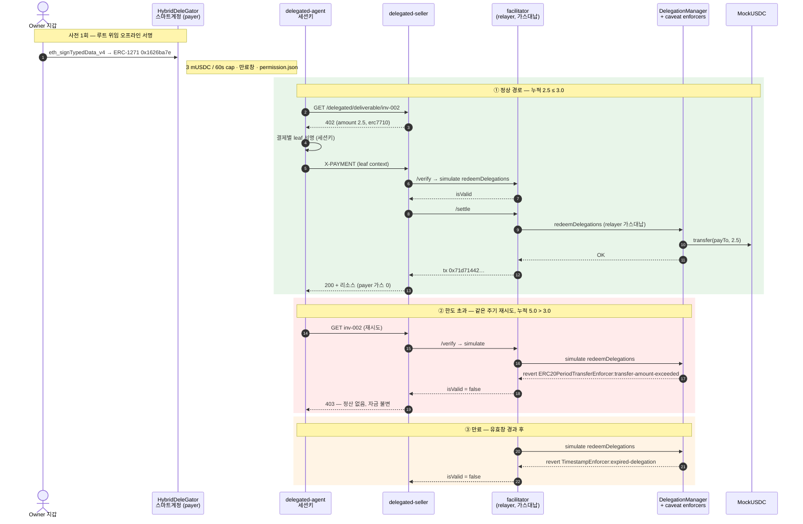

# Mapae — 기술자료

> 마패는 특권의 증표가 아니라 한계의 증표다.
> 새겨진 말의 수는 쓸 수 있는 권한이 아니라, 그 권한이 끝나는 지점이었다.

GIWA Chain 위에서 에이전트가 **위임받은 한도 안에서** 정산을 집행하고, 그 집행을 검증 가능한 기록으로 남기는 인프라.

---

## 1. 시스템 구성

| 컴포넌트 | 역할 | 런타임 |
|---|---|---|
| `contracts/` | MockUSDC (EIP-3009) | Solidity 0.8.28 / Foundry |
| `facilitator/` | x402 결제 검증·정산 브로드캐스트 | x402-rs (Rust, 컨테이너 운영) |
| `apps/seller` | 402 발행 (유료 리소스) | Bun + Hono |
| `apps/agent` | 402 수신 → 서명 → 재요청 | Bun (→ MCP 클라이언트) |
| `apps/console` | 위임·한도 관리, 영수증 조회 | Vite + TanStack + wagmi |
| `packages/shared` | 체인·토큰·x402 타입·에러 모델 | TypeScript |
| `packages/delegation` | Framework 환경·caveat·서명·재위임·취소·ERC-7710 | Smart Accounts Kit 1.7 |
| `apps/facilitator-erc7710` | ERC-7710 verify/settle 어댑터 | Bun + viem |
| `apps/delegated-agent` | parent 위임에서 결제별 leaf 생성 | Bun |
| `apps/delegated-seller` | ERC-7710 402 발행·리소스 게이트 | Bun + Hono |

**언어 선택 근거** — 위임 레이어가 ERC-7710/7715 구현체(MetaMask Delegation Toolkit)에 의존하고 이는 TypeScript 전용이므로 애플리케이션 계층은 TS. facilitator는 자체 구현 대신 x402-rs 컨테이너를 **운영**하는 포지션.

---

## 2. 결제 흐름

Mapae는 회귀 가능한 두 경로를 병렬 유지한다.

### D2 — EIP-3009 직접 결제

```
에이전트 → 리소스 요청
        ← 402 Payment Required (금액·수취인·asset·EIP-712 도메인)
        → 한도 확인 후 EIP-3009 authorization 서명 (오프체인)
facilitator → 서명 검증 → GIWA에 정산 트랜잭션 브로드캐스트
        ← 리소스 + 영수증
```

지불자는 가스를 내지 않는다. 트랜잭션을 실제로 쏘는 건 facilitator의 릴레이어 서명자이며, authorization에 `from`·`to`·`value`가 서명으로 고정되어 있어 릴레이어는 **브로드캐스터 이상의 권한을 갖지 못한다.**

### D3/D4 — ERC-7710 위임 결제

```text
account owner wallet → HybridDeleGator owner account
            → erc20PeriodTransfer parent delegation
agent       → 402 수신
            → amount/payTo/facilitator가 고정된 결제별 leaf 서명
seller      → ERC-7710 facilitator /verify → /settle
facilitator → DelegationManager.redeemDelegations
            → mUSDC.transfer(payTo, amount)
```

parent caveat는 60초 주기 한도와 만료창(기본 30분, 데모는 `PERMISSION_TTL_SECONDS`로
연장)을 온체인으로 강제한다. Vendor 프로필은 ERC-20 `transfer` calldata의 수취인
위치도 고정한다. Manager→Child 재위임에서는 child의 개별 한도와 manager의 합산
한도가 동시에 적용된다.

아래 시퀀스는 데모의 세 경로 — 정상 정산, 주기 한도 초과 거절, 만료 거절 — 를
같은 위임 하나에 대해 보여준다. 거절은 백엔드가 아니라 온체인 caveat이 판정한다.



#### 라이브 데모 증거 — GIWA Sepolia (2026-07-24)

| 경로 | 결과 | 증거 |
|---|---|---|
| Framework 배포 | 38-unit + 2단계 ownership + owner 스마트계정 | manager `0xF2F782Fa…F40C`, owner account `0xA4e4d00E…DDF382` |
| 정상 정산 (inv-001, 1 mUSDC) | 성공, payer 가스 0 | tx `0xe897fe55…a97d`, block 31555419 |
| 정상 정산 (inv-002, 2.5 mUSDC) | 성공 | tx `0x71d71442…6ce4`, block 31558282 |
| **주기 한도 초과** (누적 5.0 > 3.0) | **온체인 거절, 자금 불변** | revert `ERC20PeriodTransferEnforcer:transfer-amount-exceeded` |
| **만료** (유효창 경과) | **온체인 거절** | revert `TimestampEnforcer:expired-delegation` |

거절 두 경우 모두 relayer는 트랜잭션을 브로드캐스트하지 않는다 — facilitator의
`/verify`가 `simulate.redeemDelegations`로 미리 걸러 가스를 낭비하지 않는다.
동일한 2.5 mUSDC 결제가 여유가 있을 땐 정산되고 누적이 cap을 넘으면 거절된다는
점이 핵심이다: **한도는 코드의 약속이 아니라 온체인 enforcer가 강제하는 사실이다.**

---

## 3. 에러 모델

정산 경로의 모든 실패 모드에 태그를 부여한 판별 유니온 (`packages/shared/src/errors.ts`).

블록체인 코드는 에러 표면이 유난히 넓다 — RPC 타임아웃, 레이트리밋, revert, nonce 경합, 서명 검증 실패, 릴레이어 가스 고갈. 이들을 하나의 `catch`로 뭉개면 **복구에 필요한 유일한 정보가 사라진다.** 각 태그는 다음을 구분한다:

- **재시도 가능** (`RpcUnavailable`, `RpcRateLimited`) — 백오프 후 재시도
- **운영 장애** (`RelayerOutOfGas` 등) — 503, 호출자 잘못이 아님. 알림 대상
- **호출자 오류** (`InvalidSignature`, `DomainMismatch`, `MalformedPayload`) — 4xx, 원인을 그대로 반환

`DomainMismatch`를 별도 태그로 둔 이유: EIP-712 도메인 불일치는 x402 통합에서 가장 흔한 실패이며, generic 500으로 나가면 데모 중에 원인을 특정할 수 없다.

### Effect 이관 계획

현재 판별 유니온으로 구현하되, `_tag` 판별자는 **의도적으로 [Effect](https://effect.website)의 `Data.TaggedError`와 동형**으로 잡았다.

| 단계 | 상태 |
|---|---|
| 현재 | 판별 유니온 + 명시적 분기. 타입 레벨에서 실패 모드가 전부 열거됨 |
| 다음 | 정산 경로를 `Effect<A, SettlementError, R>`로 이관 — 타입드 에러 채널, `Schedule` 기반 재시도/백오프, 리소스 안전한 RPC 커넥션 |

MVP 기간에 도입하지 않은 이유는 부분 도입이 어렵기 때문이다. Effect는 호출 체인 전체를 감염시키므로, 핵심 결제 루프가 검증되기 전에 도입하면 실행 리스크가 된다. 에러 모델의 **형태**를 먼저 확정해두면 이관은 재작성이 아니라 기계적 치환이 된다.

---

## 4. 보안 고려

| 벡터 | 대응 |
|---|---|
| 서명 리플레이 | EIP-3009 nonce 소비 (`authorizationState`), 테스트로 검증 |
| 스마트어카운트 서명 | OZ `SignatureChecker` — EOA와 EIP-1271 동시 지원. `ecrecover` 단독은 4337 계정에서 조용히 실패 |
| authorization 프론트런 | `transferWithAuthorization`은 관찰자가 먼저 제출 가능하나 자금은 서명된 `to`로만 이동 — 절도가 아닌 순서 문제. 수취 사실에 로직을 거는 경우 `receiveWithAuthorization` 사용 |
| 유효 기간 | `validAfter`/`validBefore` 강제. L2 시퀀서의 타임스탬프 조작 폭(초)은 유효창(분·시간) 대비 무의미 |
| 릴레이어 권한 | 금액·수취인이 서명에 고정되어 변경 불가 |
| 서명 로그 노출 | facilitator 오류 로그에는 signature·전체 payload를 남기지 않고 체인·자산·금액·주소·nonce 메타데이터만 기록 |
| facilitator 공격면 | API를 loopback/사설망에만 노출하고, 컨테이너 이미지를 digest로 고정하며 read-only·cap-drop·no-new-privileges 적용 |
| 리다이렉트 탈취 | agent와 seller의 결제 요청은 HTTP redirect를 거부해 `X-PAYMENT` authorization이 다른 origin으로 전달되지 않게 함 |
| 악성 DelegationManager | GIWA 배포 아티팩트에서 단일 manager allowlist, canonical EntryPoint와 필수 enforcer 주소 검증 |
| permission context 노출 | Git 제외, 크기 제한, 로그·오류 상세 미출력 |
| payer 영수증 위조 | `permissionContext`의 마지막/root delegator를 canonical payer로 도출하고 wire claim 불일치 거절 |
| verify→settle 경합 | settle 직전 재시뮬레이션 |
| 중복 settle | canonical 결제 조건과 context 바이트의 `paymentIntentId`로 단일화, broadcast tx hash를 receipt보다 먼저 저장 |
| 복잡한 delegation gas DoS | estimate 후 설정 gas cap 초과 거절 |
| 비인가 relayer | leaf의 `RedeemerEnforcer`와 402 `facilitatorAddresses` 교집합 강제 |

---

## 5. 확인된 온체인 환경

| 항목 | 값 |
|---|---|
| 네트워크 | GIWA Sepolia (`eip155:91342`) |
| RPC | `https://sepolia-rpc.giwa.io` |
| MockUSDC | `0xcfeb694719A09caeb80798e2011298F29CDa4e92` |
| EIP-712 도메인 | name `Mock USDC` / version `2` / decimals `6` |
| EntryPoint | canonical v0.7 `0x0000000071727De22E5E9d8BAf0edAc6f37da032` |
| Delegation Framework v1.3 | **GIWA 배포·검증 완료** — DelegationManager `0xF2F782Fa…F40C` (active, owner=admin, unpaused), 38-unit exact composition |
| owner 스마트계정 (payer) | `0xA4e4d00E5860d3700aF2247fFa818Fb62BDDF382` (HybridDeleGator, owner=Case1) |
| ERC20PeriodTransferEnforcer | `0x700330288f6f094780121ea54cd2eDEfe45b3625` |
| Dojang | EAS 기반 attestation, 배포 확인 (등급2에서 사용 예정) |

---

## 6. 다음 단계

- **GIWA D3/D4 활성화 ✅ 완료** — Framework 배포, owner account 배포, root 위임
  서명(ERC-1271 검증), 정상 정산 + 한도·만료 거절까지 GIWA에서 실증
- **real-Framework negative-path 수트** — 감사 항목 4. expiry·period cap은 이미
  실증됐고, replay·wrong-redeemer·revocation·child 합산 cap·period reset·payer
  mismatch를 `local-integration.ts` 체인-파라미터화로 자동화
- **정산 두뇌** — 트리거·스케줄러, 복합 위임(수취인·주기·상한), 원장, 재시도
- **등급2 검증 경로** — Dojang KYC 게이트 + EAS 계약/영수증 스키마 + 리졸버
- **이행검증** — optimistic 구조(기본 통과·이의제기 창·본드). 최종 판정자가 재실행이 아닌 중재이므로 trustless가 아님을 전제로 설계
