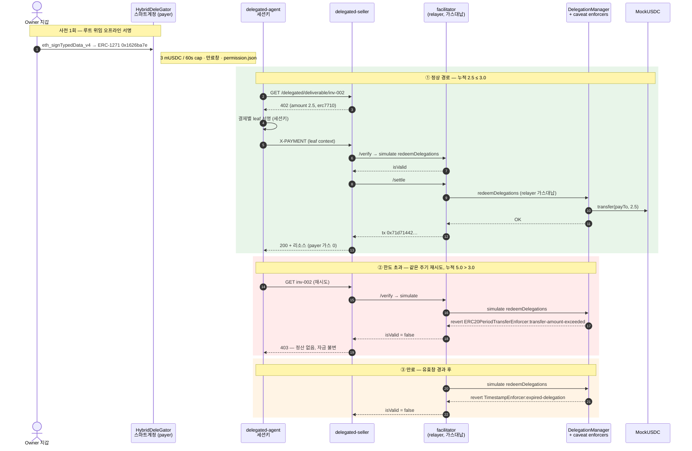

<!-- 생성된 파일 — 직접 수정하지 말 것. 정본은 `docs/tech-notes.md`, 재생성은 `bun run gitbook:build`. -->

# 2. 결제 흐름

Mapae는 회귀 가능한 두 경로를 병렬 유지한다.

## EIP-3009 직접 결제

```
에이전트 → 리소스 요청
        ← 402 Payment Required (금액·수취인·asset·EIP-712 도메인)
        → 한도 확인 후 EIP-3009 authorization 서명 (오프체인)
facilitator → 서명 검증 → GIWA에 정산 트랜잭션 브로드캐스트
        ← 리소스 + 영수증
```

지불자는 가스를 내지 않는다. 트랜잭션을 브로드캐스트하는 것은 facilitator의
릴레이어 서명자이며, authorization에 `from`·`to`·`value`가 서명으로 고정되어
있어 릴레이어는 브로드캐스터 이상의 권한을 갖지 못한다.

## ERC-7710 위임 결제

```text
account owner wallet → HybridDeleGator owner account
            → erc20PeriodTransfer parent delegation
agent       → 402 수신
            → amount/payTo/facilitator가 고정된 결제별 leaf 서명
seller      → ERC-7710 facilitator /verify → /settle
facilitator → DelegationManager.redeemDelegations
            → mUSDC.transfer(payTo, amount)
```

이 문서에서 권한(permission)과 위임(delegation)은 같은 서명 아티팩트를 가리킨다
— ERC-7715와 ERC-7710의 표기 차이다. parent caveat는 60초 주기 한도와
만료창(기본 30분, 데모에서는 `PERMISSION_TTL_SECONDS`로 연장)을 온체인으로
강제한다. Vendor 프로필은 ERC-20
`transfer` calldata의 수취인 위치도 고정한다. Manager→Child 재위임에서는
child의 개별 한도와 manager의 합산 한도가 동시에 적용된다.

아래 시퀀스는 같은 위임 하나에 대한 세 경로 — 정상 정산, 주기 한도 초과 거절,
만료 거절 — 를 보여준다. 거절의 판정 주체는 백엔드가 아니라 온체인 caveat이다.



### 정산 증거 — GIWA Sepolia (2026-07-24)

증거 수준을 구분해 표기한다. **채굴됨**은 GIWA에 블록으로 들어가 익스플로러에서
열리는 트랜잭션이고, **시뮬레이션**은 GIWA의 현재 상태를 상대로 한 `eth_call`이다
— 판정은 배포된 enforcer 바이트코드가 실제 주기 카운터를 읽어 내리지만, 블록에
들어간 것은 없다.

| 경로 | 결과 | 증거 수준 | 증거 |
|---|---|---|---|
| Framework 배포 | 38-unit + 2단계 ownership + owner 스마트계정 | **채굴됨** | manager `0xF2F782Fa…F40C`, owner account `0xA4e4d00E…DDF382` |
| 정상 정산 (inv-001, 1 mUSDC) | 성공, payer 가스 0 | **채굴됨** | tx `0xe897fe55…a97d`, block 31555419 |
| 정상 정산 (inv-002, 2.5 mUSDC) | 성공 | **채굴됨** | tx `0x71d71442…6ce4`, block 31558282 |
| **주기 한도 초과** (누적 5.0 > 3.0) | **거절, 자금 불변** | 시뮬레이션 | revert `ERC20PeriodTransferEnforcer:transfer-amount-exceeded` |
| **만료** (유효창 경과) | **거절** | 시뮬레이션 | revert `TimestampEnforcer:expired-delegation` |

거절 두 건에 트랜잭션 해시가 없는 것은 설계의 결과다. facilitator의 `/verify`가
`simulate.redeemDelegations`로 먼저 걸러내므로, revert가 예정된 트랜잭션에는
가스를 쓰지 않는다. 동일한 2.5 mUSDC 결제가 잔량이 있을 때는 정산되고 누적이
cap을 넘으면 거절된다 — 한도는 애플리케이션 코드의 약속이 아니라 배포된
enforcer가 강제하는 상태다.

## 에이전트 자동화 (MCP)

결제 루프는 `packages/delegation/src/payment-client.ts`의
`payForDelegatedResource` 하나로 수렴하며, CLI 에이전트와 MCP 서버가 같은
구현을 공유한다. 구현이 두 벌이면 어긋난다.

`apps/agent-mcp`가 노출하는 tool은 둘이다.

| tool | 역할 |
|---|---|
| `mapae_pay_for_resource` | 402 수신 → caveat 안에서 leaf 서명 → 재요청 → 리소스 |
| `mapae_status` | 세션키·엔드포인트·배포 검증 여부 (키·permission context는 반환하지 않음) |

이 경로는 GIWA Sepolia에서 완주했다. MCP tool 호출 한 번이 사람 개입 없이 결제를
정산했고, 트랜잭션
[`0x533c…9964c`](https://sepolia-explorer.giwa.io/tx/0x533c5cb2945b89c7a56abf681ef049124deb4daf141e1a52b280385cefd9964c)
(block 31634935)에서 payer −1 mUSDC, vendor +1 mUSDC, payer의 ETH 지출은 `0`이다.
이 경로의 증거 수준은 로컬 fork가 아니라 **GIWA 채굴**이다. 같은 트랜잭션이
§3의 타임아웃 사례이기도 하다 — 온체인 정산은 성공했고, 보고 경로의 타임아웃
예산은 이후 재설계되었다.

**실패는 이유로 반환된다.** 코어는 예외 대신 판별된 결과를 돌려주며
`SELLER_OFFER_INVALID`·`FACILITATOR_UNTRUSTED`·`MANAGER_MISMATCH`·`LIMIT_EXCEEDED`·
`PERMISSION_INACTIVE`·`SIGNING_FAILED`·`PAYMENT_REJECTED` 등으로 원인을 가리킨다.

**온체인 pre-flight.** 서명 전에 enforcer의 회계를 직접 읽어, 성공할 수 없는
결제를 미리 거른다. 한도는 어차피 온체인이 강제하므로 이 단계의 목적은 안전이
아니라 **사유의 정확도**다 — 판매자까지 갔다가 403을 받는 대신
`payment of 2500000 exceeds 2000000 left in this period`처럼 원인을 말한다.
성공할 수 없는 결제에 leaf를 서명하지 않는 부수 효과도 있다(leaf는 bearer
authorization이다).

pre-flight 판정(`judgePreflight`)은 순수 함수로 분리되어 있고, 체인 읽기는
콜백으로 주입된다. 상태 조회는 부모 permission의 **모든 링크**에 대해
`readDelegationStatus`로 수행한다 — root만 보면 재위임된 child의 더 좁은 한도를
놓친다. 판정 규칙 두 가지가 테스트로 고정되어 있다: **비활성 사유가 한도보다
우선한다**(어떤 금액으로도 쓸 수 없는 permission을 `LIMIT_EXCEEDED`로 보고하면
운영자가 원인이 아닌 한도를 조정하게 된다), 그리고 **한도는 체인의 최솟값이지
root의 값이 아니다.**

런타임 동작 두 가지:

- **런타임 로딩은 lazy이며 성공만 캐시한다.** 부팅 시점의 env·네트워크 실패가
  프로세스를 죽이는 대신 tool 결과로 사유가 반환되고, 환경을 고치면 재시작 없이
  복구된다.
- **stdout은 JSON-RPC 채널이다.** 로깅은 전부 stderr로 나간다.

## 콘솔 (지갑 모듈)

두 화면 모두 데이터를 체인에서 직접 읽는다.

| 화면 | 출처 |
|---|---|
| 위임·한도 | `ERC20PeriodTransferEnforcer.getAvailableAmount` (남은 주기 잔액), caveat terms (한도·유효창), `DelegationManager.disabledDelegations` (회수 여부) |
| 영수증 | `TransferredInPeriod` 이벤트 |

캡을 소모한 정산은 반드시 이 이벤트를 남기므로 영수증에 별도 원장이 필요 없다.
남은 잔액을 오프체인에서 자체 집계하지 않는 이유는 그것이 두 번째 진실이 되어
실제로 강제하는 쪽과 어긋날 수 있기 때문이다.

유효창 해석에는 `TimestampEnforcer`의 0 값 의미가 반영되어 있다 — enforcer는
유효창의 각 절반을 `> 0`일 때만 검사하므로, term의 0은 1970이 아니라
**무제한**이다.

**영수증 조회 창.** 조회는 `fromBlock`을 필수 인자로 받는다. GIWA는
`eth_getLogs` 10만 블록 초과를 거절하므로 무제한 기본값은 실패하거나 잘린 이력을
완전한 것처럼 반환하게 된다. 기본 창은 50,000 블록이며, GIWA의 블록 생성이 약
1초에 1개(31634888→31634935 구간 측정)이므로 하루가 되지 않는다. 그래서 화면
헤더와 빈 목록 문구가 창이 열린 시각을 함께 표시하고, 그 시각은 가정한
블록타임이 아니라 `fromBlock` 블록의 타임스탬프를 체인에서 읽어 쓴다. 노드가 그
블록을 주지 못하면(pruned) 문구는 블록 수 표기로 후퇴하고 화면은 유지된다.
`fromBlock === 0`이면 "전체 이력"으로 표기한다. 창은
`VITE_RECEIPT_LOOKBACK_BLOCKS`로 넓힐 수 있으나 10만 블록 상한 위로는 갈 수
없고, 콘솔은 페이징하지 않으며 패널에 그렇게 적혀 있다.

**회수의 경계.** `DeleGatorCore.disableDelegation`은 `onlyEntryPointOrSelf`라
owner EOA가 직접 호출할 수 없고 EntryPoint UserOperation이어야 한다. 두 분기
모두 수트가 실행한다 — *self* 분기는 impersonation으로 결과(회수 후
`disabledDelegations`가 참, 동일 결제가 `PERMISSION_INACTIVE`로 거절)를
증명하고, *EntryPoint* 분기는 실제 owner 키로 서명한 UserOperation을
`handleOps`로 태운다. 이 UserOperation의 `callData`는
`buildRevocationCall(...).data` 그대로이며 `execute()`로 감싸지 않는다 — 감싸면
EntryPoint → `execute` → self 호출이 되어 이미 덮은 *self* 분기로 되돌아간다.
각 의존 요소에는 대조군이 붙는다.

| 대조군 | 증명 대상 | 실제 결과 |
|---|---|---|
| `revocation-userop` | 정상 경로 | 성공 — `UserOperationEvent.success == true`, `disabledDelegations` 참 |
| `revocation-userop-unfunded` | 예치금이 실제 게이트다 | `FailedOp(0,AA21 didn't pay prefund)` |
| `revocation-userop-wrong-signer` | 계정이 `owner()`를 검증한다 | `FailedOp(0,AA24 signature error)` |
| `revocation-userop-tampered-field` | 서명된 `entryPoint` 필드가 유효하다 | `FailedOp(0,AA24 signature error)` |
| `revocation-submitter` | JSON 와이어 제출이 검증기를 거쳐 회수된다 | 성공 — 검증된 struct가 서명된 struct와 9필드 동일 |
| `revocation-submitter-foreign-sender` | 타 계정 회수는 체인 읽기 전에 거절 | `sender is not the account this submitter serves` |

**제출 엔드포인트 (`apps/revocation-submitter`).** `handleOps`는 누구나 호출할
수 있고 릴레이어가 가스를 선지급하므로, 받은 것을 그대로 전달하는 서비스는 타인
자금으로 구동되는 범용 UserOperation 릴레이가 된다. `validateRevocationSubmission`이
이를 한 계정의 한 연산으로 좁힌다 — `sender` 허용목록, 루트의
`delegator == sender`, `initCode`·`paymasterAndData` 빈 값 강제, 가스 4종 상한,
그리고 `callData`의 **재인코딩 바이트 일치**. 마지막 검사가 decode가 아닌 이유는
decode가 뒤에 덧붙은 바이트를 통과시키기 때문이다.

서명은 의도적으로 오프라인에서 검증하지 않는다. 계정이 `HybridDeleGator`라
ERC-1271로 검증되므로 오프라인 `ecrecover`는 계정과 조용히 어긋날 수 있다.
서명의 권위는 브로드캐스트 전 시뮬레이션에서 EntryPoint가 돌려주는 `AA24`다.

`judgeSubmissionReadiness`는 체인 상태에서 판정 가능한 거절 사유를 구분해
반환한다 — `prefund_short`(payer는 설계상 ETH 0이라 예치금이 유일한 재원이며,
가장 흔한 상태), `fee_below_basefee`(EntryPoint는
`min(maxFeePerGas, baseFee+priority)`로 보전하는데 릴레이어의 트랜잭션은
`baseFee` 아래로 포함되지 못하므로, 그대로 태우면 성공하면서 운영자만 손해를
본다), `base_fee_unreadable`(base fee를 읽지 못한 상태 — 재서명이 아니라 재시도
대상이므로 앞의 것과 사유를 분리한다), `relayer_unfunded`.

성공 판정은 receipt status가 아니라 `UserOperationEvent.success`를 직접
확인한다. EntryPoint는 내부 호출의 revert를 `UserOperationRevertReason`으로
흡수하고 트랜잭션 자체는 성공시키므로(`EntryPoint.sol:340-353`), receipt만 보면
`disableDelegation`이 revert해도 성공으로 읽힌다.

**서비스 기동 검증** (`bun run test:e2e:revoke`). 검증기와 온체인 강제는 단위
테스트와 반례 수트가 덮지만, 프로세스 자체의 기동 — env 파싱, 배포 아티팩트
읽기, 부팅 시 릴레이어 대조, `/health`, single-flight, simulate→broadcast — 은
별도 e2e가 GIWA fork 위에 서비스를 실제로 띄워 왕복한다. 케이스 수는 수트가
스스로 세어 `PASS — N cases (ABC…)`로 출력한다.

이 수트의 두 설계가 비자명하다. 첫째, **리플레이 방어는 두 케이스로 나뉜다.**
같은 바디의 재전송을 막는 첫 방어선은 예치금 게이트인데, 그 상태에서 nonce는
실행된 적이 없다. 그래서 예치금을 다시 채워 게이트를 치운 뒤 동일 바디를
재전송하고, 남은 유일한 방어선인 EntryPoint nonce가
`AA25 invalid account nonce`로 끊는 것까지 확인한다. 둘째, **성공 케이스는
릴레이어의 수지를 검증한다.** GIWA에서 잘 알려진 Anvil 개발 주소들은 EIP-7702
designator가 붙어 있고 그 대상은 유입 잔액을 전액 이체하는 스위퍼다.
`EntryPoint._compensate`가 beneficiary에게 `call{value:…}`로 지급하므로 그런
주소를 beneficiary로 쓰면 `handleOps` 한 번에 릴레이어가 비워진다(fork 측정:
1 ETH → 0.00024 ETH, 트랜잭션 비용 0.00017 ETH). 수트는 beneficiary 주소에
코드가 없음을 시작 시점에 강제한다.

브라우저 레그도 응답을 직접 확인한다. 콘솔(:5173)과 제출기(:8082)는 출처가
다르고 요청이 `content-type: application/json`을 실으므로 브라우저는 preflight를
먼저 보낸다 — preflight가 실패하면 POST는 나가지 않는다. 수트는 허용된 출처의
preflight가 204인지, 낯선 출처가 403인지, `Origin` 없는 요청(서버 사이드
호출)이 그대로 동작하는지를 각각 검사한다.

**콘솔 버튼 (`RevokeButton`).** 지갑 연결 → `owner()` 대조 → nonce 읽기 → 빌드
→ `signTypedData` → 제출 엔드포인트 POST. 설계 결정 세 가지: (1) **서명 전에
연결 지갑을 계정의 `owner()`와 대조한다**(`HybridDeleGator.sol:233`) — 다른
지갑의 서명은 EntryPoint에서 `AA24`로 나타나 nonce·가스 문제와 구별되지 않는다.
(2) **nonce를 클릭 시점에 읽고 한 번에 빌드한다** — 빌드와 서명 사이에 값이
다시 읽히면 digest가 낡고 역시 `AA24`가 된다. `buildRevocationUserOperation`이
순수 함수인 이유다. (3) 와이어 바디는 제출 엔드포인트가 검증에 쓰는 것과 같은
모듈의 `buildRevocationSubmissionBody`가 만든다 — 인코더와 디코더가 갈라지지
않도록 라운드트립 테스트가 바이트 단위 재현을 고정한다.

버튼이 잠기는 사유는 다섯 가지이고 각각 다른 문구를 표시한다 — 제출 엔드포인트
미설정, 이미 회수됨, 지갑 미연결, 소유자 아님, 예치금 부족. 소유자 불일치를
예치금 부족보다 먼저 알린다 — 지갑은 화면 앞의 사람이 바꿀 수 있는 유일한
요소이기 때문이다.

**검증되지 않은 구간:** 지갑 확장이 서명 요청 구조체(9개 필드)를 사람이 읽을 수
있게 렌더링하는지는 실제 지갑을 띄워야 확인된다. 자동화가 덮지 못하는 유일한
구간으로 남아 있다.

콘솔은 회수의 **재원 상태**를 함께 표시한다(`apps/console/src/Revocation.tsx`):
EntryPoint 예치금, 1회 필요액, 부족분, 지불 계정의 ETH 잔액. 마지막 항목은 0일
때도 표시한다 — 가스리스가 핵심 주장인 이상, 값이 0이 아닐 때만 나타나는 행은
불변식 준수를 확인할 수 없는 행이다. 필요액은
`revocationPrefund(DEFAULT_REVOCATION_GAS)`로 계산하며, 빌더와 같은 헬퍼를
쓰므로 표시값과 실제 필요액이 어긋나지 않는다.

**킬 스위치의 가스 재원.** 결제는 EntryPoint를 거치지 않는다 — relayer가
`redeemDelegations`를 직접 호출하므로 payer의 zero-ETH 불변식은 결제에 대해
유지된다. 회수만은 EntryPoint를 피할 수 없고, EntryPoint는 계정의 native 잔액이
아니라 예치금(`StakeManager.deposits`)에서 가스를 걷는다.
`DeleGatorCore._payPrefund`(:559-566)는 실패한 송금을 흡수하므로 예치금이
없으면 계정이 아니라 EntryPoint가 `AA21`로 거절한다 — `AA23`이 아니다. `EntryPoint.depositTo(address)`는 접근
제어 없는 `public payable`이라 relayer가 타 계정의 예치금을 채울 수 있고, 이때
payer의 native 잔액은 0으로 유지된다. 단 `withdrawTo`는 `deposits[msg.sender]`를
읽으므로 relayer가 회수할 수 없는 편도 비용이다. 로컬에서 회수 경로를 완주하는
절차는 [회수 런북](../revocation-runbook.md)에 있다.

**Framework 킬 스위치.** 회수가 위임 하나를 끊는다면
`DelegationManager.pause()`는 프레임워크 전체를 멈춘다(`onlyOwner` — 예치금이
필요 없는 평범한 EOA 트랜잭션). 방어는 두 겹이다: facilitator의
`verifyFrameworkOperationalState`가 매 요청마다 `paused`를 확인해 정산 전에
거절하고, 온체인에서는 `redeemDelegations`에 걸린
`whenNotPaused`(`DelegationManager.sol:132`)가 게이트 우회조차 revert시킨다.
fork에서 owner를 impersonate해 `pause()`를 실행하면 결제가
`PAYMENT_REJECTED 403`으로 거절되고 `/health`가 `ok=false`와
`DelegationManager is not operationally active` 사유를 보고하는 것까지 수트가
확인한다.

## 재현

```bash
bun run check                      # 키·네트워크 없이 전 계층 회귀
cd apps/delegation-lab
bun run test:negative              # caveat 케이스 — 기본 타깃은 일회용 체인
SUITE_TARGET=fork bun run test:negative   # 같은 케이스를 GIWA fork 위에서
bun run test:e2e:mcp               # 결제 완주 → 한도 초과 pre-flight 거절 → pause → 회수
bun run test:e2e:revoke            # 제출 엔드포인트를 실제로 띄워 왕복
bun run preflight:giwa             # GIWA 헤드 상태 읽기 전용 GO/NO-GO
```

`test:negative`의 기본 타깃은 일회용 체인이다. GIWA fork 타깃은
`SUITE_TARGET=fork`로 별도 실행해야 하며, 한 줄이 두 타깃을 모두 돌지 않는다.
세 수트 모두 통과 판정과 함께 케이스 수를 스스로 세어 출력한다
(`N/N cases passed`, `PASS — N cases (ABC…)`, `GO — N개 조건 전부 충족`).

실행 요건은 명령마다 다르다. `bun run check`와 `test:negative`는 키·네트워크·
배포 아티팩트 없이 깨끗한 클론에서 돈다 — `test:negative`는 일회용 Anvil에
38유닛 Framework를 직접 배포해 검사한다. 반면 `test:e2e:mcp`는 owner가 서명한
root permission 아티팩트를 요구하므로, 배포된 계정을 소유한 지갑 없이 맨
클론에서는 돌지 않는다.

`test:e2e:mcp`는 자식 프로세스가 loopback RPC에 고정되지 않으면 시작하지 않고,
종료 후 실제 GIWA relayer nonce를 다시 읽어 아무것도 브로드캐스트되지 않았음을
확인한다.

**fork 소스의 자격증명은 argv에 노출되지 않는다.** 사설 GIWA 엔드포인트는 URL
경로에 API 키를 담으므로 URL 전체가 크리덴셜이고, argv는 `ps`로 노출된다.
`anvil --fork-url`에는 환경변수 별칭이 없으므로
`apps/delegation-lab/fork-source-proxy.ts`가 키를 메모리에 보관하고 anvil에는
키 없는 `http://127.0.0.1:<임시포트>`를 전달한다. fork를 띄우는 네 곳 모두 이
경로를 사용한다.
