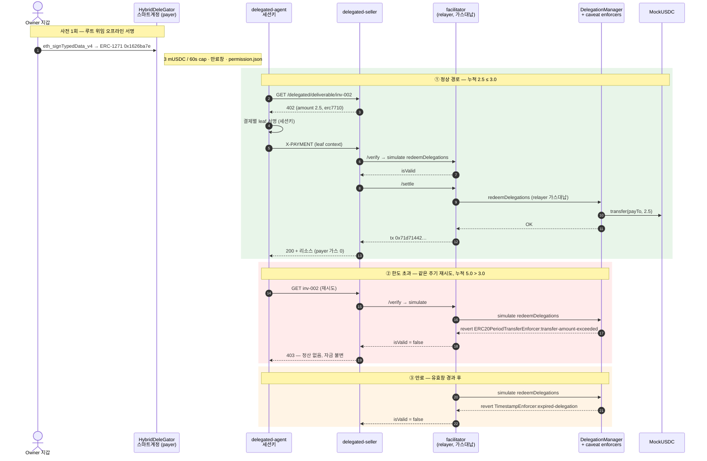

<!-- 생성된 파일 — 직접 수정하지 말 것. 정본은 `docs/tech-notes.md`, 재생성은 `bun run gitbook:build`. -->

# 2. 결제 흐름

Mapae는 회귀 가능한 두 경로를 병렬 유지한다.

## EIP-3009 직접 결제

```
에이전트 → 리소스 요청
        ← 402 Payment Required (금액·수취인·asset·EIP-712 도메인)
        → 한도 확인 후 EIP-3009 authorization 서명 (오프체인)
facilitator → 서명 검증 → GIWA에 정산 트랜잭션 브로드캐스트
        ← 리소스 + 영수증
```

지불자는 가스를 내지 않는다. 트랜잭션을 실제로 쏘는 건 facilitator의 릴레이어 서명자이며, authorization에 `from`·`to`·`value`가 서명으로 고정되어 있어 릴레이어는 **브로드캐스터 이상의 권한을 갖지 못한다.**

## ERC-7710 위임 결제

```text
account owner wallet → HybridDeleGator owner account
            → erc20PeriodTransfer parent delegation
agent       → 402 수신
            → amount/payTo/facilitator가 고정된 결제별 leaf 서명
seller      → ERC-7710 facilitator /verify → /settle
facilitator → DelegationManager.redeemDelegations
            → mUSDC.transfer(payTo, amount)
```

parent caveat는 60초 주기 한도와 만료창(기본 30분, 데모는 `PERMISSION_TTL_SECONDS`로
연장)을 온체인으로 강제한다. Vendor 프로필은 ERC-20 `transfer` calldata의 수취인
위치도 고정한다. Manager→Child 재위임에서는 child의 개별 한도와 manager의 합산
한도가 동시에 적용된다.

아래 시퀀스는 데모의 세 경로 — 정상 정산, 주기 한도 초과 거절, 만료 거절 — 를
같은 위임 하나에 대해 보여준다. 거절은 백엔드가 아니라 온체인 caveat이 판정한다.



### 라이브 데모 증거 — GIWA Sepolia (2026-07-24)

**증거 수준** 열을 먼저 읽을 것. `채굴됨`은 GIWA에 블록으로 들어가 익스플로러에서
열리는 트랜잭션이다. `시뮬레이션`은 GIWA의 현재 상태를 상대로 한 `eth_call`이다 —
판정은 배포된 enforcer 바이트코드가 실제 주기 카운터를 읽어 내리지만, 블록에 들어간
것은 없고 따라서 걸 링크도 없다. 둘을 한 열에 섞으면 표가 실제보다 더 많은 것을
증명한 것처럼 읽힌다.

| 경로 | 결과 | 증거 수준 | 증거 |
|---|---|---|---|
| Framework 배포 | 38-unit + 2단계 ownership + owner 스마트계정 | **채굴됨** | manager `0xF2F782Fa…F40C`, owner account `0xA4e4d00E…DDF382` |
| 정상 정산 (inv-001, 1 mUSDC) | 성공, payer 가스 0 | **채굴됨** | tx `0xe897fe55…a97d`, block 31555419 |
| 정상 정산 (inv-002, 2.5 mUSDC) | 성공 | **채굴됨** | tx `0x71d71442…6ce4`, block 31558282 |
| **주기 한도 초과** (누적 5.0 > 3.0) | **거절, 자금 불변** | 시뮬레이션 | revert `ERC20PeriodTransferEnforcer:transfer-amount-exceeded` |
| **만료** (유효창 경과) | **거절** | 시뮬레이션 | revert `TimestampEnforcer:expired-delegation` |

거절 두 건에 tx 해시가 없는 것은 빈틈이 아니라 설계가 작동한 결과다. facilitator의
`/verify`가 `simulate.redeemDelegations`로 먼저 걸러내므로, 어차피 revert할
트랜잭션에 가스를 쓰지 않는다. 대신 그 거절을 **채굴된 revert로 보여주려면** 일부러
실패할 트랜잭션을 브로드캐스트해야 한다 — 지금은 하지 않는다.

핵심은 그대로다: 동일한 2.5 mUSDC 결제가 여유가 있을 땐 정산되고 누적이 cap을 넘으면
거절된다. **한도는 코드의 약속이 아니라 배포된 enforcer가 강제하는 사실이다.** 다만
그 사실을 확인한 방법이 블록이 아니라 `eth_call`이라는 것을 표가 스스로 말하게 둔다.

## 에이전트 자동화 (MCP)

결제 루프는 `packages/delegation/src/payment-client.ts`의
`payForDelegatedResource` 하나로 모여 있고, CLI 에이전트와 MCP 서버가 그것을
공유한다. 두 벌로 두면 x402 도메인이 두 벌일 때와 같은 방식으로 어긋난다.

`apps/agent-mcp`가 노출하는 tool은 둘이다.

| tool | 하는 일 |
|---|---|
| `mapae_pay_for_resource` | 402 수신 → caveat 안에서 leaf 서명 → 재요청 → 리소스 |
| `mapae_status` | 세션키·엔드포인트·배포 검증 여부 (키·permission context는 반환하지 않음) |

이 경로는 GIWA Sepolia에서도 완주했다. MCP tool 한 번이 사람 개입 없이 결제를
정산했고, 트랜잭션
[`0x533c…9964c`](https://sepolia-explorer.giwa.io/tx/0x533c5cb2945b89c7a56abf681ef049124deb4daf141e1a52b280385cefd9964c)
(block 31634935)에서 payer는 1 mUSDC, vendor는 1 mUSDC만큼 변했고 payer의 ETH는
그대로 `0`이었다. 따라서 이 경로의 증거 수준은 로컬 fork가 아니라 **GIWA 채굴**이다.

**실패는 죽지 않고 이유가 된다.** 코어는 예외 대신 판별된 결과를 돌려주며,
`SELLER_OFFER_INVALID`·`FACILITATOR_UNTRUSTED`·`MANAGER_MISMATCH`·`LIMIT_EXCEEDED`·
`PERMISSION_INACTIVE`·`SIGNING_FAILED`·`PAYMENT_REJECTED` 등으로 원인을 가리킨다.
서명 실패를 `TRANSPORT_ERROR`에 뭉개면 읽는 사람이 네트워크를 들여다보게 된다.

**온체인 pre-flight.** 서명 전에 enforcer 자신의 회계를 읽어 못 낼 결제를 먼저
거른다. 한도는 어차피 온체인이 강제하므로 이건 안전장치가 아니라 **사유의 정확도**를
위한 것이다 — seller까지 갔다가 403을 받고 "거절됨"이라고 말하는 대신
`payment of 2500000 exceeds 2000000 left in this period`라고 말한다. 낼 수 없는
결제에 leaf를 서명하지 않는다는 부수 효과도 있다(leaf는 bearer authorization이다).

pre-flight는 콜백으로 주입한다. 결제 코어 자체는 체인 비의존으로 남아야 mock
fetch만으로 단위 테스트가 되기 때문이다. 실제 구현은 `agent-runtime`이 부모
permission의 **모든 링크**에 대해 `readDelegationStatus`로 제공한다 — root만 보면
재위임된 child의 더 빡빡한 한도를 통과시키고, 그 결제는 온체인에서 revert한다.

**판정은 순수 함수로 분리했다** (`judgePreflight`). 콘솔의 회수 게이트를
`revoke-state.ts`로 뽑아낸 것과 같은 이유다: 이건 에이전트와 서명 사이에 서 있는
판정인데, env·파일·RPC를 요구하는 부트스트랩을 통해서만 닿을 수 있으면 아무도
테스트하지 않는다. 실제로 그랬다 — 이 leg만 실행 증거가 0건이었다.

두 가지 순서를 뮤테이션으로 고정했다. **비활성이 한도보다 먼저**여야 한다. 어떤
금액으로도 못 쓰는 permission을 `LIMIT_EXCEEDED`로 보고하면 운영자가 원인이 아닌
한도를 올리러 간다. 그리고 **최솟값이지 root값이 아니다.** 처음 쓴 순서 테스트는
한도 분기가 애초에 발화하지 않는 금액을 써서 이름만 그 속성이었고, 뮤테이션이
그걸 잡았다 — 둘 다 발화하는 입력으로 바꾼 뒤에야 실제로 고정됐다.

`readDelegationStatus`는 kit 헬퍼가 `readContract`가 아니라
`client.request({method:"eth_call"})`로 내려가므로 JSON-RPC 이음매에서 스크립트한다.
덕분에 테스트가 프로덕션 ABI 인코딩/디코딩 경로를 그대로 태운다. 핵심 단언은
**남은 잔액이 terms에서 계산한 값이 아니라 enforcer가 답한 값**이라는 것이다 —
캡과 모순되는 값을 답하게 해두고 그 값이 그대로 올라오는지 본다.

두 가지 비자명한 결정:

- **런타임 로딩은 lazy이고 성공만 캐시한다.** 즉시 부팅하면 env·네트워크 실패가
  "서버 기동 실패"로 프로세스를 죽여, 이유를 돌려주기로 한 설계를 정면으로
  위반한다. lazy면 tool 결과로 사유가 나가고 환경을 고친 뒤 재시작 없이 복구된다.
- **stdout은 JSON-RPC 채널이다.** 로깅은 전부 stderr. `console.log` 한 줄이
  스트림을 깨뜨린다.

## 콘솔 (지갑 모듈)

두 화면 모두 데이터를 체인에서 직접 읽는다.

| 화면 | 출처 |
|---|---|
| 위임·한도 | `ERC20PeriodTransferEnforcer.getAvailableAmount` (남은 주기 잔액), caveat terms (한도·유효창), `DelegationManager.disabledDelegations` (회수 여부) |
| 영수증 | `TransferredInPeriod` 이벤트 |

캡을 소모한 정산은 반드시 그 이벤트를 남기므로 **영수증에는 별도 원장도 계정
체계도 필요 없다.** 지갑 연결이 곧 신원이다.

남은 잔액을 오프체인에서 자체 집계하지 않는 이유는 그것이 곧 두 번째 진실이
되어, 실제로 강제하는 쪽과 어긋날 수 있기 때문이다.

영수증 조회는 `fromBlock`을 필수 인자로 받는다. GIWA가 `eth_getLogs` 10만 블록
초과를 거절하므로 `earliest` 기본값은 실패하거나 **잘린 이력을 완전한 것처럼**
돌려준다.

**그 창은 생각보다 짧고, 그래서 화면이 창을 말한다.** 기본 50,000 블록인데 GIWA는
블록을 약 1초에 하나씩 낸다(31634888→31634935 측정) — 하루가 안 된다. 정산 다음 날
아침에 데모를 열면 영수증 목록이 비고, 거기에 "정산 기록이 없습니다"만 떠 있으면
**작동한 적 없다는 뜻으로 읽힌다.** 실제로 참인 명제는 "그 정산이 창 밖으로
밀려났다"이다. 그래서 헤더와 빈 목록 문구가 창이 열린 시각을 말하며, 그 시각은
가정한 블록타임이 아니라 `fromBlock`의 블록 타임스탬프를 체인에서 읽어 쓴다.
노드가 그 블록을 안 주면(pruned) 문구만 블록 수로 후퇴하고 화면은 살아 있다.
`fromBlock === 0`이면 창이 아무것도 잘라내지 않으므로 "전체 이력"이라고 말한다 —
거기서 시각을 찍으면 적용되지도 않는 컷오프를 있다고 주장하는 셈이다.

`VITE_RECEIPT_LOOKBACK_BLOCKS`로 넓힐 수 있지만 위의 10만 블록 천장 위로는 못 간다.
**이 콘솔은 페이징하지 않으며, 패널이 그렇게 적어둔다.** 조용히 자르고 완전한 이력인
척하는 쪽이 더 나쁘다.

**회수의 경계.** `DeleGatorCore.disableDelegation`은 `onlyEntryPointOrSelf`라
owner EOA가 직접 호출할 수 없고 EntryPoint UserOperation이어야 한다. 두 분기 모두
수트에서 돈다.

**두 화면은 이제 테스트에서 실제로 렌더된다.** 이전에는 브라우저 밖에서 한 번도
렌더된 적이 없었고, 그래서 caveat 존재 여부만 보고 만료 행을 그리는 버그가
`유효` 뱃지 옆에 `만료 1970-01-01`을 띄운 채로 들어갔다 — `TimestampEnforcer`는
각 절반을 `> 0`으로 검사하므로 0은 1970이 아니라 **무제한**이다. `Screens.test.tsx`가
`renderToStaticMarkup` + 미리 채운 쿼리 캐시로 로딩·성공·실패 세 분기를 모두 찍는다.

실패 분기를 찍으려면 `retryOnMount: false`가 필요하다. 기본값 `true`에서는
`QueryObserver`가 에러 상태의 쿼리에 대해 마운트하는 관찰자에게 **낙관적 pending**을
돌려주므로, 읽기에 실패한 화면을 정적 렌더하면 로딩 패널이 나오고 에러 문구에 대한
단언이 전부 공허하게 통과한다. 추측이 아니라 측정했다 — 같은 시드가 기본값에서는
PENDING, 이 플래그에서는 ERROR를 렌더한다.

렌더 단언은 전부 mutation-prove했다: 만료 행 게이트, 영수증 역순, 파생 불가 금액을
결제액으로 표시, `faultLine` 한 줄 절단, 상태 뱃지 tone, 재위임 경고, 연결 경로를
`ready` 전용 disable로 접기, 해시 없는 성공의 익스플로러 링크, 잘못된 지갑 주소
표기, `relayer_unfunded`를 EntryPoint 예치금으로 오도 — 10개 변이가 각각 자기를
잡는다고 주장한 테스트만 정확히 깨뜨린다.

*self* 분기는 impersonation으로 태워 **결과**를 증명한다 — 회수 후
`disabledDelegations`가 참으로 바뀌고 동일한 MCP 결제가 `PERMISSION_INACTIVE`로
거절된다. 셀러가 403을 주는 게 아니라 pre-flight가 첫 402 응답만 보고 서명 전에
끊으므로 HTTP 상태코드는 없다.

*EntryPoint* 분기는 impersonation 없이, 실제 owner 키로 서명한 UserOperation을
`handleOps`로 태운다. `packages/delegation/src/revocation.ts`의
`buildRevocationUserOperation`이 EIP-712 페이로드를 만들고(순수 함수, 네트워크
접근 없음), 서명은 kit이 아니라 맨 viem EOA로 받아 **구성 자체**를 검증한다 —
kit으로 서명하면 kit을 kit으로 검증하는 셈이 된다. 두 서명이 바이트 단위로 같은지
함께 확인한다. `callData`는 `buildRevocationCall(...).data` 그대로이며 `execute()`로
감싸지 않는다. 감싸면 EntryPoint → `execute` → self-call이 되어 이미 덮은 self
분기로 되돌아가기 때문이다.

| 대조군 | 무엇을 증명하나 | 실제 revert |
|---|---|---|
| `revocation-userop` | 정상 경로 | 성공 — `UserOperationEvent.success == true`, `disabledDelegations` 참 |
| `revocation-userop-unfunded` | 예치금이 실제로 게이트 역할을 한다 | `FailedOp(0,AA21 didn't pay prefund)` |
| `revocation-userop-wrong-signer` | 계정이 `owner()`를 실제로 검증한다 | `FailedOp(0,AA24 signature error)` |
| `revocation-userop-tampered-field` | 서명된 `entryPoint` 필드가 유효하다 | `FailedOp(0,AA24 signature error)` |
| `revocation-submitter` | JSON 와이어로 온 제출이 검증기를 거쳐 실제로 회수된다 | 성공 — 검증된 struct가 서명된 struct와 9필드 전부 동일 |
| `revocation-submitter-foreign-sender` | 남의 계정 회수는 체인을 읽기도 전에 거절된다 | `sender is not the account this submitter serves` |

**제출 엔드포인트 (`apps/revocation-submitter`).** `handleOps`는 누구나 부를 수 있고
릴레이어가 가스를 먼저 낸다. 그래서 받은 것을 그대로 흘려보내는 서비스는 **남의 키로
굴러가는 범용 UserOperation 릴레이**가 된다. `validateRevocationSubmission`이 그 구멍을
막는다 — `sender` 허용목록, 루트의 `delegator == sender`, `initCode`·`paymasterAndData`
빈 값 강제, 가스 4종 상한, 그리고 **`callData` 바이트 일치**.

마지막 것이 decode가 아니라 **재인코딩 동치**인 게 핵심이다. decode는 앞부분만 파싱되면
통과하므로 뒤에 바이트를 덧붙인 calldata를 받아준다. 뮤테이션으로 확인했다: 동치 검사를
prefix 검사로 바꾸면 정확히 `trailing bytes` 케이스 하나만 깨진다.

서명은 **일부러 오프라인에서 검증하지 않는다.** 계정이 `HybridDeleGator`라 ERC-1271로
검증하므로, 오프라인 `ecrecover`는 계정과 조용히 어긋난다. 권위는 EntryPoint의 `AA24`이고,
브로드캐스트 전 시뮬레이션에서 잡는다.

`judgeSubmissionReadiness`는 체인을 읽기 전에 알 수 있는 거절 사유 3종을 분리한다 —
`prefund_short`(가장 흔하다. payer는 설계상 ETH 0이라 예치금이 유일한 재원이다),
`fee_below_basefee`(EntryPoint는 `min(maxFeePerGas, baseFee+priority)`로 정산하는데
릴레이어의 트랜잭션은 `baseFee` 아래로 실릴 수 없다 → 성공하면서 운영자만 잃는 브로드캐스트),
`relayer_unfunded`. 소유자에게 "거절됨" 대신 "0.0035 ETH 모자람"을 돌려주기 위한 구분이다.

성공 케이스가 receipt status만 보고 통과하지 않도록 `UserOperationEvent.success`를
직접 확인한다. `EntryPoint.sol:340-353`은 내부 호출 revert를
`UserOperationRevertReason`으로 삼키고 트랜잭션 자체는 성공시키므로, receipt만
보면 `disableDelegation`이 revert해도 초록으로 보인다(뮤테이션으로 확인함).

**서비스를 실제로 띄운 검증** (`bun run test:e2e:revoke`). 위 표는 수트가 검증기와
온체인 강제를 덮는다는 뜻이지 **프로세스가 뜬다는 뜻은 아니었다.** env 파싱, 배포
아티팩트 읽기, 부팅 시 릴레이어 대조, `/health`, single-flight, simulate→broadcast는
별도 e2e가 GIWA fork 위에 서비스를 실제로 spawn해서 왕복한다. 케이스는 A부터
글자로 붙고, 수트가 통과한 글자를 세어 마지막 줄에 그대로 출력한다
(`PASS — N cases (ABC…)`) — 한 건이 빠지면 글자와 숫자가 같이 줄어든다.

마지막 세 케이스는 **브라우저 레그**다. 나머지가 Bun의 서버 사이드 `fetch`를 쓰는데
그건 CORS를 강제하지 않아서, 콘솔의 회수 버튼이 페이지에서 제출기에 아예 닿지 못하는
동안에도 수트는 계속 초록이었다. 콘솔(:5173)과 제출기(:8082)는 출처가 다르고 요청이
`content-type: application/json`을 실으므로 브라우저는 preflight를 먼저 보낸다 — 그
preflight가 404면 POST는 나가지 않고 소유자의 서명은 버려진다. 그래서 F/G/H는 강제에
기대지 않고 **응답을 직접 확인한다**: 허용된 출처의 preflight가 204인지, 낯선 출처가
403인지, `Origin` 없는 요청(즉 스크립트)이 그대로 동작하는지.

그중 두 케이스가 분리된 이유가 비자명하다. "같은 바디를 다시 보내면 거절된다"만으로는
리플레이 방어를 증명하지 못한다 — 그걸 막은 건 체인 **앞단의** 예치금 게이트고 nonce는
실행된 적이 없다. 그래서 예치금을 다시 채워 그 게이트를 치운 뒤 동일 바디를 재전송하고,
그때 남는 유일한 방어선인 EntryPoint nonce가 `AA25 invalid account nonce`로 끊는 것을
확인한다. 처음 작성했을 때는 이 구분이 없어 **틀린 이유로 통과하고 있었다.**

성공 케이스는 릴레이어의 **수지**도 확인한다 — 가스로 쓴 것보다 더 줄었으면 실패시킨다.
이건 형식적인 검사가 아니다: GIWA에서 잘 알려진 Anvil 주소들은 EIP-7702 designator를
달고 있고 그 대상이 들어온 잔액을 전액 쓸어가는 스위퍼다. `_compensate`가 beneficiary에게
`call{value: …}`로 지급하므로 그 주소를 릴레이어로 쓰면 `handleOps` 한 번에 릴레이어가
빈다(측정: 1 ETH → 0.00024 ETH, 트랜잭션 비용은 0.00017 ETH). 트랜잭션이 성공했다는
사실만으로는 릴레이어가 보전됐다는 뜻이 아니다. 절차는
[회수 런북](../revocation-runbook.md)에 있다.

반례 수트도 같은 이유로 `handleOps` beneficiary를 릴레이어와 분리해 두고 있었는데,
주석에 적힌 원인은 "fork에서 Anvil이 dev 계정 잔액 override를 잃는다"였고 이는
측정 결과 **틀렸다.** 원인이 로컬 도구가 아니라 체인 상태이므로 고치는 방법도
달라진다 — beneficiary는 **대상 체인에서 코드가 없는 주소**여야 하고,
`assertBeneficiaryIsCodeFree`가 주석 대신 그것을 강제한다. 뮤테이션으로 고정했다:
beneficiary를 designator가 붙은 주소로 바꾸면 fork 타깃에서만 걸리고 ephemeral은
그대로 통과한다 — 위험이 있는 곳에서만 정확히 발화한다.

**콘솔 버튼 (`RevokeButton`).** 지갑 연결 → `owner()` 대조 → nonce 읽기 → 빌드 →
`signTypedData` → 제출 엔드포인트 POST. 세 가지가 비자명하다.

첫째, **서명 전에 연결된 지갑을 계정의 `owner()`와 대조한다**
(`HybridDeleGator.sol:233`). 계정이 ERC-1271로 검증하므로 다른 지갑으로 서명하면
EntryPoint가 `AA24 signature error`를 돌려주는데, 사람 눈에는 nonce나 가스 문제와
구별되지 않는다. 둘째, **nonce를 클릭 시점에 읽고 한 번에 빌드한다.**
`buildRevocationUserOperation`이 순수 함수인 이유가 이것이다 — 빌드와 서명 사이에
다시 읽히는 값이 있으면 digest가 낡고, 역시 `AA24`로 나온다. 셋째, 바디는 제출
엔드포인트가 **검증에 쓰는 바로 그 모듈**의 `buildRevocationSubmissionBody`가 만든다.
와이어 포맷의 인코더와 디코더가 갈라지는 건 이 저장소가 EIP-712 도메인으로 이미 한 번
값을 치른 실패다. 라운드트립 유닛 테스트가 서명된 struct를 바이트 단위로 재현하는지
고정한다.

버튼이 잠기는 이유는 다섯 가지고 각각 다른 문장을 보여준다 — 제출 엔드포인트 미설정,
이미 회수됨, 지갑 미연결, 소유자 아님, 예치금 부족. 순서도 의도적이다: **소유자 불일치를
예치금 부족보다 먼저** 알린다. 예치금은 relayer가 채워야 하지만 지갑은 화면 앞 사람이
바꿀 수 있는 유일한 것이라, 예치금을 먼저 띄우면 정작 고칠 수 있는 걸 가린다. 두 순서
결정 모두 뮤테이션으로 고정했다.

**아직 증명하지 않은 것:** MetaMask가 그 구조체를 **사람에게 렌더링**하는 화면.
viem `LocalAccount.signTypedData`와 `eth_signTypedData_v4`가 바이트 동일한 서명을
낸다는 것은 확인했지만, 지갑이 9개 필드를 읽을 수 있게 보여주는지는 실제 지갑을
띄워봐야 한다.

대신 콘솔은 그 자리에서 **재원 상태**를 읽어 보여준다
(`apps/console/src/Revocation.tsx`): EntryPoint 예치금, 1회 필요액, 부족분,
그리고 지불 계정의 ETH 잔액. 마지막 항목은 0일 때도 — 0일 때야말로 — 계속
보인다. 가스리스가 이 데모의 핵심 주장인데, 값이 0이 아닐 때만 나타나는 행은
불변식이 지켜졌음을 아무도 확인할 수 없는 행이기 때문이다. 필요액은
`revocationPrefund(DEFAULT_REVOCATION_GAS)`로 계산한다 — prefund는 가스
파라미터만의 순수 함수라 아무도 서명하지 않을 UserOperation의 nonce를 체인에
물어볼 이유가 없고, 빌더와 같은 헬퍼를 쓰므로 표시값과 실제 필요액이 어긋날 수
없다.

**킬 스위치의 가스 재원.** 결제는 EntryPoint를 거치지 않는다 — relayer가
`redeemDelegations`를 직접 호출하므로 payer의 zero-ETH 불변식은 결제에 대해
그대로다. 회수만은 EntryPoint를 피할 수 없고, EntryPoint는 계정의 native 잔액이
아니라 **예치금**(`StakeManager.deposits[sender].deposit`)에서 걷는다.
`DeleGatorCore._payPrefund`(:559-566)는 실패한 송금을 삼키므로, 잔액도 예치금도
없으면 계정이 아니라 EntryPoint가 `AA21`로 거절한다 — `AA23`이 아니다.

`EntryPoint.depositTo(address)`는 접근 제어가 없는 `public payable`이라 relayer가
남의 계정 예치금을 채워줄 수 있고, 이때 payer의 native 잔액은 정확히 0으로
유지된다(수트가 매번 확인한다). 다만 `withdrawTo`는 `deposits[msg.sender]`를
읽으므로 relayer가 도로 빼올 수 없다 — 편도 비용이다. 예치금이 없는 백스톱은
`DelegationManager.pause()`로, 이건 평범한 `onlyOwner` EOA 트랜잭션이다.

**Framework 킬 스위치.** 회수가 위임 하나를 끊는다면, `DelegationManager.pause()`는
프레임워크 전체를 멈춘다 (`onlyOwner`). 방어는 두 겹이다:

1. **우리 게이트** — `verifyFrameworkOperationalState`가 매 요청마다 `paused`를
   확인하고, 참이면 정산 전에 거절한다.
2. **온체인 백스톱** — `redeemDelegations`에 `whenNotPaused`가 걸려 있어
   (`DelegationManager.sol:132`), 게이트를 우회해도 리딤 자체가 revert한다.

fork에서 owner를 impersonate해 `pause()`를 실행하고 **1번이 실제로 막는지**를
증명한다. 퍼실리테이터의 준비상태 캐시(5초)를 기다린 뒤 요청하므로, 거절이
온체인 revert가 아니라 게이트 자신의 판정임이 보장된다 — 결제는
`PAYMENT_REJECTED 403`으로 거절되고 `/health`가 `ok=false`와 함께
`DelegationManager is not operationally active`를 이유로 보고한다. 증명 후
`unpause()`로 되돌려 뒤따르는 회수 증명을 독립적으로 유지한다.

## 재현

```bash
bun run check                      # 키·네트워크 없이 전 계층 회귀
cd apps/delegation-lab
bun run test:negative              # caveat 케이스 — 기본 타깃은 일회용 체인
SUITE_TARGET=fork bun run test:negative   # 같은 케이스를 GIWA fork 위에서
bun run test:e2e:mcp               # 결제 완주 → 한도 초과 pre-flight 거절 → pause → 회수
bun run test:e2e:revoke            # 제출 엔드포인트를 실제로 띄워 왕복
bun run preflight:giwa             # GIWA 헤드 상태 읽기 전용 GO/NO-GO
```

`test:negative` 를 두 줄로 적은 이유는, 한 줄이 두 타깃을 다 도는 게 아니기 때문이다.
`SUITE_TARGET` 의 기본값은 `ephemeral` 이라 그냥 실행하면 일회용 체인만 돈다. 이 블록은
오래도록 한 줄 옆에 "(일회용 체인 / GIWA fork)" 라고만 적어두었는데, 그러면 **더 강한
쪽을 돌렸다고 읽으면서 실제로는 돌리지 않게 된다.** `SUITE_TARGET=fork` 는 이 저장소
문서 전체에서 `deployed-contracts.md` 한 곳에만 있었다.

케이스·조건의 **개수는 여기 적지 않는다.** 셋 다 자기가 세어 출력하고
(`N/N cases passed`, `PASS — N cases (ABC…)`, `GO — N개 조건 전부 충족`),
그중 preflight 의 N 은 고정이 아니다 — facilitator 나 판매자에 닿지 못하면 그 아래
항목들이 아예 기록되지 않아 총계가 줄어든다. 숫자를 문서에 박아두면 **줄어든 총계를
통과로 읽을 수 있다.** 이 규칙은 `docs/revocation-runbook.md` 와 `giwa-demo-runbook.md`
가 먼저 적어둔 것인데, 정작 이 문서가 세 줄 모두에 숫자를 박고 있었다.

`test:e2e:mcp`는 자식 프로세스가 loopback RPC에 고정되지 않으면 시작하지 않고,
종료 후 실제 GIWA relayer nonce가 그대로인지 다시 읽어 아무것도 브로드캐스트되지
않았음을 확인한다.

**fork 소스의 자격증명은 argv 에 나오지 않는다.** 프라이빗 GIWA 엔드포인트는 URL
**경로**에 API 키를 담고, argv 는 `ps` 로 누구나 읽는다. `anvil --fork-url` 에는 env
별칭이 없고 `ETH_RPC_URL` 만으로는 fork 되지 않으므로(체인 id `0x7a69` 반환),
`apps/delegation-lab/fork-source-proxy.ts` 가 키를 자기 메모리에 들고 anvil 에는
키 없는 `http://127.0.0.1:<임시포트>` 를 넘긴다. fork 를 띄우는 네 곳 전부가 이 경로를
쓴다. 양쪽 모두 같은 도구로 측정했다 — 직접 넘기면 `pgrep -f` 가 키를 찾고, 프록시를
거치면 못 찾는다(anvil 이 떠 있는 동안 `test:e2e:mcp` 40회·`test:e2e:revoke` 8회 샘플,
모두 0건). macOS 에서는 `ps -Eww -o command=` 를 쓰면 안 된다 — 전체 argv 를 보여주지
않아 프록시 없는 경우에도 거짓 0 을 낸다.
