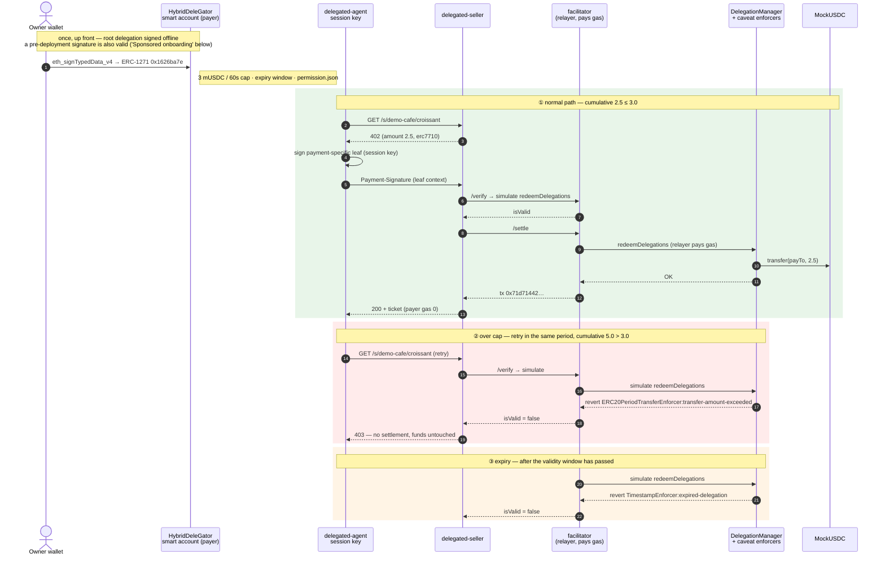

<!-- Generated file — do not edit. The source of truth is `docs/tech-notes.en.md`; regenerate with `bun run gitbook:build`. -->

# 2. Payment flows

Mapae's payment path is the ERC-7710 delegated payment. EIP-3009 direct payment, the
first regression path, has lost its apps (a seller and an agent) and kept only its
primitives.

## EIP-3009 direct payment — what remains

MockUSDC in `contracts/` implements `transferWithAuthorization`; `packages/shared`
holds the authorization's types, its EIP-712 domain and the settlement error model
(`SettlementError`); `facilitator/` is the x402-rs container configuration. The two
apps that issued and paid this path were removed when the hosted shop arrived — the
delegated path closes the same 402 → sign → settle loop under narrower authority.

One property was kept as the delegated path's starting point: the authorization
pins `from`, `to`, and `value` under the signature, so the relayer that broadcasts it
holds no authority beyond that of a broadcaster. The payer pays no gas.

## ERC-7710 delegated payment

```text
account owner wallet → HybridDeleGator owner account
            (if the account does not exist yet: pre-deployment signature → account-bootstrap deploys with sponsor gas)
            → erc20PeriodTransfer parent delegation
agent       → receives 402
            → signs a payment-specific leaf with amount/payTo/facilitator pinned
seller      → ERC-7710 facilitator /verify → /settle
facilitator → DelegationManager.redeemDelegations
            → mUSDC.transfer(payTo, amount)
```

In this document, permission and delegation refer to the same signed artifact — the
difference is ERC-7715 versus ERC-7710 terminology. The parent caveat enforces the
60-second period cap and the expiry window (30 minutes by default, extended via
`PERMISSION_TTL_SECONDS` for the demo) on-chain. The vendor profile also pins the
recipient position in the ERC-20 `transfer` calldata. In manager-to-child
re-delegation, the child's individual cap and the manager's aggregate cap apply
simultaneously.

The sequence below shows three paths for one and the same delegation — a normal
settlement, an over-cap refusal, and an expiry refusal. What decides a refusal is
the on-chain caveat, not a backend.



### Settlement evidence — GIWA Sepolia (2026-07-24 ~ 2026-08-04)

Evidence levels are stated separately. **Mined** is a transaction that entered a
GIWA block and opens in the explorer; **simulated** is an `eth_call` against GIWA's
current state — the verdict is handed down by the deployed enforcer bytecode reading
the real period counter, but nothing entered a block.

| Path | Result | Evidence level | Evidence |
|---|---|---|---|
| Framework deployment | 38-unit + 2-step ownership + owner smart account | **mined** | manager `0xF2F782Fa…F40C`, owner account `0xA4e4d00E…DDF382` |
| Normal settlement (inv-001, 1 mUSDC) | success, payer gas 0 | **mined** | tx `0xe897fe55…a97d`, block 31555419 |
| Normal settlement (inv-002, 2.5 mUSDC) | success | **mined** | tx `0x71d71442…6ce4`, block 31558282 |
| **Period cap exceeded** (cumulative 5.0 > 3.0) | **refused, funds untouched** | simulated | revert `ERC20PeriodTransferEnforcer:transfer-amount-exceeded` |
| **Expiry** (validity window passed) | **refused** | simulated | revert `TimestampEnforcer:expired-delegation` |
| Sponsored onboarding — account deployment | CREATE2 deploy from the owner recovered out of a pre-deployment signature, new user gas 0 | **mined** | account `0x15286FE9…3301`, tx `0xed21ac71…9902` |
| Sponsored onboarding — mUSDC float | 3 mUSDC minted | **mined** | tx `0x9d14588b…baa0` |
| Post-hoc acceptance of a pre-deployment signature (late binding) | live `isValidSignature` = `0x1626ba7e` | simulated | account `0x15286FE9…3301` |

That the two refusals have no transaction hash is a consequence of the design. The
facilitator's `/verify` filters first with `simulate.redeemDelegations`, so no gas
is spent on a transaction destined to revert. The same 2.5 mUSDC payment settles
while balance remains in the period and is refused once the cumulative total crosses
the cap — the limit is state enforced by the deployed enforcer, not a promise made
by application code.

## Sponsored onboarding (account bootstrap)

A new user signs the root delegation against a payer smart account that **does not
exist yet**, and `apps/account-bootstrap` deploys that account with sponsor gas.
Nobody needs to hold GIWA ETH to create a delegation.

Two measurements decided the design. First, **deploying at settlement time is
impossible** — `DelegationManager` runs the signature loop before any execution, a
codeless delegator falls into the EOA branch, and `ECDSA.recover` returns the owner
rather than the account, so it ends in `InvalidEOASignature`. There is no ERC-6492
anywhere in the Framework. Second, **late binding holds** — a signature made against
a codeless account passes ERC-1271 after deployment, because `HybridDeleGator`
compares against `owner()` and the owner is baked into the CREATE2 initcode. The
`0x1626ba7e` in the table above is the value with which the live chain answered
that fact.

The request body is `{permissionContext}` and nothing else. The owner is recovered
from the signature; the account is `CREATE2(recovered owner)` and must match the
delegator the permission names. Accepting an owner or salt from the caller would let
anyone nominate an address for us to pay to deploy — in this structure, the caller
has to solve a fixed point that cannot be solved without the key. The signature is
also checked offline for canonical form (low-s, `v ∈ {27,28}`). viem accepts
signatures that OZ `ECDSA` reverts on, so without this check we would pay to deploy
accounts whose every grant reverts forever.

Per-account idempotency is identity, not a budget — keypairs are free offline, so
the real bounds on a griefing run are the faucet window (one top-up per account per
24 hours), the daily gas budget (`BOOTSTRAP_DAILY_WEI`), and the sponsor balance
kept deliberately small. There is no per-IP limit: IPs are shared and keys are
free, so it never stopped a griefer and did stop two people in one office. The
faucet tops any account below 1000 tUSDC (testnet, not real money) up to that
target (`packages/delegation/src/faucet-policy.ts`). The sponsor holds no
delegation authority, so it cannot reach payer funds, caps, or settlement.
Verification is `bun run test:e2e:bootstrap` — 15 cases on a GIWA fork (kill
switch, approval mismatch, shared-relayer refusal, foreign signer, high-s,
deployment, late binding, gas accounting, faucet top-up to target, idempotency,
concurrency, faucet 24-hour window, budget exhaustion, chain-failure leak guard),
15/15.

## Agent automation (MCP)

The payment loop converges on a single `payForDelegatedResource` in
`packages/delegation/src/payment-client.ts`, and the CLI agent and the MCP server
share the same implementation. Two copies of an implementation drift apart.

`apps/agent-mcp` exposes two tools.

| tool | Role |
|---|---|
| `mapae_pay_for_resource` | receive 402 → sign a leaf within the caveat → retry the request → resource |
| `mapae_status` | session key, endpoints, deployment verification state (never returns keys or the permission context) |

The procedure for registering the server in an MCP client, and the environment
variables, are in the [MCP connection guide](../../mcp-guide.md).

This path has run to completion on GIWA Sepolia. One MCP tool call settled a payment
with no human intervention, and in transaction
[`0x533c…9964c`](https://sepolia-explorer.giwa.io/tx/0x533c5cb2945b89c7a56abf681ef049124deb4daf141e1a52b280385cefd9964c)
(block 31634935) the payer is −1 mUSDC, the vendor +1 mUSDC, and the payer's ETH
spend is `0`. The evidence level for this path is **mined on GIWA**, not a local
fork. The same transaction is also §3's timeout case — the on-chain settlement
succeeded, and the reporting path's timeout budgets were redesigned afterwards.

**Failures are returned as reasons.** The core returns a discriminated result
instead of throwing, and points at the cause with `SELLER_OFFER_INVALID`,
`FACILITATOR_UNTRUSTED`, `MANAGER_MISMATCH`, `LIMIT_EXCEEDED`,
`PERMISSION_INACTIVE`, `SIGNING_FAILED`, `PAYMENT_REJECTED`, and the like.

**On-chain pre-flight.** Before signing, the agent reads the enforcer's own
accounting directly and filters out payments that cannot succeed. The chain enforces
the cap either way, so the purpose of this step is not safety but **accuracy of the
reason** — instead of going all the way to the seller and receiving a 403, it states
the cause, as in `payment of 2500000 exceeds 2000000 left in this period`. A side
effect is that no leaf is signed for a payment that cannot succeed (a leaf is a
bearer authorization).

The pre-flight verdict (`judgePreflight`) is factored out as a pure function, with
chain reads injected as callbacks. Status lookup runs `readDelegationStatus` over
**every link** of the parent permission — looking only at the root misses the
narrower cap of a re-delegated child. Two verdict rules are pinned by tests: **an
inactive reason takes precedence over the cap** (reporting a permission that cannot
spend any amount as `LIMIT_EXCEEDED` sends the operator adjusting the cap, which is
not the cause), and **the cap is the chain's minimum, not the root's value.**

Two runtime behaviours:

- **Runtime loading is lazy and caches only success.** An env or network failure at
  boot returns a reason in the tool result instead of killing the process, and
  fixing the environment recovers it without a restart.
- **stdout is the JSON-RPC channel.** All logging goes to stderr.

## Studio (wallet module)

Both screens read their data directly from chain.

| Screen | Source |
|---|---|
| Delegation and limits | `ERC20PeriodTransferEnforcer.getAvailableAmount` (remaining period balance), caveat terms (cap, validity window), `DelegationManager.disabledDelegations` (revocation state) |
| Receipts | `TransferredInPeriod` events |

A settlement that consumes the cap always leaves this event, so the receipts need no
separate ledger. The remaining balance is not self-aggregated off-chain because that
would become a second truth, able to drift from the side that actually enforces.

The validity-window interpretation reflects what a 0 value means to the
`TimestampEnforcer` — the enforcer checks each half of the window only when it is
`> 0`, so a 0 in the terms means **unbounded**, not 1970.

**The receipt query window.** The query takes `fromBlock` as a required argument.
GIWA refuses `eth_getLogs` beyond 100,000 blocks, so an unbounded default would
either fail or return a truncated history as if it were complete. The default window
is 50,000 blocks, and with GIWA producing roughly 1 block per second (measured
over the 31634888→31634935 span) that is less than a day. So the screen header and
the empty-list message both show the time at which the window opens, and that time
is read from chain as the timestamp of the `fromBlock` block, not derived from an
assumed block time. If the node cannot serve that block (pruned), the message falls
back to a block-count notation and the screen stays up. When `fromBlock === 0` it is
labelled "full history". The window is fixed at 50,000 blocks; Studio does not
paginate, and the panel says so.

**The boundary of revocation.** `DeleGatorCore.disableDelegation` is
`onlyEntryPointOrSelf`, so the owner EOA cannot call it directly — it must be an
EntryPoint UserOperation. The suite exercises both branches — the *self* branch
proves the outcome via impersonation (after revocation `disabledDelegations` is
true, and the same payment is refused with `PERMISSION_INACTIVE`), and the
*EntryPoint* branch sends a UserOperation signed with the real owner key through
`handleOps`. That UserOperation's `callData` is `buildRevocationCall(...).data`
verbatim, not wrapped in `execute()` — wrapping would make it an EntryPoint →
`execute` → self call, folding back into the *self* branch already covered. Each
dependency carries a control.

| Control | What it proves | Actual result |
|---|---|---|
| `revocation-userop` | the normal path | success — `UserOperationEvent.success == true`, `disabledDelegations` true |
| `revocation-userop-unfunded` | the deposit is the real gate | `FailedOp(0,AA21 didn't pay prefund)` |
| `revocation-userop-wrong-signer` | the account verifies `owner()` | `FailedOp(0,AA24 signature error)` |
| `revocation-userop-tampered-field` | the signed `entryPoint` field is in force | `FailedOp(0,AA24 signature error)` |
| `revocation-submitter` | a JSON wire submission passes the validator and revokes | success — the validated struct matches the signed struct in all 9 fields |
| `revocation-submitter-foreign-sender` | a foreign account's revocation is refused before any chain read | `sender is not the account this submitter serves` |

**The submission endpoint (`apps/revocation-submitter`).** Anyone can call
`handleOps` and the relayer fronts the gas, so a service that forwards whatever it
is handed becomes a general-purpose UserOperation relay running on someone else's
funds. `validateRevocationSubmission` narrows it to one operation on one account — a
`sender` allowlist, the root's `delegator == sender`, `initCode` and
`paymasterAndData` forced empty, ceilings on the 4 gas fields, and **byte
equality of `callData` against a re-encode**. The last check is not a decode because
a decode passes bytes appended at the end.

The signature is deliberately not verified offline. The account is a
`HybridDeleGator` and validates through ERC-1271, so an offline `ecrecover` can
silently disagree with the account. The authority on the signature is the `AA24` the
EntryPoint returns in pre-broadcast simulation.

`judgeSubmissionReadiness` returns, as distinct reasons, the refusals that can be
judged from chain state — `prefund_short` (the payer holds ETH 0 by design, so the
deposit is the only funding source, and this is the most common state),
`fee_below_basefee` (the EntryPoint reimburses at
`min(maxFeePerGas, baseFee+priority)` while the relayer's transaction cannot be
included below `baseFee`, so sending it anyway succeeds while only the operator
loses), `base_fee_unreadable` (the base fee could not be read — a case for retry,
not re-signing, which is why its reason is kept separate from the previous one),
`relayer_unfunded`.

Success is judged by checking `UserOperationEvent.success` directly, not the receipt
status. The EntryPoint absorbs an inner call's revert into
`UserOperationRevertReason` and lets the transaction itself succeed
(`EntryPoint.sol:340-353`), so by the receipt alone a reverted `disableDelegation`
still reads as success.

**Service boot verification** (`bun run test:e2e:revoke`). Unit tests and the
negative-path suite cover the validator and the on-chain enforcement, but the boot
of the process itself — env parsing, reading the deployment artifacts, the relayer
cross-check at boot, `/health`, single-flight, simulate→broadcast — is round-tripped
by a separate e2e that actually starts the service on a GIWA fork. The suite counts
its own cases and prints `PASS — N cases (ABC…)`.

Two designs in this suite are non-obvious. First, **replay defence splits into two
cases.** The first line of defence against re-sending the same body is the deposit
gate, and in that state the nonce has never been executed. So the suite refills the
deposit to remove the gate, re-sends the identical body, and confirms that the one
remaining line of defence — the EntryPoint nonce — cuts it off with
`AA25 invalid account nonce`. Second, **the success case verifies the relayer's
balance sheet.** On GIWA the well-known Anvil development addresses carry an
EIP-7702 designator whose target is a sweeper that transfers away any incoming
balance in full. `EntryPoint._compensate` pays the beneficiary with
`call{value:…}`, so using such an address as the beneficiary empties the relayer in
a single `handleOps` (fork measurement: 1 ETH → 0.00024 ETH, transaction cost
0.00017 ETH). The suite enforces at startup that the beneficiary address has no
code.

The browser leg also checks the responses directly. The browser client (local dev
:5173) and the submitter (:8082) are different origins and the request carries
`content-type: application/json`, so the browser sends a preflight first — if the
preflight fails, the POST never goes out. The suite checks each case: that an
allowed origin's preflight gets 204, that an unknown origin gets 403, and that a
request with no `Origin` (a server-side call) works as-is.

**Studio's revoke button (`apps/web/src/dapp/RevokeButton.tsx`).** Connect the
wallet → check against `owner()` → read the nonce → build → `signTypedData` → POST
to the submission endpoint. Three design decisions: (1) **the connected wallet is
checked against the account's `owner()` before signing**
(`HybridDeleGator.sol:233`) — a signature from another wallet surfaces as `AA24` at
the EntryPoint, indistinguishable from a nonce or gas problem. (2) **The nonce is
read at click time and the operation is built in one pass** — if the value is
re-read between building and signing, the digest goes stale and the result is again
`AA24`. That is why `buildRevocationUserOperation` is a pure function. (3) The wire
body is produced by `buildRevocationSubmissionBody` from the same module the
submission endpoint uses for validation — a round-trip test pins byte-level
reproduction so the encoder and the decoder cannot diverge.

Each reason the button locks shows its own message — revocation endpoint not
configured, already revoked, wallet not connected, chain mismatch, not the owner. A
short deposit is not a lock reason — on the public path the sponsor tops up the
deposit at revoke time, and that is the reason sponsored mode exists. An owner
mismatch is reported first — the wallet is the only element the person in front of
the screen can change.

**The unverified stretch:** whether the wallet extension renders the
signature-request struct (9 fields) legibly for a human can only be confirmed with a
real wallet open. It remains the one stretch automation cannot cover.

The **funding state** of self-funded (pinned-mode) revocation — the EntryPoint
deposit, the per-revocation requirement
(`revocationPrefund(DEFAULT_REVOCATION_GAS)`), and the shortfall — is answered by
the submission endpoint's `/health`. The former D6 console displayed these values on
screen at all times (even at 0 — as long as gaslessness is the central claim, a row
that appears only when the value is not 0 is a row that cannot confirm the
invariant holds), and that principle carries over into Studio's status display.

**How the kill switch is funded.** Payments never pass through the EntryPoint — the
relayer calls `redeemDelegations` directly, so the payer's zero-ETH invariant holds
for payments. Revocation alone cannot avoid the EntryPoint, and the EntryPoint
collects gas not from the account's native balance but from the deposit
(`StakeManager.deposits`). `DeleGatorCore._payPrefund` (:559-566) absorbs a failed
transfer, so with no deposit it is the EntryPoint, not the account, that refuses
with `AA21` — not `AA23`. `EntryPoint.depositTo(address)` is `public payable` with
no access control, so the relayer can fill another account's deposit, and the
payer's native balance stays at 0 while it does. But `withdrawTo` reads
`deposits[msg.sender]`, so this is a one-way cost the relayer cannot claw back. The
procedure for completing the revocation path locally is in the
[revocation runbook](../../revocation-runbook.md).

**The Framework kill switch.** Where revocation severs one delegation,
`DelegationManager.pause()` stops the entire framework (`onlyOwner` — an ordinary
EOA transaction that needs no deposit). The defence is two layers: the facilitator's
`verifyFrameworkOperationalState` checks `paused` on every request and refuses
before settling, and on-chain the `whenNotPaused` on `redeemDelegations`
(`DelegationManager.sol:132`) reverts even a bypass of that gate. The suite confirms
that executing `pause()` on a fork with an impersonated owner has the payment
refused with `PAYMENT_REJECTED 403` and `/health` reporting `ok=false` with the
reason `DelegationManager is not operationally active`.

## Reproduction

```bash
bun run check                      # full-stack regression, no keys or network
cd apps/delegation-lab
bun run test:negative              # caveat cases — the default target is a disposable chain
SUITE_TARGET=fork bun run test:negative   # the same cases on a GIWA fork
bun run test:e2e:mcp               # full payment run → over-cap pre-flight refusal → pause → revocation
bun run test:e2e:revoke            # actually starts the submission endpoint and round-trips it
SUITE_FORK_BLOCK=<recent block> bun run test:e2e:bootstrap   # 15 onboarding-service cases
bun run preflight:giwa             # read-only GO/NO-GO against GIWA head state
```

`test:negative`'s default target is a disposable chain. The GIWA fork target must be
run separately with `SUITE_TARGET=fork`; no single line runs both targets. All four
suites count their own cases and print the count alongside the pass verdict
(`N/N cases passed`, `PASS — N cases (ABC…)`, `GO — N개 조건 전부 충족`).

The execution requirements differ per command. `bun run check` and `test:negative`
run from a clean clone with no keys, no network, and no deployment artifacts —
`test:negative` deploys the 38-unit Framework itself onto a disposable Anvil and
tests against it. `test:e2e:mcp`, by contrast, requires a root permission artifact
signed by the owner, so it does not run from a bare clone without the wallet that
owns the deployed account. `test:e2e:bootstrap` deploys a fresh account onto a GIWA
fork and therefore reads state no cache has ever held — a recent block must be
passed as `SUITE_FORK_BLOCK` (GIWA prunes old state).

`test:e2e:mcp` refuses to start unless every child process is pinned to a loopback
RPC, and after finishing it re-reads the real GIWA relayer nonce to confirm that
nothing was broadcast.

**Fork-source credentials are never exposed in argv.** The private GIWA endpoint
carries its API key in the URL path, so the whole URL is a credential, and argv is
visible via `ps`. `anvil --fork-url` has no environment-variable alias, so
`apps/delegation-lab/fork-source-proxy.ts` holds the key in memory and hands anvil a
keyless `http://127.0.0.1:<ephemeral port>`. All four places that spawn a fork use
this path.
